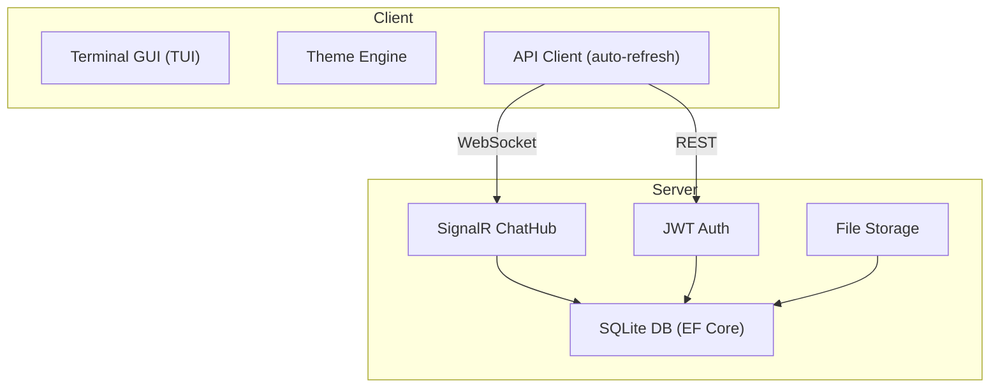

<p align="center">
  
</p>

<h1 align="center">EchoHub</h1>

<p align="center">
  No tracking. No subscriptions. No "enhanced AI features". Just chat.
</p>

<p align="center">
  <a href="#what-is-this">What</a> •
  <a href="#getting-started">Setup</a> •
  <a href="#client-commands">Commands</a> •
  <a href="#configuration">Config</a> •
  <a href="#license">License</a>
</p>

<p align="center">
  
  
  
  
  
  
</p>

---

## What is this?

Chat apps used to be simple. You connected to a server, joined a channel, and talked to people. No one was mining your messages for ad targeting, no one was selling your "engagement metrics", and the app didn't need 2GB of RAM to display text.

EchoHub is a return to that. Self-hosted, IRC-inspired chat that runs in your terminal. You own the server, you own the data, and the client won't try to upsell you on a premium tier.

Each server is fully independent — no central authority, no account federation, no corporate overlord. Just spin one up and go.



## What you get

### Server

- **Self-hostable** — your server, your rules, your data
- **Real-time messaging** via SignalR WebSockets
- **JWT auth** with short-lived access tokens and 30-day refresh tokens
- **Channels** — create, set topics, delete (no 47-step permission wizard required)
- **File & image uploads** with actual validation (magic bytes, not just trusting the extension)
- **Image-to-ASCII** — because images in a terminal is objectively cool
- **Presence tracking** — online/away/DND/invisible with custom status messages
- **Rate limiting** — in case someone gets too excited
- **Auto-restart** on crash with exponential backoff — it picks itself back up
- **Serilog logging** — console + rolling file, because `Console.WriteLine` isn't a logging strategy
- **Zero config first run** — generates its own JWT secret and config on launch

### Client

- **Runs in your terminal** — no browser, no Electron, no 500MB of bundled Chromium
- **13 built-in themes** — including `hacker` for when you want to feel like you're in a movie
- **Slash commands** — `/join`, `/send`, `/status`, `/theme`, etc.
- **Colored nicknames** — pick your hex color, express yourself
- **File/image sharing** — local files or URLs
- **Multi-server** — save and switch between servers
- **Auto-reconnect** — drops happen, it rejoins your channels automatically
- **Message history** on join — you won't miss context

## Getting Started

### Download

Grab a self-contained binary from [Releases](../../releases) — no runtime needed, just run it.

### Prerequisites (for development)

- [.NET 10 SDK](https://dotnet.microsoft.com/download)

### Run the Server

```bash
dotnet run --project src/EchoHub.Server
```

First run does everything for you:

1. Creates `appsettings.json` from the example config
2. Generates a secure JWT secret
3. Creates the database with a `#general` channel

### Run the Client

```bash
dotnet run --project src/EchoHub.Client
```

Connect, register, chat. That's the whole onboarding flow.

### Build from Source

```bash
dotnet build src/EchoHub.slnx
```

## Client Commands

| Command | Description |
| ------- | ----------- |
| `/join <channel>` | Join a channel |
| `/leave` | Leave current channel |
| `/topic <text>` | Set channel topic (creator only) |
| `/send <file or URL>` | Upload a file or image |
| `/status <online\|away\|dnd\|invisible>` | Set your status |
| `/status <message>` | Set a status message |
| `/nick <name>` | Set display name |
| `/color <#hex>` | Set nickname color |
| `/theme <name>` | Switch theme |
| `/profile` | Open profile editor |
| `/users` | List online users in channel |
| `/servers` | Manage saved servers |
| `/help` | Show help |
| `/quit` | Exit |

## Themes

`/theme <name>` to switch:

| Theme | Vibe |
| ----- | ---- |
| `default` | Gray on black — clean and quiet |
| `transparent` | White on black — for fancy transparent terminals |
| `classic` | White on blue — IRC nostalgia |
| `light` | Black on white — for the brave |
| `hacker` | Green on black — *I'm in* |
| `solarized` | Cyan/yellow on dark gray — for the refined |
| `dracula` | Purple accents on black — the classic dark theme |
| `monokai` | Yellow highlights on black — warm and familiar |
| `nord` | Cool blues — arctic vibes |
| `gruvbox` | Earthy yellows on black — retro warmth |
| `ocean` | Cyan on deep blue — underwater aesthetics |
| `highcontrast` | Bright yellow on black — maximum readability |
| `rosepine` | Muted pinks on black — cozy and soft |

## Configuration

`appsettings.json` is auto-generated on first run. Tweak what you need:

| Key | Default | Description |
| --- | ------- | ----------- |
| `Urls` | `http://0.0.0.0:5000` | Listen address and port |
| `ConnectionStrings:DefaultConnection` | *(empty — app directory)* | SQLite connection string |
| `Jwt:Secret` | *(auto-generated)* | JWT signing key |
| `Server:Name` | `My EchoHub Server` | Server display name |
| `Server:Description` | `A self-hosted EchoHub chat server` | Server description |
| `Cors:AllowedOrigins` | *(all origins)* | CORS whitelist |

Logging uses Serilog — console + daily rolling files with 14-day retention. Configure it in the `Serilog` section of appsettings.

## Project Structure

```text
src/
├── EchoHub.Core/          # Shared models, DTOs, contracts, validation
│   ├── Constants/         # ValidationConstants, HubConstants
│   ├── Contracts/         # IEchoHubClient (SignalR interface)
│   ├── DTOs/              # Record DTOs
│   └── Models/            # Entity models
│
├── EchoHub.Server/        # ASP.NET Core server
│   ├── Auth/              # JWT token service
│   ├── Controllers/       # REST API endpoints
│   ├── Data/              # EF Core DbContext + migrations
│   ├── Hubs/              # SignalR ChatHub
│   ├── Services/          # Presence, file storage, image processing
│   └── Setup/             # First-run setup, DB initialization
│
├── EchoHub.Client/        # Terminal.Gui TUI client
│   ├── Config/            # Client configuration
│   ├── Services/          # API client, SignalR connection
│   ├── Themes/            # 6 built-in themes
│   └── UI/                # MainWindow, dialogs, chat renderer
│
└── EchoHub.slnx           # Solution file
```

## License

[MIT](LICENSE) — do whatever you want with it.
