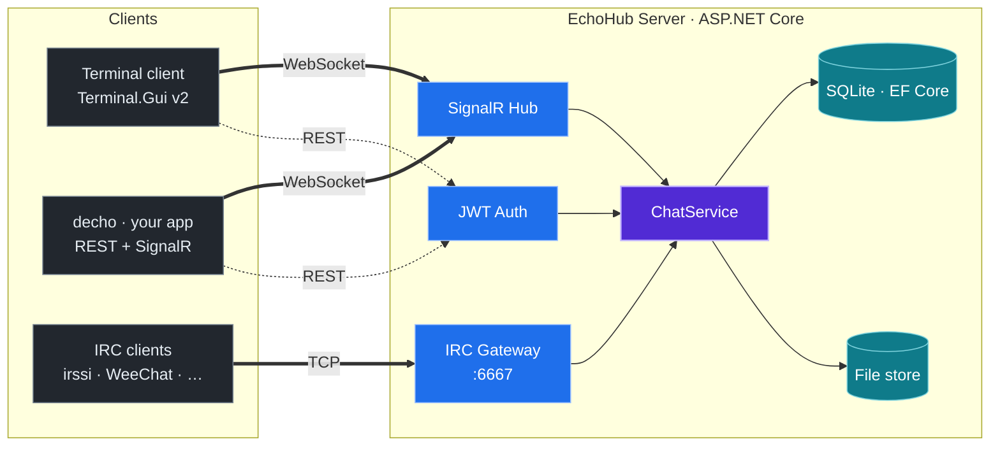

<div align="center">


<h1>EchoHub</h1>

**No tracking. No subscriptions. No "enhanced AI features". Just chat.**

Self-hosted, IRC-inspired chat with an open API. Use the terminal, a desktop app, IRC, or a client you build yourself.

[Website](https://echohub.voidcube.cloud/) · [Public servers](https://echohub.voidcube.cloud/servers) · [Documentation](https://huebyte.github.io/EchoHub/) · [Changelog](docs/changelog/index.md)

<a href="https://github.com/HueByte/EchoHub/actions/workflows/ci.yml"></a>
<a href="https://github.com/HueByte/EchoHub/releases/latest"></a>
<a href="https://community.chocolatey.org/packages/echohub"></a>
<a href="https://github.com/HueByte/EchoHub/pkgs/container/echohub-server"></a>

<a href="LICENSE"></a>

</div>

---

## What is this?

Chat apps used to be simple. You connected to a server, joined a channel, and talked to people. No one was mining your messages for ad targeting, no one was selling your "engagement metrics", and the app didn't need 2GB of RAM to display text.

EchoHub is a return to that. Self-hosted, IRC-inspired chat where you own the server and the data, and the client won't try to upsell you on a premium tier.

Each server is fully independent. No central authority, no account federation, no corporate overlord. Just spin one up and go.

The terminal client in this repo is the main way in: a proper native app that runs right in your terminal, no browser or Electron in sight. But you're not locked to it. The server speaks an open API (REST and SignalR) plus native IRC, so you can reach it however you like. There's already [**decho**](https://github.com/Stone-Red-Code/Decho), any IRC client works fine, and if none of those suit you, writing your own is fair game.

<!--
  Screenshots / demo GIF go here once ready. Drop them in docs/images/ and reference like:
  <p align="center"></p>
-->

## Architecture

One server process speaks two protocols: SignalR for native clients and raw IRC for everything else. Both land on the same `ChatService`, so a message from irssi and one from the terminal client look identical by the time they hit the database.


```mermaid
graph LR
    subgraph Clients
        direction TB
        TUI["Terminal client<br/>Terminal.Gui v2"]
        Desk["decho · your app<br/>REST + SignalR"]
        IRCC["IRC clients<br/>irssi · WeeChat · …"]
    end

    subgraph Server["EchoHub Server · ASP.NET Core"]
        direction TB
        Hub["SignalR Hub"]
        GW["IRC Gateway<br/>:6667"]
        Chat["ChatService"]
        Auth["JWT Auth"]
        DB[("SQLite · EF Core")]
        Files[("File store")]
    end

    TUI == "WebSocket" ==> Hub
    TUI -. "REST" .-> Auth
    Desk == "WebSocket" ==> Hub
    Desk -. "REST" .-> Auth
    IRCC == "TCP" ==> GW
    Hub --> Chat
    GW --> Chat
    Auth --> Chat
    Chat --> DB
    Chat --> Files

    classDef core fill:#512BD4,stroke:#c3b5ff,color:#ffffff,stroke-width:1.5px;
    classDef io fill:#1f6feb,stroke:#9dc1ff,color:#ffffff;
    classDef data fill:#0f7b8a,stroke:#7fd3de,color:#ffffff;
    classDef client fill:#22272e,stroke:#768390,color:#e6edf3;

    class Chat core
    class Hub,GW,Auth io
    class DB,Files data
    class TUI,Desk,IRCC client
```

## Highlights

|  |  |
| --- | --- |
| 🔒 **Actually private** | Self-hosted, no telemetry. Password rooms are end-to-end encrypted with a key derived from the passphrase on your own machine, so not even the server owner can read them. |
| 🖥️ **Native client, open API** | A real terminal client ships in the box. The REST + SignalR API is open too, so you're never stuck with it: there's the [**decho**](https://github.com/Stone-Red-Code/Decho) desktop app, any IRC client, or roll your own. |
| 💬 **IRC still works** | A built-in gateway drops irssi and WeeChat users into the same rooms as everyone else, live. Actions, replies and presence all carry across. |
| 🛡️ **Moderation, built in** | Four roles with ban, kick, mute and invite-only signup. Spam and flooding earn an automatic timed mute, no plugins to install. |
| 📎 **Files, images, audio** | Uploads are checked by their real bytes, not the file extension. Images even render as ASCII in the terminal, because why not. |
| 📤 **Take your data and go** | One command exports everything the server knows about you. Another deletes the account for good. |

Full feature tour in the [documentation](https://huebyte.github.io/EchoHub/articles/getting-started.html).

## Clients

The terminal client is the main, native interface. Beyond that the API and the IRC gateway are open, so you can bring whatever you like.

| Client | Platform | Notes |
| --- | --- | --- |
| **[Terminal client](src/EchoHub.Client)** | Windows · macOS · Linux | The main, native client (Terminal.Gui v2), shipped as a self-contained binary |
| **[decho](https://github.com/Stone-Red-Code/Decho)** | Desktop | A community desktop client |
| **Any IRC client** | Everywhere | irssi, WeeChat, TheLounge, and friends, through the built-in gateway |
| **Your own** | anything | Build against the open REST + SignalR API. See the [documentation](https://huebyte.github.io/EchoHub/) |

## Quick start

### Install the client

```bash
# Windows (Chocolatey)
choco install echohub

# Linux / macOS
curl -sSfL https://raw.githubusercontent.com/HueByte/EchoHub/master/scripts/install.sh | sh
```

Or grab a self-contained binary from [Releases](../../releases). No runtime required.

### Host a server

```bash
cp .env.example .env
docker compose up -d
```

Pre-built multi-arch images live on [GHCR](https://github.com/HueByte/EchoHub/pkgs/container/echohub-server). Prefer running from source? `dotnet run --project src/EchoHub.Server` (needs the [.NET 10 SDK](https://dotnet.microsoft.com/download)). The first launch writes its config, generates a JWT secret, and creates the database with a `#general` channel. No manual setup.

→ **[Getting started](https://huebyte.github.io/EchoHub/articles/getting-started.html)** · **[Docker & deployment](https://huebyte.github.io/EchoHub/articles/docker.html)** · **[Configuration](https://huebyte.github.io/EchoHub/articles/configuration.html)**

## Documentation

Everything lives at **[huebyte.github.io/EchoHub](https://huebyte.github.io/EchoHub/)**:

| Guide | What's inside |
| --- | --- |
| [Getting started](https://huebyte.github.io/EchoHub/articles/getting-started.html) | Install, first connection, the onboarding flow |
| [TUI guide](https://huebyte.github.io/EchoHub/articles/tui-guide.html) | Slash commands, themes, keybindings, message actions |
| [Configuration](https://huebyte.github.io/EchoHub/articles/configuration.html) | Every `appsettings.json` / env key explained |
| [IRC gateway](https://huebyte.github.io/EchoHub/articles/irc-gateway.html) | Connecting IRC clients, what maps to what, TLS |
| [Encrypted rooms](https://huebyte.github.io/EchoHub/articles/encrypted-rooms.html) | How zero-knowledge password channels work |
| [Moderation](https://huebyte.github.io/EchoHub/articles/moderation.html) | Roles, bans, mutes, invite codes |
| [Docker & deployment](https://huebyte.github.io/EchoHub/articles/docker.html) | Compose, reverse proxy, TLS (see also [`examples/nginx.conf`](examples/nginx.conf)) |
| [Architecture](https://huebyte.github.io/EchoHub/articles/architecture.html) | How the pieces above actually fit together |

## Building from source

```bash
dotnet build src/EchoHub.slnx      # build everything
dotnet test src/EchoHub.Tests      # run the test suite
```

Contributions are welcome. Open an issue to discuss larger changes first.

## Contributors

<div align="center">
<table>
  <tr>
    <td align="center" width="160">
      <a href="https://github.com/HueByte">
        <br />
        <sub><b>HueByte</b></sub>
      </a><br />
      <sub>Creator &amp; maintainer</sub>
    </td>
    <td align="center" width="160">
      <a href="https://github.com/Stone-Red-Code">
        <br />
        <sub><b>Stone_Red</b></sub>
      </a><br />
      <sub>Creator &amp; maintainer</sub>
    </td>
  </tr>
</table>
</div>
