# IChannelService.cs

> **Source:** `src/EchoHub.Core/Contracts/IChannelService.cs`

*Figure: How IChannelService works.*

```mermaid
%%{init: {'theme':'base','themeVariables':{'background':'#faf7ef','primaryColor':'#f0e2c2','primaryTextColor':'#1f2840','primaryBorderColor':'#8a7548','secondaryColor':'#d9efec','secondaryBorderColor':'#1d8a80','secondaryTextColor':'#1f2840','tertiaryColor':'#f2ebd8','tertiaryBorderColor':'#8a7548','tertiaryTextColor':'#1f2840','lineColor':'#1d8a80','titleColor':'#1f2840','fontSize':'14px','edgeLabelBackground':'#faf7ef','clusterBkg':'#f2ebd8','clusterBorder':'#8a7548','actorBkg':'#f0e2c2','actorBorder':'#8a7548','actorTextColor':'#1f2840','actorLineColor':'#8a7548','signalColor':'#1d8a80','signalTextColor':'#1f2840','activationBkgColor':'#d9efec','activationBorderColor':'#1d8a80','noteBkgColor':'#f2ebd8','noteBorderColor':'#8a7548','noteTextColor':'#1f2840','labelBoxBkgColor':'#f0e2c2','labelBoxBorderColor':'#8a7548','labelTextColor':'#1f2840','transitionColor':'#1d8a80','transitionLabelColor':'#1f2840','stateLabelColor':'#1f2840','altBackground':'#f2ebd8'}}}%%
flowchart TB
IChannelService["IChannelService: entry"] -->|"GetChannelsAsync(userId, offset, limit)"| PaginatedResponse["Build PaginatedResponse of ChannelDto"]
PaginatedResponse -->|"items: ChannelDto"| ChannelDto["Map DB rows to ChannelDto"]
IChannelService -->|"CreateChannelAsync(creatorUserId, name, topic, isPublic, password?, encryptionSalt?, wrappedRoomKey?)"| Channel["Create Channel record"]
Channel -->|"return"| ChannelOperationResult["ChannelOperationResult (success/error)"]
IChannelService -->|"UpdateTopicAsync(callerUserId, channelName, topic?)"| ChannelOperationResult
IChannelService -->|"SetChannelPasswordAsync(callerUserId, channelName, password?)"| ChannelOperationResult
IChannelService -->|"RekeyChannelAsync(callerUserId, channelName, oldPassword, newPassword, newEncryptionSalt, newWrappedRoomKey)"| ChannelCryptoDto["Update encryptionSalt and wrappedRoomKey"]
ChannelCryptoDto -->|"return"| ChannelOperationResult
IChannelService -->|"DeleteChannelAsync(callerUserId, channelName)"| ChannelOperationResult
IChannelService -->|"GetChannelByNameAsync(channelName)"| ChannelDto
IChannelService -->|"GetChannelMetaAsync(channelName)"| ChannelMetaDto
IChannelService -->|"GetChannelCryptoAsync(channelName)"| ChannelCryptoDto
IChannelService -->|"GetChannelKeyEnvelopeAsync(channelName) -> (EncryptionSalt, WrappedRoomKey)"| ChannelCryptoDto
IChannelService -->|"GetChannelTopicAsync(channelName) -> (Topic, Exists)"| ChannelMetaDto
IChannelService -->|"GetChannelListAsync()"| ChannelListItem["Return list of ChannelListItem"]
IChannelService -->|"EnsureChannelMembershipAsync(userId, channelName, password?) -> (Success, Error, PasswordRequired)"| ChannelOperationResult
IChannelService -->|"EnsureSystemChannelAsync(channelName, topic?)"| Channel["Create or reclaim system Channel"]
Channel -->|"return ChannelDto"| ChannelDto
```



## Contents

- [IChannelService](#ichannelservice)
- [ChannelListItem](#channellistitem)

---

## IChannelService
> **File:** `src/EchoHub.Core/Contracts/IChannelService.cs`  
> **Kind:** interface

```csharp
public interface IChannelService
```


Provides the canonical server-side API for creating, querying, updating, and deleting chat channels and for enforcing membership and channel-level security. Use `IChannelService` when implementing application logic that needs to manage channel lifecycle (CRUD), inspect channel metadata or crypto information, handle membership checks (including password-protected rooms), or ensure server-owned system channels exist and cannot be hijacked by user-created channels.

## Remarks
`IChannelService` centralizes channel-related policy and state so higher-level features (e.g. connection/auth layers, hub message routing, admin tools) can treat channel management as a single abstraction. It separates responsibilities: CRUD and topic/password operations return a [`ChannelOperationResult`](../DTOs/CommonDtos.cs.md) that callers must inspect (via `ChannelOperationResult.IsSuccess`) while read-only queries (e.g. [`GetChannelByNameAsync`](../../EchoHub.Server/Services/ChannelService.cs.md), `GetChannelMetaAsync`, `GetChannelCryptoAsync`) let callers obtain DTO representations. Crypto and key-envelope methods (`GetChannelCryptoAsync`, [`GetChannelKeyEnvelopeAsync`](../../EchoHub.Server/Services/ChannelService.cs.md), `RekeyChannelAsync`) keep cryptographic metadata operations colocated with channel lifecycle logic. The [`EnsureSystemChannelAsync`](../../EchoHub.Server/Services/ChannelService.cs.md) method is intentionally server-managed: it creates missing system channels and reclaims any same-named user-owned channels so server content is never stored in a user-controlled room.

## Example
```csharp
// create a public channel and then fetch its DTO if creation succeeded
var result = await channelService.CreateChannelAsync(creatorUserId, "general", "General chat", isPublic: true);
if (result.IsSuccess)
{
    var channel = await channelService.GetChannelByNameAsync("general");
    // use 'channel' (type: ChannelDto) for further operations
}
else
{
    // handle failure (inspect result for details provided by the implementation)
}
```

## Notes
- Methods that return [`ChannelOperationResult`](../DTOs/CommonDtos.cs.md) (for example `CreateChannelAsync`, [`UpdateTopicAsync`](../../EchoHub.Server/Services/ChannelService.cs.md), [`SetChannelPasswordAsync`](../../EchoHub.Server/Services/ChannelService.cs.md), `RekeyChannelAsync`, `DeleteChannelAsync`) must have their `ChannelOperationResult.IsSuccess` checked before assuming the operation succeeded. Do not assume a returned DTO exists unless the operation reports success.
- Several parameters are nullable (`topic`, `password`, `encryptionSalt`, `wrappedRoomKey`); callers should explicitly pass `null` when no value is intended and be prepared for implementations to treat `null` as "no value" or as an instruction to remove/clear a setting (verify service semantics for your deployment).
- [`GetChannelTopicAsync`](../../EchoHub.Server/Services/ChannelService.cs.md) returns `(string? Topic, bool Exists)` — a `null` `Topic` can mean either an empty topic or that no topic was set; check `Exists` to distinguish a non-existent channel from a channel with a `null` topic.
- [`EnsureChannelMembershipAsync`](../../EchoHub.Server/Services/ChannelService.cs.md) returns a tuple including `PasswordRequired`; if `PasswordRequired` is `true`, callers should prompt for and supply a password on subsequent calls. The `Error` element may contain implementation-specific failure information.
- `GetChannelsAsync` accepts `offset` and `limit` for pagination; callers are responsible for passing sensible bounds and handling potentially large result sets incrementally.

---

## ChannelListItem
> **File:** `src/EchoHub.Core/Contracts/IChannelService.cs`  
> **Kind:** record

```csharp
public record ChannelListItem(string Name, string? Topic, int OnlineCount, bool IsPublic = true, bool IsProtected = false)
```

**Parameters:**

| Parameter | Type | Default |
|-----------|------|---------|
| `Name` | `string` | — |
| `Topic` | `string?` | — |
| `OnlineCount` | `int` | — |
| `IsPublic` | `bool` | `true` |
| `IsProtected` | `bool` | `false` |


ChannelListItem is an immutable value object that describes a single channel in a channel list. It carries the channel's display name (`Name`), an optional topic (`Topic`), the number of online users (`OnlineCount`), and visibility flags (`IsPublic` and `IsProtected`). As a `record`, it provides value-based equality and straightforward construction for transport or UI scenarios, with `IsPublic` defaulting to true and `IsProtected` defaulting to false.

## Remarks
The use of a `record` signals that this is a lightweight value object intended for transport and comparison across boundaries. It models channel metadata as a single, cohesive unit, aiding deduplication and consistent rendering in lists or API responses.

## Example
```csharp
var item = new ChannelListItem("general", "General discussion", 12);
```

## Notes
- Topic may be null to indicate no topic is set.
- IsPublic defaults to true and IsProtected defaults to false; pass explicit values to override.

---