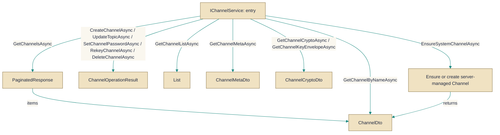

# IChannelService.cs

> **Source:** `src/EchoHub.Core/Contracts/IChannelService.cs`

*Figure: How IChannelService works.*



## Contents

- [IChannelService](#ichannelservice)
- [ChannelListItem](#channellistitem)

---

## IChannelService
> **File:** `src/EchoHub.Core/Contracts/IChannelService.cs`  
> **Kind:** interface

```csharp
public interface IChannelService
```


Provides an asynchronous API for creating, updating, deleting and querying chat channels, managing membership, and exposing channel encryption metadata. Implement this interface to centralize channel lifecycle, access control and crypto-envelope access rather than manipulating persistence or membership directly.

## Remarks
The interface groups CRUD operations, read/query methods, membership checks, and crypto-related lookups so callers can depend on a single abstraction for channel business rules. Mutating methods return ChannelOperationResult (which carries IsSuccess and factory helpers) to make success/failure handling explicit; query methods return lightweight DTOs or tuples for simple lookups. EnsureSystemChannelAsync is a server-managed path that ensures required system channels exist and prevents server content from being written into user-owned rooms.

## Example
```csharp
// Create a public channel and inspect the operation result
var createResult = await channelService.CreateChannelAsync(creatorUserId, "general", "General discussion", true);
if (createResult.IsSuccess)
{
    var created = createResult; // ChannelOperationResult.Success contains the created ChannelDto
}
else
{
    // handle failure
}

// Ensure membership for a user (third parameter is the optional password/credential)
var membership = await channelService.EnsureChannelMembershipAsync(userId, "general", null);
if (membership.Success)
{
    // user is a member or was added
}
else if (membership.PasswordRequired)
{
    // prompt for password and retry
}
else
{
    // membership failed; membership.Error contains a message
}
```

## Notes
- Always check ChannelOperationResult.IsSuccess before assuming a mutating operation succeeded; use the provided factory helpers on ChannelOperationResult to construct success/failure values.
- Methods that return encryption metadata (encryption salt, wrapped room key) expose envelopes, not raw symmetric keys; treat any secrets derived from these values securely.
- The source contains redacted/truncated text in some method signatures (CreateChannelAsync and EnsureChannelMembershipAsync). Verify the real parameter names and optional overloads in the codebase before calling those methods.


---

## ChannelListItem
> **File:** `src/EchoHub.Core/Contracts/IChannelService.cs`  
> **Kind:** record

```csharp
public record ChannelListItem(string Name, string? Topic, int OnlineCount, bool IsPublic = true, bool IsProtected = false)
```

**Parameters:**

| Parameter | Type | Default |
|-----------|------|---------|
| `Name` | `string` | — |
| `Topic` | `string?` | — |
| `OnlineCount` | `int` | — |
| `IsPublic` | `bool` | `true` |
| `IsProtected` | `bool` | `false` |


ChannelListItem is an immutable value that represents a single entry in a channel list. It carries the core metadata needed to display or transport channel information: the channel Name, an optional Topic, the current OnlineCount, and two visibility flags (IsPublic and IsProtected) which default to true and false respectively. Use this type whenever you need a concise, stable descriptor of a channel for UI lists, payloads, or comparisons, rather than a mutable or richer domain model.

## Remarks
ChannelListItem benefits from value-based equality inherent to records, so two items with identical fields compare as equal, which helps with list diffs, caching, and deduplication. The Topic is nullable to accommodate channels without a topic. Defaults (IsPublic = true, IsProtected = false) reflect common expectations for channels unless stated otherwise. Because this is a record, instances are immutable; to reflect changes (for example, a rising OnlineCount), create a new instance via a with-expression.

## Example
```csharp
// Basic construction with defaults for visibility flags
var item = new ChannelListItem("general", "Public channel for announcements", 12);

// Or using named arguments for clarity
var itemNamed = new ChannelListItem(Name: "general", Topic: "Public channel for announcements", OnlineCount: 12);

// Immutability in action: create a modified copy with an updated OnlineCount
var updated = item with { OnlineCount = 13 };
```

## Notes
- Topic is nullable; pass null if the channel has no topic.
- To reflect a change in OnlineCount or other fields, use the with-expression since ChannelListItem is immutable.


---