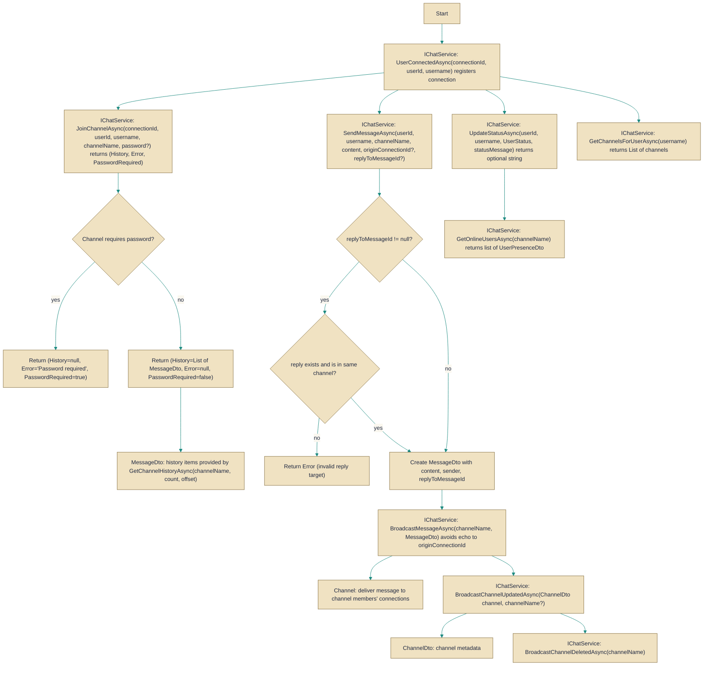

# IChatService

> **File:** `src/EchoHub.Core/Contracts/IChatService.cs`  
> **Kind:** interface

*Figure: How IChatService works.*



```csharp
public interface IChatService
```


Provides chat-layer operations for connection lifecycle, channel membership, messaging, presence and cross-process broadcasting. Reach for `IChatService` when implementing or calling the application-level chat logic (for example from controllers, real-time hubs or an IRC gateway) rather than manipulating lower-level transport or persistence APIs directly.

## Remarks
`IChatService` centralizes the domain operations needed by the real-time chat surface: tracking connections ([`UserConnectedAsync`](../../EchoHub.Server/Services/ChatService.cs.md), [`UserDisconnectedAsync`](../../EchoHub.Server/Services/ChatService.cs.md)), joining and leaving channels ([`JoinChannelAsync`](../../EchoHub.Server/Services/ChatService.cs.md), [`LeaveChannelAsync`](../../EchoHub.Server/Services/ChatService.cs.md)), sending and retrieving messages ([`SendMessageAsync`](../../EchoHub.Server/Services/ChatService.cs.md), [`GetChannelHistoryAsync`](../../EchoHub.Server/Services/ChatService.cs.md)), presence ([`UpdateStatusAsync`](../../EchoHub.Server/Services/ChatService.cs.md), [`GetOnlineUsersAsync`](../../EchoHub.Server/Services/ChatService.cs.md)), and broadcasting channel or message events to other processes ([`BroadcastMessageAsync`](../../EchoHub.Server/Services/ChatService.cs.md), [`BroadcastChannelUpdatedAsync`](../../EchoHub.Server/Services/ChatService.cs.md), [`BroadcastChannelDeletedAsync`](../../EchoHub.Server/Services/ChatService.cs.md)). The interface is designed for use by controllers and gateway components (the code comments indicate the IRC gateway uses several methods), so it intentionally mixes request/response operations (join, send) with one-way broadcast methods used to propagate state across processes.

## Example
```csharp
// Typical happy-path usage from a controller or hub
var (history, joinError, passwordRequired) = await chatService.JoinChannelAsync(connectionId, userId, username, "general");
if (joinError != null) {
    // handle join failure (implementation-specific semantics)
    return;
}
// Show the returned history to the user
foreach (var item in history) {
    // item is a [`MessageDto`](../DTOs/ChatDtos.cs.md)
}

// Send a message; the returned nullable string has implementation-dependent meaning
var sendResult = await chatService.SendMessageAsync(userId, username, "general", "Hello everyone!");
if (sendResult != null) {
    // react to non-null result per the concrete implementation
}

// Broadcast a message instance (e.g. from background processing or another gateway)
// `message` here is a [`MessageDto`](../DTOs/ChatDtos.cs.md) obtained from persistence or constructed by the implementation
// await chatService.BroadcastMessageAsync("general", message);
```

## Notes
- Several methods return `Task<string?>` (for example [`UserDisconnectedAsync`](../../EchoHub.Server/Services/ChatService.cs.md), [`SendMessageAsync`](../../EchoHub.Server/Services/ChatService.cs.md), [`UpdateStatusAsync`](../../EchoHub.Server/Services/ChatService.cs.md)). The interface does not document the exact semantics of a non-null string (error message vs. identifier vs. other). Consumers must consult the concrete implementation or its docs to interpret these values correctly.
- The `originConnectionId` parameter on [`SendMessageAsync`](../../EchoHub.Server/Services/ChatService.cs.md) is used to avoid echoing a broadcast back to the originating connection (IRC-like behavior). Other sessions owned by the same user still receive the message.
- The `replyToMessageId` parameter on [`SendMessageAsync`](../../EchoHub.Server/Services/ChatService.cs.md) must reference a message that exists in the same channel; implementations should validate this constraint.
- [`JoinChannelAsync`](../../EchoHub.Server/Services/ChatService.cs.md) returns a tuple containing `History`, `Error`, and `PasswordRequired`. Callers should handle the `Error` and `PasswordRequired` flags before assuming `History` contains usable data.
- [`GetChannelHistoryAsync`](../../EchoHub.Server/Services/ChatService.cs.md) supports simple pagination via `count` and `offset`; callers should choose `count` and `offset` to limit load and avoid returning excessively large histories in a single call.
- Broadcasting methods ([`BroadcastMessageAsync`](../../EchoHub.Server/Services/ChatService.cs.md), [`BroadcastChannelUpdatedAsync`](../../EchoHub.Server/Services/ChatService.cs.md), [`BroadcastChannelDeletedAsync`](../../EchoHub.Server/Services/ChatService.cs.md)) are intentionally one-way primitives used to notify other processes; they do not return operation results and callers should not rely on them for synchronous guarantees.