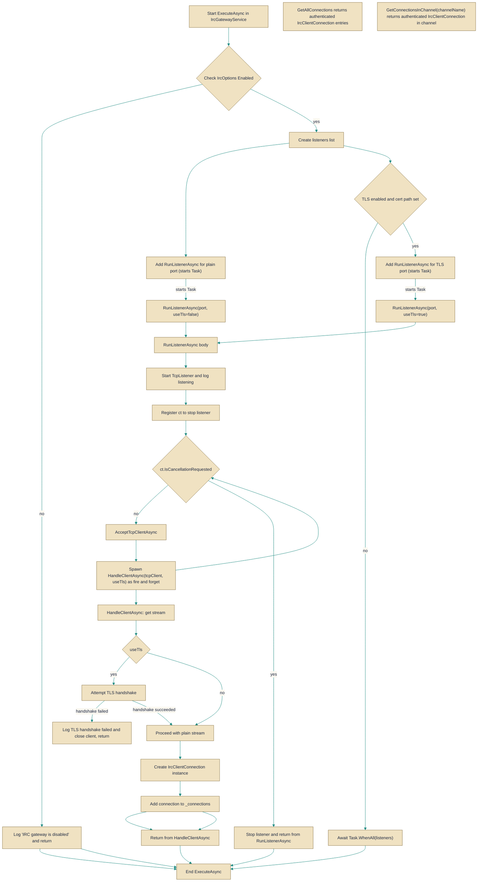

# IrcGatewayService

> **File:** `src/EchoHub.Server.Irc/IrcGatewayService.cs`  
> **Kind:** class

*Figure: How IrcGatewayService works.*



```csharp
public sealed class IrcGatewayService : BackgroundService
```


An always-on hosted gateway that accepts raw TCP (optionally TLS) connections and exposes an IRC-compatible surface backed by the EchoHub services. `IrcGatewayService` reads configuration from [`IrcOptions`](IrcOptions.cs.md), listens on the configured ports, accepts incoming `TcpClient` connections, wraps them in [`IrcClientConnection`](IrcClientConnection.cs.md) objects, and hands each connection to an [`IrcCommandHandler`](IrcCommandHandler.cs.md) that bridges IRC commands to the application services ([`IChatService`](../EchoHub.Core/Contracts/IChatService.cs.md), [`IUserService`](../EchoHub.Core/Contracts/IUserService.cs.md), [`IChannelService`](../EchoHub.Core/Contracts/IChannelService.cs.md), [`IMessageEncryptionService`](../EchoHub.Core/Contracts/IMessageEncryptionService.cs.md)). Reach for `IrcGatewayService` when you want to run an IRC-facing adapter for the EchoHub system rather than implementing socket handling and protocol dispatch yourself.

## Remarks
`IrcGatewayService` is a long-running `BackgroundService` that centralizes network-level concerns for the IRC gateway: socket listening, optional TLS handshake, acceptance of clients, and registration of active connections in the concurrent `_connections` map. It delegates protocol parsing and business-logic handling to [`IrcCommandHandler`](IrcCommandHandler.cs.md), resolving the required domain services from the DI `IServiceProvider` per connection so the gateway stays thin and focused on I/O and lifecycle. The service uses [`IrcOptions`](IrcOptions.cs.md) to control whether the gateway is enabled, which ports to bind, and whether to offer TLS; listeners are run as independent tasks and shut down when the host cancellation token is triggered.

## Notes
- TLS requires a valid `IrcOptions.TlsCertPath` and password when `IrcOptions.TlsEnabled` is true; a failed TLS handshake will be logged and the connection closed (the code logs "TLS handshake failed" on exception).  
- Active connections are tracked in the `ConcurrentDictionary` `_connections` and can be inspected via `GetConnectionsInChannel` and `GetAllConnections`; the dictionary makes concurrent adds/removes safe, but callers should expect the set to change while enumerating.  
- The provided source was truncated inside `HandleClientAsync` in the task payload; I could not verify whether each [`IrcClientConnection`](IrcClientConnection.cs.md) is always removed from `_connections` and whether streams/clients are always disposed on disconnect. If you rely on deterministic cleanup, inspect the full `HandleClientAsync` implementation to confirm that connections are removed and resources are disposed on normal disconnect and on error.