# IrcGatewayService

> **File:** `src/EchoHub.Server.Irc/IrcGatewayService.cs`  
> **Kind:** class

*Figure: How IrcGatewayService works.*

```mermaid
%%{init: {'theme':'base','themeVariables':{'background':'#faf7ef','primaryColor':'#f0e2c2','primaryTextColor':'#1f2840','primaryBorderColor':'#8a7548','secondaryColor':'#d9efec','secondaryBorderColor':'#1d8a80','secondaryTextColor':'#1f2840','tertiaryColor':'#f2ebd8','tertiaryBorderColor':'#8a7548','tertiaryTextColor':'#1f2840','lineColor':'#1d8a80','titleColor':'#1f2840','fontSize':'14px','edgeLabelBackground':'#faf7ef','clusterBkg':'#f2ebd8','clusterBorder':'#8a7548','actorBkg':'#f0e2c2','actorBorder':'#8a7548','actorTextColor':'#1f2840','actorLineColor':'#8a7548','signalColor':'#1d8a80','signalTextColor':'#1f2840','activationBkgColor':'#d9efec','activationBorderColor':'#1d8a80','noteBkgColor':'#f2ebd8','noteBorderColor':'#8a7548','noteTextColor':'#1f2840','labelBoxBkgColor':'#f0e2c2','labelBoxBorderColor':'#8a7548','labelTextColor':'#1f2840','transitionColor':'#1d8a80','transitionLabelColor':'#1f2840','stateLabelColor':'#1f2840','altBackground':'#f2ebd8'}}}%%
flowchart TB
start(("Start")) --> checkOpt{"Check IrcOptions.Enabled?"}
checkOpt -- "false" --> logDisabled["Log #quot;IRC gateway is disabled#quot;"]
logDisabled --> end1(("End"))
checkOpt -- "true" --> init["Initialize listeners list and add RunListenerAsync(Options.Port, useTls:false)"]
init --> checkTls{"Are Options.TlsEnabled and Options.TlsCertPath set?"}
checkTls -- "true" --> addTls["Add RunListenerAsync(Options.TlsPort, useTls:true)"]
checkTls -- "false" --> awaitAll
addTls --> awaitAll["Await Task.WhenAll(listeners)"]
awaitAll --> runListener["RunListenerAsync: start TcpListener and loop AcceptTcpClientAsync"]
runListener --> acceptClient["On accept: fire-and-forget HandleClientAsync(tcpClient, useTls)"]
acceptClient --> runListener
acceptClient --> createConn["Create new IrcClientConnection and add to _connections"]
createConn --> handleClient{"HandleClientAsync: useTls?"}
handleClient -- "true" --> tlsHandshake["Load cert from IrcOptions and AuthenticateAsServerAsync"]
tlsHandshake --> handshakeOk{"TLS handshake succeeded?"}
handshakeOk -- "false" --> closeTcp["Log error and close tcpClient"]
closeTcp --> endConn(("End connection setup"))
handshakeOk -- "true" --> proceedConn["Assign SslStream and continue"]
handleClient -- "false" --> proceedConn
proceedConn --> addConn["Add connection to _connections dictionary (IrcClientConnection)"]
addConn --> startProcessing["Start message processing with IrcCommandHandler and required services (IChatService, IUserService, IChannelService, IMessageEncryptionService)"]
startProcessing --> endConn
```



```csharp
public sealed class IrcGatewayService : BackgroundService
```


Provides a hosted IRC gateway that listens for incoming TCP (and optional TLS) client connections and dispatches each to an IrcCommandHandler that bridges IRC protocol traffic to the application's chat, user and channel services. Start this BackgroundService when you want the application to accept IRC client connections without manually managing TcpListeners, TLS handshakes, or per-connection handler wiring.

## Remarks
This BackgroundService reads configuration from IrcOptions and opens one or two listeners (plain and optionally TLS) for the ports configured. For every accepted TcpClient it creates an IrcClientConnection, stores it in an internal ConcurrentDictionary keyed by ConnectionId, and constructs an IrcCommandHandler (using IChatService, IUserService, IChannelService and IMessageEncryptionService from DI) to drive the connection. The service centralizes lifecycle concerns: listener startup/shutdown, TLS handshake and per-connection dispatching so higher-level application code can focus on chat/user/channel logic implemented in the injected services.

## Notes
- If IrcOptions.Enabled is false the service logs and returns immediately; no listeners are started.
- TLS is only attempted when TlsEnabled is true and TlsCertPath is provided; TLS handshake failures are logged and the client connection is closed.
- The Connections collection is a ConcurrentDictionary and entries are added when clients connect. Public helper methods (GetAllConnections, GetConnectionsInChannel) filter by IrcClientConnection.IsAuthenticated — use those to obtain the set of active, authenticated clients rather than inspecting the raw dictionary directly.