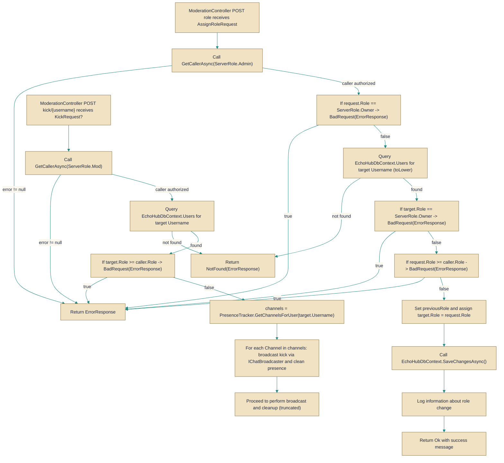

# ModerationController

> **File:** `src/EchoHub.Server/Controllers/ModerationController.cs`  
> **Kind:** class

*Figure: How ModerationController works.*



```csharp
[ApiController]
[Route("api/moderation")]
[Authorize]
[EnableRateLimiting("general")]
public class ModerationController : ControllerBase
```


Provides HTTP endpoints under `api/moderation` for server moderation operations such as assigning roles, kicking and banning users. Use `ModerationController` when you need a centralized, authenticated API surface to perform privileged user-management actions that update persistent state and notify connected clients.

## Remarks
`ModerationController` centralizes moderation workflows: it validates the caller's privileges (via the controller's caller-checking helpers), performs database updates through [`EchoHubDbContext`](../Data/EchoHubDbContext.cs.md), emits real-time notifications to connected clients through [`IChatBroadcaster`](../../EchoHub.Core/Contracts/IChatBroadcaster.cs.md) implementations, and updates runtime state via [`PresenceTracker`](../Services/PresenceTracker.cs.md) and [`ServerStatsCollector`](../Services/Stats/ServerStatsCollector.cs.md). The class is decorated with `[Authorize]` and `[EnableRateLimiting("general")]`, so all endpoints require an authenticated caller and are subject to the configured rate limits. Actions that modify user connectivity (for example kicking a user) will both broadcast the event to affected channels and invoke the controller's disconnect/cleanup logic to remove presence and force client disconnects.

## Notes
- User lookup uses a lowercased username (e.g. `username.ToLowerInvariant()`), so callers should supply the canonical username form; mismatched casing can lead to `NotFound` responses.  
- Role hierarchy is enforced: the controller prevents assigning the `ServerRole.Owner`, prevents changing the server owner's role, and disallows assigning or acting on users with roles equal to or higher than the caller (see the `AssignRole` and `KickUser` checks).  
- Persistent changes are saved via `EchoHubDbContext.SaveChangesAsync()` and important actions are logged with the injected `ILogger<ModerationController>`, so moderation operations are durable and auditable.  
- Because the controller broadcasts moderation events using [`IChatBroadcaster`](../../EchoHub.Core/Contracts/IChatBroadcaster.cs.md) and may call `ForceDisconnectAndCleanupAsync`, clients connected to channels may be forcibly disconnected as part of an action — callers should expect immediate real-time side effects beyond the HTTP response.  
- The `[EnableRateLimiting("general")]` attribute can cause requests to be throttled under high load; plan client-side retry/backoff for operator tooling that calls these endpoints.