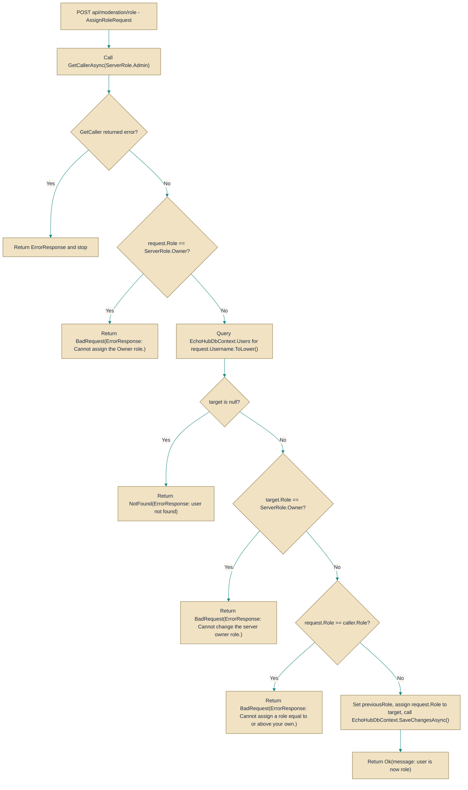

# ModerationController

> **File:** `src/EchoHub.Server/Controllers/ModerationController.cs`  
> **Kind:** class

*Figure: How ModerationController works.*



```csharp
[ApiController]
[Route("api/moderation")]
[Authorize]
[EnableRateLimiting("general")]
public class ModerationController : ControllerBase
```


Exposes HTTP endpoints under api/moderation for server moderation operations such as assigning roles, kicking users, and banning users. Reach for this controller when implementing administrative or moderation features (web UI, automated moderation tools, or internal scripts) that must enforce role hierarchy, persist changes to the user store, notify connected clients, and clean up presence/connection state.

## Remarks
This controller centralizes server-side moderation logic and enforces policy at the API boundary: callers must be authenticated and possess the appropriate ServerRole before actions are performed. It coordinates several responsibilities through injected services — persisting role changes via the DbContext, enumerating and notifying affected channels via the PresenceTracker and IChatBroadcaster implementations, forcing connection teardown and cleanup, and recording moderation metrics with ServerStatsCollector. The design keeps authorization and business rules (for example, preventing Owner reassignment and preventing actors from assigning or acting on users with equal or higher roles) inside the controller so callers cannot bypass them.

## Notes
- Usernames are normalized (lowercased) before lookup; callers should supply usernames case-insensitively.
- Role comparisons rely on the numeric ordering of ServerRole (the controller rejects assigning or acting on roles that are equal to or higher than the caller).
- Methods have observable side effects: database updates, broadcasts to connected clients, forced disconnects and presence cleanup, and server-stat increments — consumers should treat these endpoints as state-changing and potentially long-running operations.
- The controller logs moderation actions (role changes, kicks, etc.); ensure logging and monitoring are configured appropriately for audit purposes.