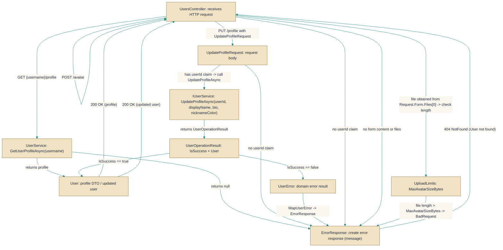

# UsersController

> **File:** `src/EchoHub.Server/Controllers/UsersController.cs`  
> **Kind:** class

*Figure: How UsersController works.*



```csharp
[ApiController]
[Route("api/users")]
[Authorize]
[EnableRateLimiting("general")]
public class UsersController : ControllerBase
```


Handles HTTP endpoints rooted at /api/users for authenticated user operations such as retrieving a user's public profile, updating the caller's profile, and uploading an avatar. The controller delegates business logic to IUserService and ImageToAsciiService, applies rate limiting and upload-size checks, and returns standard DTOs like ErrorResponse and AvatarUploadResponse.

## Remarks
This controller is the HTTP adapter for user-focused features: it validates requests and authorization, enforces upload and rate limits, converts uploaded images to ASCII art via ImageToAsciiService, and forwards profile and avatar changes to IUserService. It centralizes request-level concerns (model binding, auth, error translation) so the underlying services can remain framework-agnostic.

## Notes
- UploadAvatar requires a multipart/form POST (Request.HasFormContentType) and will reject requests with no files or files exceeding the configured UploadLimits.MaxAvatarSizeBytes.
- The controller reads the caller's user id from ClaimTypes.NameIdentifier and uses Guid.Parse; if the claim is present but malformed the parse will throw. The implementation assumes authenticated tokens supply a well-formed GUID.
- Take care when extending or changing image validation: FileValidationHelper.IsValidImage is called on the uploaded stream before ImageToAsciiService.ConvertToAscii is invoked. If validation reads the stream to its end without rewinding, the conversion will receive an empty stream — ensure the validation either rewinds the stream or operates on a buffered/copy of the data.