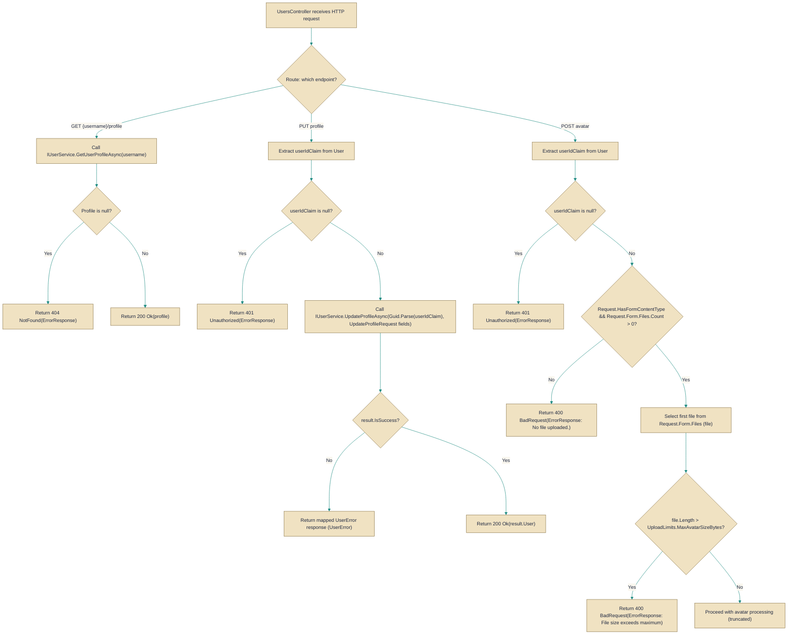

# UsersController

> **File:** `src/EchoHub.Server/Controllers/UsersController.cs`  
> **Kind:** class

*Figure: How UsersController works.*



```csharp
[ApiController]
[Route("api/users")]
[Authorize]
[EnableRateLimiting("general")]
public class UsersController : ControllerBase
```


Controller that exposes the HTTP surface for user profile and account-related operations under `api/users`, including profile retrieval, profile updates and avatar upload. Reach for `UsersController` when you need to translate authenticated HTTP requests into calls to the user, storage and broadcasting services (for example, calling [`IUserService`](../../EchoHub.Core/Contracts/IUserService.cs.md) to update a profile or [`ImageToAsciiService`](../../EchoHub.Core/Services/ImageToAsciiService.cs.md) to convert an uploaded avatar).

## Remarks
`UsersController` is an orchestration layer: it validates and normalizes incoming HTTP requests, enforces authentication and rate-limiting policies, performs lightweight validation (for example file size and image format checks), and delegates the domain work to collaborators such as [`IUserService`](../../EchoHub.Core/Contracts/IUserService.cs.md), [`ImageToAsciiService`](../../EchoHub.Core/Services/ImageToAsciiService.cs.md), [`FileStorageService`](../Services/FileStorageService.cs.md), [`PresenceTracker`](../Services/PresenceTracker.cs.md) and the collection of [`IChatBroadcaster`](../../EchoHub.Core/Contracts/IChatBroadcaster.cs.md) implementations. The controller centralizes common web concerns (claim extraction via `User.FindFirstValue`, mapping service results to HTTP responses with `MapUserError`, and producing [`ErrorResponse`](../../EchoHub.Core/DTOs/CommonDtos.cs.md)/[`AvatarUploadResponse`](../../EchoHub.Core/DTOs/ProfileDtos.cs.md) payloads) so the underlying services can remain focused on business logic. The `DeletedUserName` constant is a reserved tombstone username: [`UserService`](../Services/UserService.cs.md) will refuse to register it, and it is used when re-attributing messages after account deletion (messages re-attributed to `DeletedUserName`). Note also that exported account data includes stored messages but that any end-to-end encrypted room content remains ciphertext on the server (the controller preserves what the server stores, it does not decrypt client-side E2E content).

## Notes
- The controller is annotated with `Authorize`, so every action requires authentication by default. An action must be decorated with `AllowAnonymous` to be reachable without credentials.
- `UploadAvatar` expects a multipart/form-data request and will return `BadRequest` when `Request.Form.Files` is empty. It also enforces size limits using `_uploadLimits.MaxAvatarSizeBytes` and reports the limit in MB in the error text.
- `FileValidationHelper.IsValidImage` is used to allow only images (it recognizes JPEG, PNG, GIF and WebP). Because both validation and ASCII conversion operate on the same `Stream` (`file.OpenReadStream()`), ensure the validation method does not consume the stream or that the stream position is reset before calling `ImageToAsciiService.ConvertToAscii` — otherwise the conversion may see an empty stream.
- The controller extracts the caller identity using `User.FindFirstValue(ClaimTypes.NameIdentifier)` and then calls `Guid.Parse(...)`. If the claim is present but not a valid GUID this will throw; callers should ensure the claim is a GUID or the parsing should be hardened (for example with `Guid.TryParse`).
- Upload endpoints have a more specific rate limit: the controller-level `[EnableRateLimiting("general")]` applies broadly while `UploadAvatar` additionally uses `[EnableRateLimiting("upload")]`, so be aware of which policy will throttle a client.
- Many methods rely on `MapUserError` to convert domain errors into HTTP responses; consumers of these endpoints should expect standardized [`ErrorResponse`](../../EchoHub.Core/DTOs/CommonDtos.cs.md) payloads for error cases.