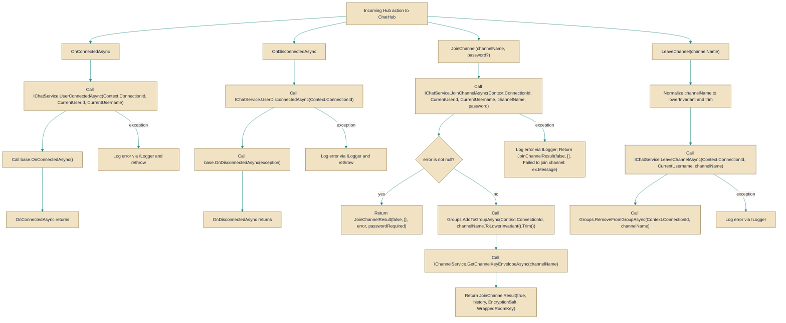

# ChatHub

> **File:** `src/EchoHub.Server/Hubs/ChatHub.cs`  
> **Kind:** class

*Figure: How ChatHub works.*



```csharp
[Authorize]
public class ChatHub : Hub<IEchoHubClient>
```


A SignalR hub that exposes real-time chat operations (connect/disconnect, join/leave channel, send messages) and bridges authenticated SignalR connections with the domain services that manage presence, channels and message delivery. Reach for `ChatHub` when you need a server-side, authenticated entry point that coordinates [`IChatService`](../../EchoHub.Core/Contracts/IChatService.cs.md) and [`IChannelService`](../../EchoHub.Core/Contracts/IChannelService.cs.md), manages SignalR groups, and forwards notifications to clients via the [`IEchoHubClient`](../../EchoHub.Core/Contracts/IEchoHubClient.cs.md) callbacks.

## Remarks
`ChatHub` is a thin application-layer adapter: it enforces authentication (the class is decorated with `Authorize`), resolves the current user from the SignalR `Context` claims via `CurrentUserId` and `CurrentUsername`, and delegates core logic to [`IChatService`](../../EchoHub.Core/Contracts/IChatService.cs.md) and [`IChannelService`](../../EchoHub.Core/Contracts/IChannelService.cs.md). It is responsible for SignalR group membership using `Groups.AddToGroupAsync` / `Groups.RemoveFromGroupAsync`, for logging errors via `ILogger<ChatHub>`, and for returning protocol-shaped results such as [`JoinChannelResult`](../../EchoHub.Core/DTOs/ChatDtos.cs.md) and client-facing error messages through the `IEchoHubClient.Error` callback. The hub intentionally does not perform domain operations itself — it translates connection-level events and client requests into calls to the underlying services and shapes the responses for connected clients.

## Notes
- `CurrentUserId` and `CurrentUsername` throw a `HubException` if the expected claims are absent; the `Authorize` attribute reduces this risk, but any token must contain `ClaimTypes.NameIdentifier` and a `"username"` claim for the hub to function.
- Channel names are normalized with `channelName.ToLowerInvariant().Trim()` before being used with SignalR groups; callers and services must use the same normalization to avoid mismatches in group membership.
- When `JoinChannel` succeeds for an encrypted channel the hub returns the channel key envelope obtained from `IChannelService.GetChannelKeyEnvelopeAsync` (the server comment notes members unwrap the room key client-side); do not expect the server to decrypt room content for clients.