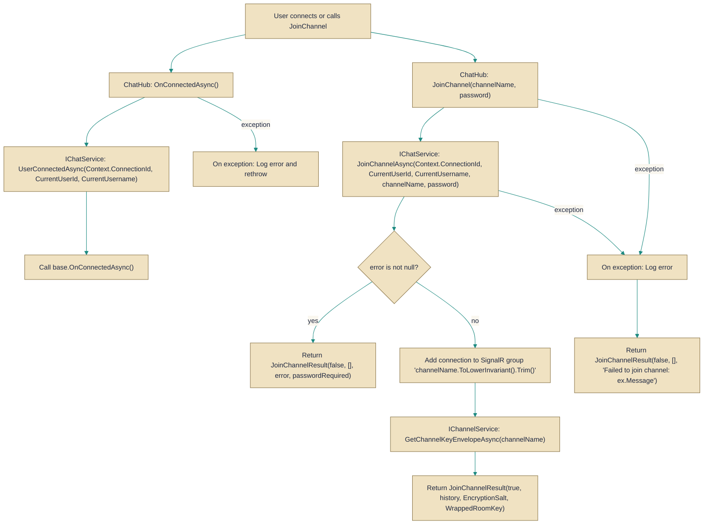

# ChatHub

> **File:** `src/EchoHub.Server/Hubs/ChatHub.cs`  
> **Kind:** class

*Figure: How ChatHub works.*



```csharp
[Authorize]
public class ChatHub : Hub<IEchoHubClient>
```


A SignalR Hub that exposes real-time chat operations to authenticated clients. ChatHub mediates between connected clients and the server-side chat logic (IChatService) and channel management (IChannelService), handling user connection lifecycle, channel join/leave actions, message sending, and delivery of channel encryption envelopes when applicable.

## Remarks
ChatHub is an authorization-guarded entrypoint for real-time chat behavior: it uses the caller's claims to identify the user, registers and deregisters connection state with IChatService on connect/disconnect, and forwards channel and message operations to the underlying domain services. It centralizes error logging and converts service-level outcomes into client-facing responses (for example, returning a JoinChannelResult or invoking Error on the caller). The hub also normalizes group names (lowercasing and trimming) and returns channel key envelopes from IChannelService for encrypted rooms so clients can unwrap room keys locally.

## Notes
- The hub requires authentication claims: CurrentUserId and CurrentUsername read from the connection's ClaimsPrincipal and will throw a HubException if the expected claims are missing. Ensure clients authenticate and include these claims.
- Channel names are normalized via ToLowerInvariant().Trim() before being added to or removed from SignalR groups; callers should expect case-insensitive channel membership.
- When joining encrypted channels the hub obtains an encryption salt and a wrapped room key from IChannelService and returns them to the client so the client can decrypt room keys locally — the server does not hold the raw room key.
- Connection lifecycle failures in OnConnectedAsync/OnDisconnectedAsync are logged and rethrown, while most per-operation failures return structured results or invoke Clients.Caller.Error so callers receive a clear error message without server-side leaks.