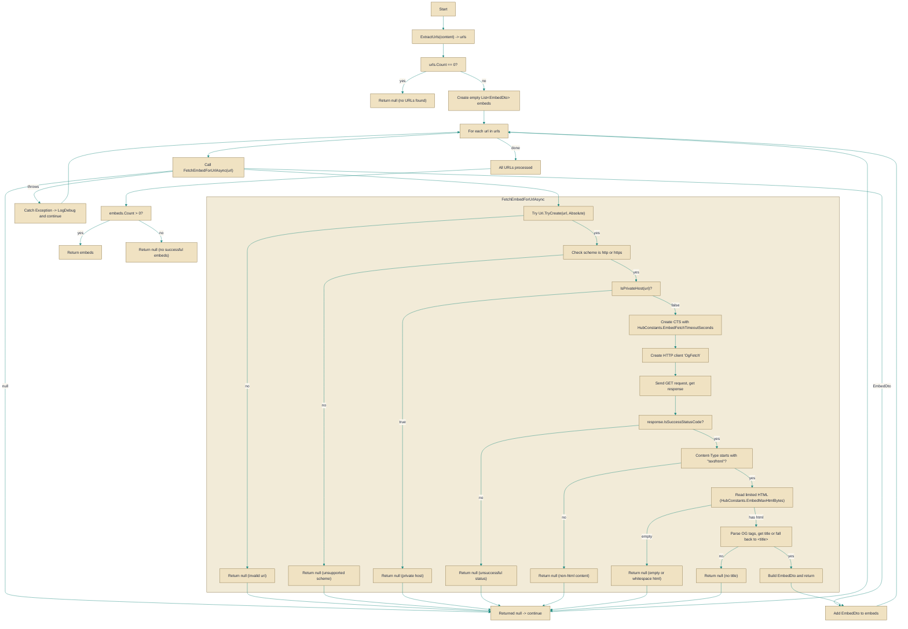

# LinkEmbedService

> **File:** `src/EchoHub.Server/Services/LinkEmbedService.cs`  
> **Kind:** class

*Figure: How LinkEmbedService works.*



```csharp
public partial class LinkEmbedService
```


Scans a piece of message text for URLs and attempts to produce lightweight link preview data (EmbedDto) by fetching and parsing Open Graph and common HTML metadata. Use TryGetEmbedsAsync when you need server-side link previews for chat messages and want a defensive, timeout- and size-limited fetch that never throws (it logs failures and returns null when no usable embeds are found).

## Remarks
LinkEmbedService centralizes the logic for discovering URLs in a message and converting remote HTML metadata into EmbedDto instances suitable for display. It is intentionally defensive: only absolute http/https URLs are considered, private hosts are skipped, fetches are limited by a cancellation timeout and a maximum HTML byte count (HubConstants), and only text/html responses are parsed. Errors during individual fetches are caught and logged at debug level so the caller observes either a list of successful embeds or null (no useful embeds).

## Example
```csharp
// Given an instance of LinkEmbedService (typically from DI):
var embeds = await linkEmbedService.TryGetEmbedsAsync(messageContent);
if (embeds is null)
{
    // No embeds found or all fetch attempts failed.
}
else
{
    Console.WriteLine($"Found {embeds.Count} embeds");
    foreach (var embed in embeds)
    {
        // render embed in UI or pass to presentation layer
    }
}
```

## Notes
- TryGetEmbedsAsync returns null when no URLs are present or when all fetches fail; it does not return an empty list in those cases—check for null before iterating. 
- The service expects an IHttpClientFactory and creates a client with the name "OgFetch"; ensure your HttpClient configuration (handlers, DNS/timeout policies) is appropriate for remote HTML fetches.
- HTML metadata extraction is heuristic: it uses Open Graph tags, falls back to a <title> regex, reads only the first N bytes of HTML, and truncates long descriptions per HubConstants. Consumers should treat returned fields as untrusted display content and apply any necessary sanitization in the UI layer.