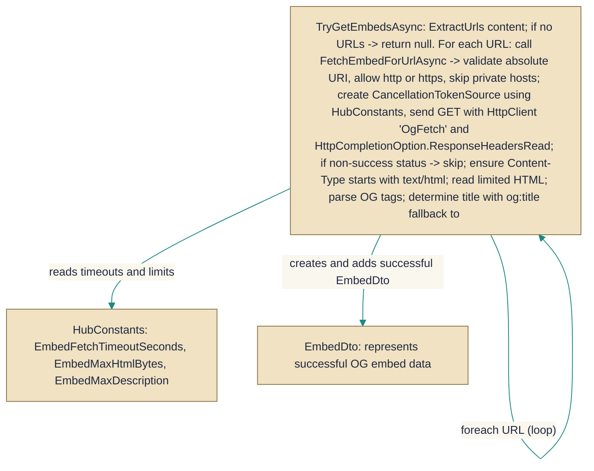

# LinkEmbedService

> **File:** `src/EchoHub.Server/Services/LinkEmbedService.cs`  
> **Kind:** class

*Figure: How LinkEmbedService works.*



```csharp
public partial class LinkEmbedService
```


Detects and fetches Open Graph-style embed metadata for any URLs found in a piece of message `content`. Use `LinkEmbedService` (via its `TryGetEmbedsAsync` method) when you want a best-effort, non-throwing attempt to produce [`EmbedDto`](../../EchoHub.Core/DTOs/ChatDtos.cs.md) objects for links inside user messages — for example, to show link previews — and you want network, size and privacy protections applied automatically.

## Remarks
`LinkEmbedService` centralizes link-preview logic so callers do not have to implement URL extraction, host-safety checks, HTTP fetching, HTML-size limits, or Open Graph parsing themselves. The public `TryGetEmbedsAsync` method returns `null` when no useful embed data is available (either because no URLs were found or all fetch attempts failed) and never throws; individual fetch failures are caught and logged at debug level. Internally it calls the private `FetchEmbedForUrlAsync` for each URL which enforces absolute `http`/`https` URIs, rejects private hosts via `IsPrivateHost`, uses an `IHttpClientFactory`-created client named `"OgFetch"`, applies a `CancellationTokenSource` timeout (`HubConstants.EmbedFetchTimeoutSeconds`), requires a `text/html` response, bounds the HTML read size (`HubConstants.EmbedMaxHtmlBytes`), extracts Open Graph tags (falling back to the `<title>` tag), decodes HTML entities with `WebUtility.HtmlDecode`, and truncates long descriptions to `HubConstants.EmbedMaxDescriptionLength`.

## Notes
- The service expects an `IHttpClientFactory` client named `"OgFetch"` to be configured; network policy (proxies, handlers) should be applied on that named client rather than relying on this class to set HTTP options. 
- Fetching is constrained by time and size: a cancellation timeout (`HubConstants.EmbedFetchTimeoutSeconds`) and a maximum number of HTML bytes (`HubConstants.EmbedMaxHtmlBytes`) are enforced; pages that exceed these limits may yield no embed. 
- Only absolute `http`/`https` URLs are considered and private/internal hosts are explicitly ignored by `IsPrivateHost`; the method will return `null` instead of an [`EmbedDto`](../../EchoHub.Core/DTOs/ChatDtos.cs.md) for such URLs. 
- Failures during individual URL fetches are swallowed (logged at debug) so `TryGetEmbedsAsync` remains non-throwing for callers — check logs when embeds are unexpectedly missing.