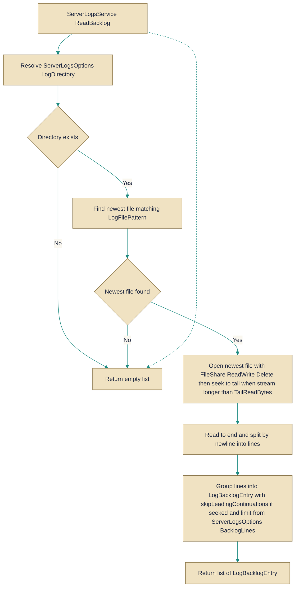

# ServerLogsService.cs

> **Source:** `src/EchoHub.Server/Services/ServerLogs/ServerLogsService.cs`

*Figure: How ServerLogsService works.*



## Contents

- [ServerLogsService](#serverlogsservice)
- [LogBacklogEntry](#logbacklogentry)

---

## ServerLogsService
> **File:** `src/EchoHub.Server/Services/ServerLogs/ServerLogsService.cs`  
> **Kind:** class

```csharp
public sealed class ServerLogsService
```


Provides the logic needed to present a read-only "live logs" room: it exposes the room identity, the role-based gate for who may join, and a best-effort reader that returns the most recent log entries from the active rolling Serilog file. Use this service when you need to show a live, read-only backlog of server log entries (rather than storing log lines as chat messages).

## Remarks
This class centralizes the concerns required for a live log room: determining the configured room name and sender, enforcing the minimum role required to view logs, and extracting a focused backlog from the current log file on disk. It treats the file sink as the single source of truth (Serilog keeps the file open and rolls it), reads only the tail of the newest file up to a bounded byte size, and groups raw lines into logical entries by detecting timestamp-prefixed lines. ReadBacklog is resilient: any I/O or parsing problem yields an empty backlog rather than propagating an error.

## Example
```csharp
// 'options' is an existing ServerLogsOptions instance configured for the server.
var service = new ServerLogsService(options);

// Check whether a user role may view/join the live logs room
if (service.CanView(userRole))
{
    // Read the most recent backlog entries (best-effort; may be empty on error)
    var backlog = service.ReadBacklog();
    foreach (var entry in backlog)
    {
        // LogBacklogEntry exposes a timestamp and the concatenated content
        Console.WriteLine($"{entry.Timestamp:O} {entry.Content}");
    }
}

// Room identity helpers
var isLogs = service.IsLogsChannel("logs");
var sender = ServerLogsService.SenderName; // "server"
```

## Notes
- ReadBacklog swallows all exceptions and returns an empty list on any I/O problem; callers must tolerate an empty backlog as a sign of transient failure or missing files.
- To avoid reading an arbitrarily large file, the reader seeks to the last TailReadBytes bytes; that can start the scan mid-entry, so the grouping logic optionally drops leading continuation lines when the tail was seeked.
- The FileStream is opened with FileShare.ReadWrite | FileShare.Delete because the Serilog file sink typically keeps the file open for writing and may roll it; the service reads concurrently without taking exclusive locks.

---

## LogBacklogEntry
> **File:** `src/EchoHub.Server/Services/ServerLogs/ServerLogsService.cs`  
> **Kind:** record

```csharp
public record LogBacklogEntry(DateTimeOffset Timestamp, string Content)
```

**Parameters:**

| Parameter | Type | Default |
|-----------|------|---------|
| `Timestamp` | `DateTimeOffset` | — |
| `Content` | `string` | — |


LogBacklogEntry is a tiny, immutable data container that models a single backlog item read from the server log file. It captures the timestamp of the original log line via Timestamp and the associated log text in Content, which may include the initial line plus any continuation lines (such as exception stack traces) that followed it. Use this type when you need to treat a complete backlog segment as a unit, instead of handling raw lines individually; it’s especially helpful for grouping, displaying, or analyzing backlog entries after parsing.

## Remarks
Because LogBacklogEntry is a record, it benefits from value-based equality and concise deconstruction, making it easy to compare backlog entries or to extract the fields in pattern-matching. The Content field holds a multi-line string that includes the initial line and any continuation text that followed it; consumers should be aware that the entry may span multiple lines. This type is commonly produced by the server log reader (e.g., ServerLogsService) when assembling backlog entries from the log file, serving as a stable data carrier between parsing and presentation layers.

## Notes
- When collecting backlog lines, ensure that each entry groups the initial timestamped line with its subsequent continuation lines exactly once; splitting or merging entries incorrectly can corrupt the log's temporal grouping.


---