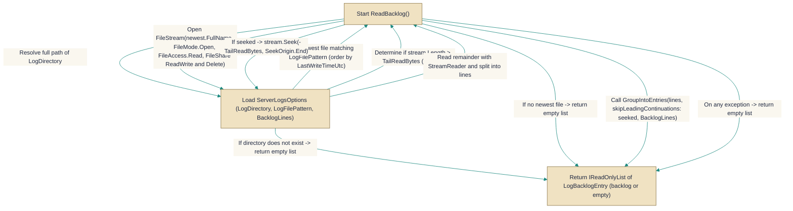

# ServerLogsService.cs

> **Source:** `src/EchoHub.Server/Services/ServerLogs/ServerLogsService.cs`

*Figure: How ServerLogsService works.*



## Contents

- [ServerLogsService](#serverlogsservice)
- [LogBacklogEntry](#logbacklogentry)

---

## ServerLogsService
> **File:** `src/EchoHub.Server/Services/ServerLogs/ServerLogsService.cs`  
> **Kind:** class

```csharp
public sealed class ServerLogsService
```


Provides utilities for exposing a read-only, live server log room: it knows the room identity and access gate and can read the tail of the current rolling log file into `LogBacklogEntry` items for display. Use `ServerLogsService` when you need to determine whether a channel is the configured logs room, check whether a role may view logs, or retrieve a best-effort backlog snapshot from the most recent log file (rather than relying on persisted messages).

## Remarks
`ServerLogsService` centralizes the concerns around presenting live server logs without persisting log lines as messages. It uses the configured [`ServerLogsOptions`](../../Config/ServerLogsOptions.cs.md) to decide whether logging is enabled, to match a channel name (`NormalizedRoomName`) in `IsLogsChannel`, and to gate access with `CanView` based on `MinRole`. For backlog retrieval, `ReadBacklog` opens the newest file matching `LogFilePattern` in `LogDirectory` with `FileShare.ReadWrite | FileShare.Delete` (to cooperate with a rolling sink like Serilog), reads up to `TailReadBytes` from the file end, and converts raw lines into `LogBacklogEntry` instances via `GroupIntoEntries`. The `GroupIntoEntries` method is public to allow unit testing of the timestamp-based grouping logic.

## Notes
- `IsLogsChannel` calls `Trim()` on the provided `channelName`; passing `null` will throw a `NullReferenceException` — callers should ensure they pass a non-null string or guard accordingly.
- `ReadBacklog` is intentionally best-effort: it catches all exceptions and returns an empty list on any I/O or parsing failure. This prevents join failures but can hide filesystem problems; monitor logs or surface errors elsewhere if you need diagnostics.
- The grouping logic depends on lines that start with the timestamp format defined by `TimestampFormat`. If your log sink uses a different timestamp template, `GroupIntoEntries` will treat those timestamped lines as continuations and entries will be merged incorrectly.
- When the newest file is larger than `TailReadBytes`, `ReadBacklog` seeks into the file and sets `skipLeadingContinuations` so a partial entry at the seek boundary is dropped. This is deliberate to avoid presenting truncated entries but means very long single entries near the file end can be partially excluded.

---

## LogBacklogEntry
> **File:** `src/EchoHub.Server/Services/ServerLogs/ServerLogsService.cs`  
> **Kind:** record

```csharp
public record LogBacklogEntry(DateTimeOffset Timestamp, string Content)
```

**Parameters:**

| Parameter | Type | Default |
|-----------|------|---------|
| `Timestamp` | `DateTimeOffset` | — |
| `Content` | `string` | — |


LogBacklogEntry is an immutable value object that captures a backlog entry read from the log file. It consists of a timestamp (`Timestamp`) and the associated content (`Content`), representing the first line of the backlog entry plus any continuation lines (such as exception stack traces) that followed it.

## Remarks
Because this is a `record`, it provides value-based equality and deconstruction, which simplifies comparing backlog entries and passing them through the processing pipeline without mutation. It acts as a lightweight data carrier that decouples raw log parsing from higher-level log aggregation or display concerns, allowing the server logs service to operate on coherent chunks of log data.

## Notes
- The `Content` may be large and contain newline characters representing multi-line stack traces; treat it as an opaque blob when storing or transmitting.

---