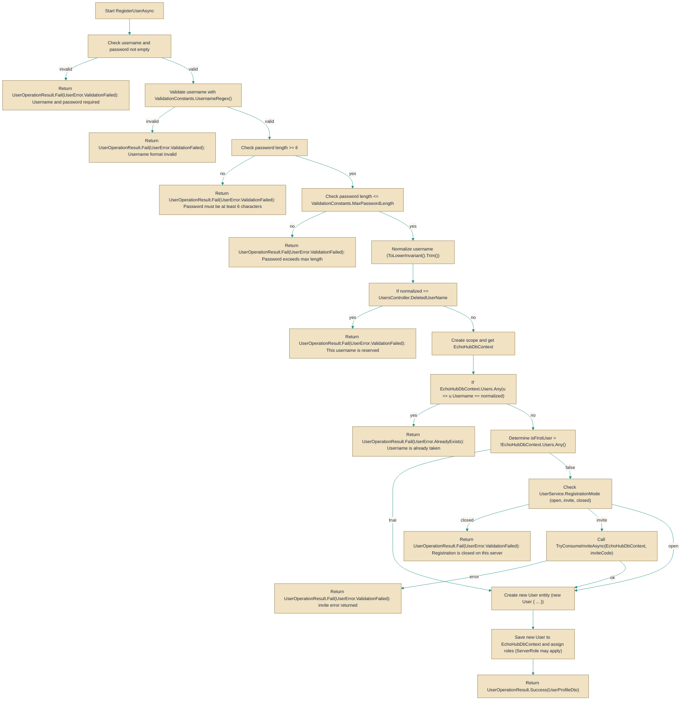

# UserService

> **File:** `src/EchoHub.Server/Services/UserService.cs`  
> **Kind:** class

*Figure: How UserService works.*



```csharp
public class UserService : IUserService
```


Handles user registration and related user-management concerns for the server. Use `UserService` when you need a high-level operation that validates credentials, enforces server-wide registration policy, creates the initial server owner account, hashes passwords, and returns canonical [`UserOperationResult`](../../EchoHub.Core/DTOs/CommonDtos.cs.md) responses instead of interacting with [`EchoHubDbContext`](../Data/EchoHubDbContext.cs.md) directly.

## Remarks
`UserService` encapsulates the rules and side effects required to create a new [`User`](../../EchoHub.Core/Models/User.cs.md) in the application: it validates the `username` with `ValidationConstants.UsernameRegex()`, enforces password length (minimum 6 characters and a maximum of `ValidationConstants.MaxPasswordLength`), normalizes the username to lowercase and trimmed form, prevents use of the reserved `Controllers.UsersController.DeletedUserName`, and checks uniqueness using [`EchoHubDbContext`](../Data/EchoHubDbContext.cs.md). The `RegistrationMode` property reads `Server:Registration` from `IConfiguration` and controls whether new sign-ups are allowed (`"open"`), require a valid invite (`"invite"`), or are disallowed (`"closed"`). The very first account created on an empty database is automatically assigned `ServerRole.Owner` to allow server bootstrap. For invite-based registration, `UserService` defers to the private `TryConsumeInviteAsync` routine which (per its comment) performs a guarded update so concurrent registrations cannot both consume the same invite.

## Example
```csharp
// Given an IUserService instance (e.g. resolved from DI):
var result = await userService.RegisterUserAsync("alice", "s3cret!", displayName: "Alice");
if (result.IsSuccess)
{
    var profile = result; // result carries the created [`UserProfileDto`](../../EchoHub.Core/DTOs/ProfileDtos.cs.md) via `UserOperationResult.Success`
    // proceed with login or return profile to caller
}
else
{
    // handle failure: message and [`UserError`](../../EchoHub.Core/DTOs/CommonDtos.cs.md) are available from the [`UserOperationResult`](../../EchoHub.Core/DTOs/CommonDtos.cs.md) returned
}
```

## Notes
- The `RegistrationMode` is computed on each access from `IConfiguration["Server:Registration"]`; changing that configuration at runtime affects subsequent calls to `RegisterUserAsync` immediately.
- The first created user bypasses invite/closed checks and is assigned `ServerRole.Owner`; this is intentional to allow initial server bootstrap and means the first successful registration must be protected in deployment scenarios.
- `RegisterUserAsync` normalizes usernames to lowercase and trims them before uniqueness checks, so the system enforces case-insensitive username uniqueness. Passwords are hashed with `BCrypt.Net.BCrypt.HashPassword` before being stored.