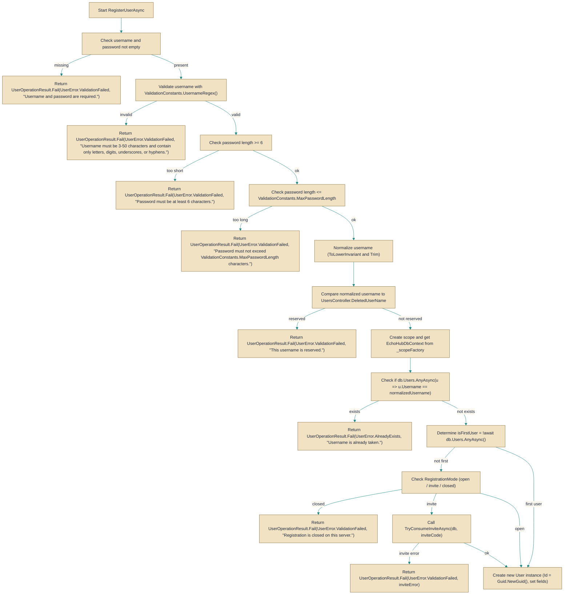

# UserService

> **File:** `src/EchoHub.Server/Services/UserService.cs`  
> **Kind:** class

*Figure: How UserService works.*



```csharp
public class UserService : IUserService
```


Implements user-account operations for the server, most notably account registration. Use this concrete IUserService implementation when you need the server-backed behavior: configuration-driven registration modes (open / invite / closed), automatic owner bootstrap for the very first account, username/password validation, reserved-name checks, and password hashing before persisting users.

## Remarks
UserService is the server-side implementation of IUserService and is responsible for safe, policy-driven user creation. It reads the registration policy from IConfiguration (Server:Registration), uses an IServiceScopeFactory to create a scoped EchoHubDbContext per operation (so the service can be used from different DI lifetimes), and enforces validation rules from ValidationConstants. The very first account created on a fresh database is always promoted to ServerRole.Owner to allow bootstrapping an administration account. Invite consumption (when registration is in "invite" mode) is performed via an atomic/guarded update to avoid races when two registrations attempt to use the last invite simultaneously.

## Example
```csharp
// Typical usage from an async context where `userService` is resolved from DI
var result = await userService.RegisterUserAsync("alice", "s3cretP@ss", displayName: "Alice");
if (result.IsSuccess)
{
    var profile = result; // UserOperationResult.Success wraps the created UserProfileDto
    // proceed with signed-in flow
}
else
{
    // registration failed; map user-visible error to response
}
```

## Notes
- Username handling: the service normalizes usernames by trimming and lower-casing; a specific reserved name (UsersController.DeletedUserName) is rejected.
- The first user bypasses the registration gate and becomes ServerRole.Owner — this is intentional so a fresh server can be bootstrapped.
- Passwords are hashed using BCrypt.Net.BCrypt.HashPassword before being stored; there is no exposed mechanism here to change the hash algorithm.
- Invite consumption uses a guarded database update to prevent two concurrent registrations from both consuming the last available use of a code; if invite validation fails, RegisterUserAsync returns a validation failure with the invite error message.