# DataMigrationService

> **File:** `src/EchoHub.Server/Setup/DataMigrationService.cs`  
> **Kind:** class

*Figure: How DataMigrationService works.*

```mermaid
%%{init: {'theme':'base','themeVariables':{'background':'#faf7ef','primaryColor':'#f0e2c2','primaryTextColor':'#1f2840','primaryBorderColor':'#8a7548','secondaryColor':'#d9efec','secondaryBorderColor':'#1d8a80','secondaryTextColor':'#1f2840','tertiaryColor':'#f2ebd8','tertiaryBorderColor':'#8a7548','tertiaryTextColor':'#1f2840','lineColor':'#1d8a80','titleColor':'#1f2840','fontSize':'14px','edgeLabelBackground':'#faf7ef','clusterBkg':'#f2ebd8','clusterBorder':'#8a7548','actorBkg':'#f0e2c2','actorBorder':'#8a7548','actorTextColor':'#1f2840','actorLineColor':'#8a7548','signalColor':'#1d8a80','signalTextColor':'#1f2840','activationBkgColor':'#d9efec','activationBorderColor':'#1d8a80','noteBkgColor':'#f2ebd8','noteBorderColor':'#8a7548','noteTextColor':'#1f2840','labelBoxBkgColor':'#f0e2c2','labelBoxBorderColor':'#8a7548','labelTextColor':'#1f2840','transitionColor':'#1d8a80','transitionLabelColor':'#1f2840','stateLabelColor':'#1f2840','altBackground':'#f2ebd8'}}}%%
flowchart TB
  Start["DataMigrationService.RunAsync(IServiceProvider)"]
  Scope["Create scope and resolve services"]
  GetServices["Get EchoHubDbContext, IConfiguration and ILogger"]

  EnsureDefault["Call EnsureDefaultChannelsPublicAsync(db, logger)"]
  CheckDefault{"Channel named HubConstants.DefaultChannel exists and IsPublic == false?"}
  UpdateDefault["Set Channel.IsPublic = true; await db.SaveChangesAsync(); logger.LogInformation"]
  SkipDefault["No change"]
  AfterDefault["Continue to next migration"]

  MigrateAnsi["Call MigrateAnsiMessagesAsync(db, logger)"]
  LoadImages["Load EchoHubDbContext.Messages where Type == MessageType.Image"]
  FilterAnsi["Filter messages where Content contains ESC (0x1B) -> toMigrate list"]
  AnsiEmpty{"toMigrate.Count == 0?"}
  AnsiProcess["For each message: converted = AnsiToColorTags(Content); if changed set Content and increment modified"]
  AnsiSave{"modified > 0?"}
  AnsiSaved["await db.SaveChangesAsync(); logger.LogInformation of migrated count"]

  MigrateEmbed["Call MigrateEmbedJsonToArrayAsync(db, logger) - convert legacy embed JSON to EmbedDto array where needed"]
  MigrateAttachments["Call MigrateLegacyAttachmentsAsync(db, logger) - migrate Attachment entities to new AttachmentKind/format"]
  EnsureAdmins["Call EnsureConfiguredAdminsAsync(db, config, logger) - ensure ServerRole admin users per config"]
  End["RunAsync complete"]

  Start --> Scope --> GetServices --> EnsureDefault --> CheckDefault
  CheckDefault -- "yes" --> UpdateDefault --> AfterDefault
  CheckDefault -- "no" --> SkipDefault --> AfterDefault

  AfterDefault --> MigrateAnsi --> LoadImages --> FilterAnsi --> AnsiEmpty
  AnsiEmpty -- "yes" --> MigrateEmbed
  AnsiEmpty -- "no" --> AnsiProcess --> AnsiSave
  AnsiSave -- "yes" --> AnsiSaved --> MigrateEmbed
  AnsiSave -- "no" --> MigrateEmbed

  MigrateEmbed --> MigrateAttachments --> EnsureAdmins --> End
```



```csharp
public static partial class DataMigrationService
```


Performs application data migrations that should run at startup. Call `RunAsync(IServiceProvider)` once (for example during application startup) to perform a series of idempotent migrations against the [`EchoHubDbContext`](../Data/EchoHubDbContext.cs.md): make the default channel public, convert legacy ANSI color escape sequences to printable color tags, migrate embed JSON to the newer array form, fold legacy single-row attachments into the `Attachments` table, and ensure configured admin users exist.

## Remarks
`DataMigrationService` centralizes small, targeted transformations that evolve persisted chat data between versions. Each migration method (for example, `EnsureDefaultChannelsPublicAsync`, `MigrateAnsiMessagesAsync`, `MigrateEmbedJsonToArrayAsync`, `MigrateLegacyAttachmentsAsync`, and `EnsureConfiguredAdminsAsync`) is written to be safe to run repeatedly: migrated rows are detected and skipped if already-upgraded so the service can be invoked on every startup without duplicating work. The service resolves a scoped [`EchoHubDbContext`](../Data/EchoHubDbContext.cs.md) (and `IConfiguration`/`ILoggerFactory`) from the provided `IServiceProvider`, performs database changes, and logs what changed.

The ANSI conversion helper `AnsiToColorTags` is exposed for reuse and relies on a generated regex (`AnsiColorRegex`) to efficiently match 24-bit foreground (`38;2;R;G;B`) and background (`48;2;R;G;B`) color sequences and the reset code (`0`). Matches are transformed to `{F:RRGGBB}`, `{B:RRGGBB}`, and `{X}` respectively.

## Notes
- `RunAsync` resolves [`EchoHubDbContext`](../Data/EchoHubDbContext.cs.md), `IConfiguration`, and `ILoggerFactory` from the provided `IServiceProvider`; ensure those services are registered in DI before calling `RunAsync`.
- `MigrateAnsiMessagesAsync` assumes `Message.Content` is populated (the code calls `m.Content.Contains('\x1b')`). If `Message.Content` can be null in your schema, the migration may throw a `NullReferenceException` — validate non-null constraints or add a null-check before running this migration.
- `AnsiToColorTags` only converts the specific 24-bit RGB sequences (`38;2` and `48;2`) and the reset code (`0`). Other ANSI sequences are left unchanged by design; if older clients used different ANSI sequences they will not be translated by this helper.