# DataMigrationService

> **File:** `src/EchoHub.Server/Setup/DataMigrationService.cs`  
> **Kind:** class

*Figure: How DataMigrationService works.*

```mermaid
%%{init: {'theme':'base','themeVariables':{'background':'#faf7ef','primaryColor':'#f0e2c2','primaryTextColor':'#1f2840','primaryBorderColor':'#8a7548','secondaryColor':'#d9efec','secondaryBorderColor':'#1d8a80','secondaryTextColor':'#1f2840','tertiaryColor':'#f2ebd8','tertiaryBorderColor':'#8a7548','tertiaryTextColor':'#1f2840','lineColor':'#1d8a80','titleColor':'#1f2840','fontSize':'14px','edgeLabelBackground':'#faf7ef','clusterBkg':'#f2ebd8','clusterBorder':'#8a7548','actorBkg':'#f0e2c2','actorBorder':'#8a7548','actorTextColor':'#1f2840','actorLineColor':'#8a7548','signalColor':'#1d8a80','signalTextColor':'#1f2840','activationBkgColor':'#d9efec','activationBorderColor':'#1d8a80','noteBkgColor':'#f2ebd8','noteBorderColor':'#8a7548','noteTextColor':'#1f2840','labelBoxBkgColor':'#f0e2c2','labelBoxBorderColor':'#8a7548','labelTextColor':'#1f2840','transitionColor':'#1d8a80','transitionLabelColor':'#1f2840','stateLabelColor':'#1f2840','altBackground':'#f2ebd8'}}}%%
flowchart TB
Start["Start"]
Scope["Create scope and resolve EchoHubDbContext"]
EnsureDefault["Call EnsureDefaultChannelsPublicAsync(EchoHubDbContext)"]
QueryGeneral["Query Channel where Name == HubConstants.DefaultChannel"]
CheckGeneral{"Channel found and Channel.IsPublic == false?"}
MarkPublic["Set Channel.IsPublic = true and save EchoHubDbContext"]
SkipMark["No change"]
MigrateAnsi["Call MigrateAnsiMessagesAsync(EchoHubDbContext)"]
QueryImages["Load messages where Type == MessageType.Image"]
FilterAnsi["Filter messages where Content contains ESC byte"]
CheckCount{"toMigrate.Count == 0?"}
LogFound["Log found messages and prepare migration"]
ConvertLoop["For each message: convert ANSI to color tags and update Content if changed"]
CheckModified{"modified > 0?"}
SaveModified["Save changes to EchoHubDbContext and log migrated count"]
SkipSave["No modifications to save"]
CallEmbed["Call MigrateEmbedJsonToArrayAsync to migrate EmbedDto JSON to array"]
CallAttach["Call MigrateLegacyAttachmentsAsync to migrate Attachment/AttachmentKind"]
CallAdmins["Call EnsureConfiguredAdminsAsync to ensure ServerRole admins configured"]
End["End"]

Start --> Scope
Scope --> EnsureDefault
EnsureDefault --> QueryGeneral
QueryGeneral --> CheckGeneral
CheckGeneral -->|"Yes"| MarkPublic
CheckGeneral -->|"No"| SkipMark
MarkPublic --> MigrateAnsi
SkipMark --> MigrateAnsi
MigrateAnsi --> QueryImages
QueryImages --> FilterAnsi
FilterAnsi --> CheckCount
CheckCount -->|"Yes"| CallEmbed
CheckCount -->|"No"| LogFound
LogFound --> ConvertLoop
ConvertLoop --> CheckModified
CheckModified -->|"Yes"| SaveModified
CheckModified -->|"No"| SkipSave
SaveModified --> CallEmbed
SkipSave --> CallEmbed
CallEmbed --> CallAttach
CallAttach --> CallAdmins
CallAdmins --> End
```



```csharp
public static partial class DataMigrationService
```


Runs a set of application-level data migrations that update content and small structural pieces of the database when the server starts. Call this during application startup (once) to apply idempotent, content-format migrations such as making the default channel public, converting legacy ANSI art to printable color tags, folding legacy attachment columns into the Attachments table, and other one-off data fixes.

## Remarks
This class centralizes lightweight, code-driven migrations that operate on row data and content formats rather than schema changes (which belong in EF migrations). Each migration method scopes a DbContext from the provided IServiceProvider and performs targeted, idempotent updates where possible (for example, legacy single-attachment rows are only migrated when no Attachment rows exist). Conversions that change message content (like ANSI→color tags) are deterministic and saved back with SaveChangesAsync.

## Notes
- AnsiToColorTags only recognizes/reset sequences produced as "\x1b[38;2;R;G;Bm", "\x1b[48;2;R;G;Bm" and the reset "\x1b[0m"; other ANSI sequences are left unchanged.
- MigrateAnsiMessagesAsync only examines messages of type Image and checks for the ESC (0x1B) character before attempting conversion, reducing unnecessary work.
- Each migration method calls SaveChangesAsync only when there are actual modifications; however RunAsync itself is asynchronous and can be long-running depending on DB size—callers should await it during startup and avoid calling concurrently.