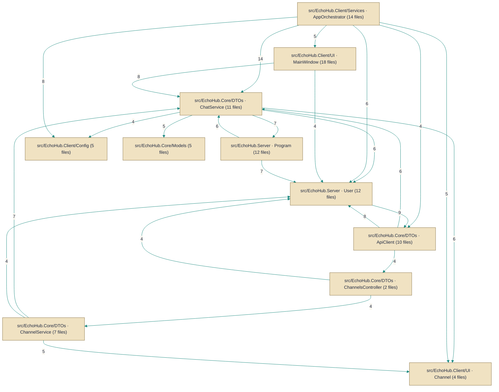

# Architecture — HueByte/EchoHub

> *Auto-synthesized from 598 documented symbols across 128 files on `master`.*

## Topic Guides

Deep-dives into cross-cutting concerns synthesized from the per-symbol corpus.

- [API client and authentication](api-client-authentication.md) — How the EchoHub client authenticates with the server, handles tokens, and defines authentication DTOs.
- [Theming and UI color management](ui-theming.md) — Representing themes, color palettes, and runtime theme application.
- [Real-time connection management](real-time-connection.md) — Managing the SignalR hub connection lifecycle and connection state.
- [Encryption and room key management](encryption-roomkeys.md) — End-to-end encryption plumbing and secure handling of per-channel room keys.
- [Command handling](command-handling.md) — Slash-command parsing and dispatching command actions from UI and orchestrator.
- [Attachments and file transfers](attachments-transfer.md) — Staging and sending attachments in chat messages and coordinating outbound attachments.
- [Clipboard utilities](clipboard-tools.md) — Helpers for clipboard interactions: files and images.
- [Update management](update-management.md) — Data and update flow: backup prior to updates and update checks.

## Architecture Diagram

## System Overview
EchoHub is a client/server chat system that exposes an HTTP API implemented by multiple controllers and a realtime messaging surface via a hub (ChatHub), with client-side components for connecting and playback. The server hosts application services and background workers (e.g. file cleanup, data migrations) that implement business logic and maintenance tasks. Persistent state is stored in the Entity Framework DbContext (EchoHubDbContext) which is used by controllers and services. Clients interact with the server through the ApiClient and implement messaging callbacks against the IEchoHubClient contract.

## Key Components
**Controllers** — HTTP API surface for client and administrative actions. Implemented by [`AuthController`](../Code/src/EchoHub.Server/Controllers/AuthController.cs.md), [`ChannelsController`](../Code/src/EchoHub.Server/Controllers/ChannelsController.cs.md), [`FilesController`](../Code/src/EchoHub.Server/Controllers/FilesController.cs.md), [`InvitesController`](../Code/src/EchoHub.Server/Controllers/InvitesController.cs.md), [`ModerationController`](../Code/src/EchoHub.Server/Controllers/ModerationController.cs.md), [`ServerController`](../Code/src/EchoHub.Server/Controllers/ServerController.cs.md), [`UsersController`](../Code/src/EchoHub.Server/Controllers/UsersController.cs.md).

**Services** — Application services implement business logic, file handling, background tasks, and utilities used by controllers and hubs. Implemented by [`ChannelService`](../Code/src/EchoHub.Server/Services/ChannelService.cs.md), [`ChatService`](../Code/src/EchoHub.Server/Services/ChatService.cs.md), [`FileStorageService`](../Code/src/EchoHub.Server/Services/FileStorageService.cs.md), [`FileCleanupService`](../Code/src/EchoHub.Server/Services/FileCleanupService.cs.md), and supporting utilities such as [`AsciiBannerService`](../Code/src/EchoHub.Core/Services/AsciiBannerService.cs.md), [`AudioPlaybackService`](../Code/src/EchoHub.Client/Services/AudioPlaybackService.cs.md), [`ClientEncryptionService`](../Code/src/EchoHub.Client/Services/ClientEncryptionService.cs.md), and [`DataMigrationService`](../Code/src/EchoHub.Server/Setup/DataMigrationService.cs.md).

**Workers / Hubs** — Real-time messaging and hosted work are provided by SignalR-style hubs and background services; the primary realtime hub is implemented by [`ChatHub`](../Code/src/EchoHub.Server/Hubs/ChatHub.cs.md).

**Data Access** — Persistent application state is managed via the Entity Framework DbContext used across services and controllers: [`EchoHubDbContext`](../Code/src/EchoHub.Server/Data/EchoHubDbContext.cs.md).

**External Clients** — Client-side communication with the server is encapsulated by an HTTP/real-time client and the client contract. Implemented by [`ApiClient`](../Code/src/EchoHub.Client/Services/ApiClient.cs.md) and the client interface [`IEchoHubClient`](../Code/src/EchoHub.Core/Contracts/IEchoHubClient.cs.md).

**Configuration** — Server runtime options and feature flags are defined in option classes used by services and integrations. Implemented by [`IrcOptions`](../Code/src/EchoHub.Server.Irc/IrcOptions.cs.md), [`ServerLogsOptions`](../Code/src/EchoHub.Server/Config/ServerLogsOptions.cs.md), [`SpamOptions`](../Code/src/EchoHub.Server/Config/SpamOptions.cs.md), [`StatsOptions`](../Code/src/EchoHub.Server/Config/StatsOptions.cs.md).

**IRC integration** — IRC-related command handling and service wiring are provided by IRC support classes and extensions. Implemented by [`IrcServiceExtensions`](../Code/src/EchoHub.Server.Irc/IrcServiceExtensions.cs.md) and [`IrcCommandHandler`](../Code/src/EchoHub.Server.Irc/IrcCommandHandler.cs.md).

**Core Contracts** — Domain and integration interfaces that define service boundaries and encryption abstractions. Implemented by [`IChannelService`](../Code/src/EchoHub.Core/Contracts/IChannelService.cs.md), [`IChatService`](../Code/src/EchoHub.Core/Contracts/IChatService.cs.md), [`IMessageEncryptionService`](../Code/src/EchoHub.Core/Contracts/IMessageEncryptionService.cs.md), and [`IUserService`](../Code/src/EchoHub.Core/Contracts/IUserService.cs.md).

## Component Map

*Subsystems below are structural clusters detected from the dependency graph — groups of symbols more densely wired to each other than to the rest of the codebase.*

- **src/EchoHub.Client/UI · MainWindow** — 18 documented files
- **src/EchoHub.Client/Services · AppOrchestrator** — 14 documented files
- **src/EchoHub.Server · Program** — 12 documented files
- **src/EchoHub.Server · User** — 12 documented files
- **src/EchoHub.Core/DTOs · ChatService** — 11 documented files
- **src/EchoHub.Core/DTOs · ApiClient** — 10 documented files
- **src/EchoHub.Core/DTOs · ChannelService** — 7 documented files
- **src/EchoHub.Client/Config** — 5 documented files
- **src/EchoHub.Core/Models** — 5 documented files
- **src/EchoHub.Client/Themes** — 4 documented files
- **src/EchoHub.Client/UI · Channel** — 4 documented files
- **src/EchoHub.Server · ServerLogsStreamService** — 4 documented files
- *…and 11 more subsystem folders*

### Components by Role

**Configuration**
- `IrcOptions` — `src/EchoHub.Server.Irc/IrcOptions.cs`
- `ServerLogsOptions` — `src/EchoHub.Server/Config/ServerLogsOptions.cs`
- `SpamOptions` — `src/EchoHub.Server/Config/SpamOptions.cs`
- `StatsOptions` — `src/EchoHub.Server/Config/StatsOptions.cs`

**Controllers**
- `AuthController` — `src/EchoHub.Server/Controllers/AuthController.cs`
- `ChannelsController` — `src/EchoHub.Server/Controllers/ChannelsController.cs`
- `FilesController` — `src/EchoHub.Server/Controllers/FilesController.cs`
- `InvitesController` — `src/EchoHub.Server/Controllers/InvitesController.cs`
- `ModerationController` — `src/EchoHub.Server/Controllers/ModerationController.cs`
- `ServerController` — `src/EchoHub.Server/Controllers/ServerController.cs`
- `UsersController` — `src/EchoHub.Server/Controllers/UsersController.cs`

**Data Access**
- `EchoHubDbContext` — `src/EchoHub.Server/Data/EchoHubDbContext.cs`

**Extensions**
- `IrcServiceExtensions` — `src/EchoHub.Server.Irc/IrcServiceExtensions.cs`

**External Clients**
- `ApiClient` — `src/EchoHub.Client/Services/ApiClient.cs`
- `IEchoHubClient` — `src/EchoHub.Core/Contracts/IEchoHubClient.cs`

**Handlers**
- `CommandHandler` — `src/EchoHub.Client/Commands/CommandHandler.cs`
- `IrcCommandHandler` — `src/EchoHub.Server.Irc/IrcCommandHandler.cs`

**Realtime Hubs**
- `ChatHub` — `src/EchoHub.Server/Hubs/ChatHub.cs`

**Services**
- `AsciiBannerService` — `src/EchoHub.Core/Services/AsciiBannerService.cs`
- `AudioPlaybackService` — `src/EchoHub.Client/Services/AudioPlaybackService.cs`
- `ChannelService` — `src/EchoHub.Server/Services/ChannelService.cs`
- `ChatService` — `src/EchoHub.Server/Services/ChatService.cs`
- `ClientEncryptionService` — `src/EchoHub.Client/Services/ClientEncryptionService.cs`
- `DataMigrationService` — `src/EchoHub.Server/Setup/DataMigrationService.cs`
- `FileCleanupService` — `src/EchoHub.Server/Services/FileCleanupService.cs`
- `FileStorageService` — `src/EchoHub.Server/Services/FileStorageService.cs`
- `IChannelService` — `src/EchoHub.Core/Contracts/IChannelService.cs`
- `IChatService` — `src/EchoHub.Core/Contracts/IChatService.cs`
- `IMessageEncryptionService` — `src/EchoHub.Core/Contracts/IMessageEncryptionService.cs`
- `IUserService` — `src/EchoHub.Core/Contracts/IUserService.cs`

---
*Generated by Aurion on 2026-07-23 05:56:01 UTC*
