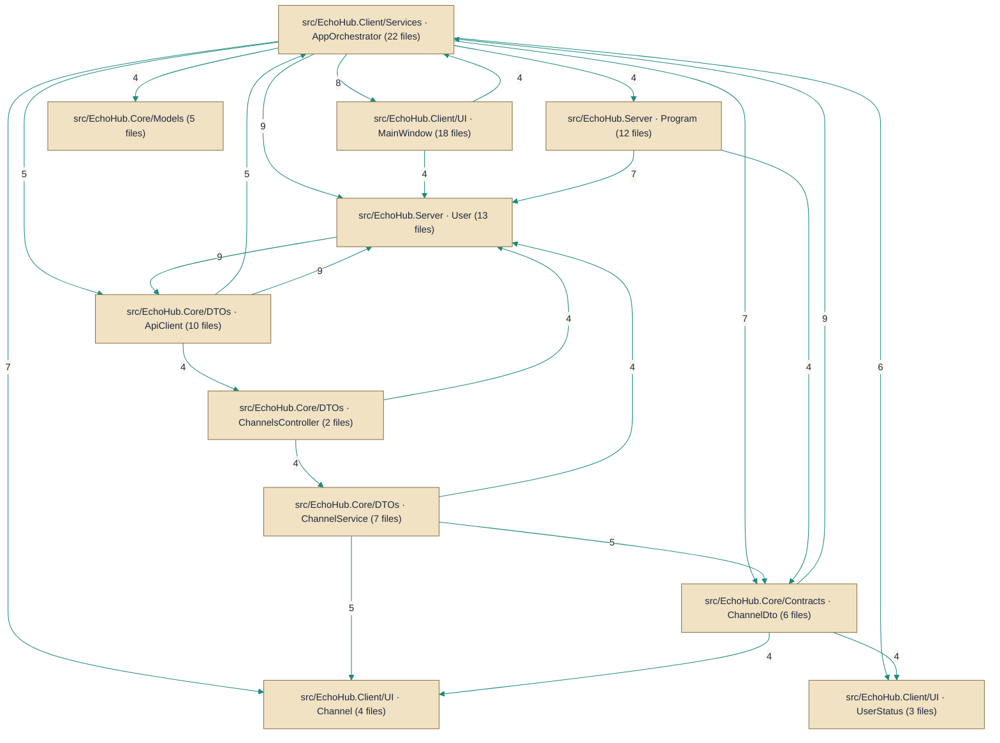

# Architecture — HueByte/EchoHub

> *Auto-synthesized from 617 documented symbols across 128 files on `master`.*

## Topic Guides

Deep-dives into cross-cutting concerns synthesized from the per-symbol corpus.

- [API client authentication](api-client-authentication.md) — How the client authenticates with the server, including login, token refresh, and token usage across API calls.
- [Real-time connection and messaging](real-time-connection.md) — How the client establishes and maintains a real-time connection to the server and handles channel messaging.
- [UI theming and theme management](ui-theming.md) — Theme data models and the system that loads, stores, and applies themes to the UI.
- [Slash command handling](command-handling.md) — Parsing and executing user commands entered as slash commands in chat.
- [Attachments transfer](attachments-transfer.md) — Attachment handling for staged files and outgoing attachments in chat messages.
- [Clipboard utilities](clipboard-tools.md) — Clipboard helpers for files and images used in the UI.
- [Update management](update-management.md) — Checking for updates and backing up state related to updates.
- [Encryption and room keys](encryption-roomkeys.md) — Client-side encryption and per-room key protection for secure messaging.

## Architecture Diagram

## System Overview
This repository implements a chat and file-sharing server with a desktop client: server-side controllers expose an HTTP API (e.g. `AuthController`, `UsersController`, `FilesController`) while a real-time hub (`ChatHub`) handles live messaging and presence. Background workers and maintenance tasks run as hosted services (for example `FileCleanupService` and `DataMigrationService`), and persistent state is stored in the Entity Framework DbContext (`EchoHubDbContext`). The desktop client communicates with the server via an API client (`ApiClient`) and includes local services like audio playback and message encryption.

## Key Components
**Controllers** — HTTP API surface for authentication, user and channel management, file operations and moderation. Implemented by [`AuthController`](../Code/src/EchoHub.Server/Controllers/AuthController.cs.md), [`ChannelsController`](../Code/src/EchoHub.Server/Controllers/ChannelsController.cs.md), [`FilesController`](../Code/src/EchoHub.Server/Controllers/FilesController.cs.md), [`InvitesController`](../Code/src/EchoHub.Server/Controllers/InvitesController.cs.md), [`ModerationController`](../Code/src/EchoHub.Server/Controllers/ModerationController.cs.md), [`ServerController`](../Code/src/EchoHub.Server/Controllers/ServerController.cs.md), [`UsersController`](../Code/src/EchoHub.Server/Controllers/UsersController.cs.md).

**Services** — Core application logic and long-running background tasks, including channel/chat handling, file storage/cleanup, migrations, and utility services used by client and server. Implemented by [`ChannelService`](../Code/src/EchoHub.Server/Services/ChannelService.cs.md), [`ChatService`](../Code/src/EchoHub.Server/Services/ChatService.cs.md), [`FileCleanupService`](../Code/src/EchoHub.Server/Services/FileCleanupService.cs.md), [`FileStorageService`](../Code/src/EchoHub.Server/Services/FileStorageService.cs.md), [`DataMigrationService`](../Code/src/EchoHub.Server/Setup/DataMigrationService.cs.md), [`AsciiBannerService`](../Code/src/EchoHub.Core/Services/AsciiBannerService.cs.md), [`AudioPlaybackService`](../Code/src/EchoHub.Client/Services/AudioPlaybackService.cs.md), [`ClientEncryptionService`](../Code/src/EchoHub.Client/Services/ClientEncryptionService.cs.md).

**Workers/Hubs** — Real-time messaging and presence channel for live client-server communication. Implemented by [`ChatHub`](../Code/src/EchoHub.Server/Hubs/ChatHub.cs.md).

**Repositories / Data Access** — Persistence layer backed by Entity Framework Core; where application state is stored. Implemented by [`EchoHubDbContext`](../Code/src/EchoHub.Server/Data/EchoHubDbContext.cs.md).

**External integrations** — Client and protocol integrations used to communicate with the server or external systems (IRC). Implemented by [`ApiClient`](../Code/src/EchoHub.Client/Services/ApiClient.cs.md), [`IrcServiceExtensions`](../Code/src/EchoHub.Server.Irc/IrcServiceExtensions.cs.md), [`IrcCommandHandler`](../Code/src/EchoHub.Server.Irc/IrcCommandHandler.cs.md), [`IrcOptions`](../Code/src/EchoHub.Server.Irc/IrcOptions.cs.md).

## Component Map

*Subsystems below are structural clusters detected from the dependency graph — groups of symbols more densely wired to each other than to the rest of the codebase.*

- **src/EchoHub.Client/Services · AppOrchestrator** — 22 documented files
- **src/EchoHub.Client/UI · MainWindow** — 18 documented files
- **src/EchoHub.Server · User** — 13 documented files
- **src/EchoHub.Server · Program** — 12 documented files
- **src/EchoHub.Core/DTOs · ApiClient** — 10 documented files
- **src/EchoHub.Core/DTOs · ChannelService** — 7 documented files
- **src/EchoHub.Core/Contracts · ChannelDto** — 6 documented files
- **src/EchoHub.Core/Models** — 5 documented files
- **src/EchoHub.Client/Themes** — 4 documented files
- **src/EchoHub.Client/UI · Channel** — 4 documented files
- **src/EchoHub.Server · ServerLogsStreamService** — 4 documented files
- **src/EchoHub.Client/Services · UpdateBackupService** — 3 documented files
- *…and 10 more subsystem folders*

### Components by Role

**Configuration**
- `IrcOptions` — `src/EchoHub.Server.Irc/IrcOptions.cs`
- `ServerLogsOptions` — `src/EchoHub.Server/Config/ServerLogsOptions.cs`
- `SpamOptions` — `src/EchoHub.Server/Config/SpamOptions.cs`
- `StatsOptions` — `src/EchoHub.Server/Config/StatsOptions.cs`

**Controllers**
- `AuthController` — `src/EchoHub.Server/Controllers/AuthController.cs`
- `ChannelsController` — `src/EchoHub.Server/Controllers/ChannelsController.cs`
- `FilesController` — `src/EchoHub.Server/Controllers/FilesController.cs`
- `InvitesController` — `src/EchoHub.Server/Controllers/InvitesController.cs`
- `ModerationController` — `src/EchoHub.Server/Controllers/ModerationController.cs`
- `ServerController` — `src/EchoHub.Server/Controllers/ServerController.cs`
- `UsersController` — `src/EchoHub.Server/Controllers/UsersController.cs`

**Data Access**
- `EchoHubDbContext` — `src/EchoHub.Server/Data/EchoHubDbContext.cs`

**Extensions**
- `IrcServiceExtensions` — `src/EchoHub.Server.Irc/IrcServiceExtensions.cs`

**External Clients**
- `ApiClient` — `src/EchoHub.Client/Services/ApiClient.cs`
- `IEchoHubClient` — `src/EchoHub.Core/Contracts/IEchoHubClient.cs`

**Handlers**
- `CommandHandler` — `src/EchoHub.Client/Commands/CommandHandler.cs`
- `IrcCommandHandler` — `src/EchoHub.Server.Irc/IrcCommandHandler.cs`

**Realtime Hubs**
- `ChatHub` — `src/EchoHub.Server/Hubs/ChatHub.cs`

**Services**
- `AsciiBannerService` — `src/EchoHub.Core/Services/AsciiBannerService.cs`
- `AudioPlaybackService` — `src/EchoHub.Client/Services/AudioPlaybackService.cs`
- `ChannelService` — `src/EchoHub.Server/Services/ChannelService.cs`
- `ChatService` — `src/EchoHub.Server/Services/ChatService.cs`
- `ClientEncryptionService` — `src/EchoHub.Client/Services/ClientEncryptionService.cs`
- `DataMigrationService` — `src/EchoHub.Server/Setup/DataMigrationService.cs`
- `FileCleanupService` — `src/EchoHub.Server/Services/FileCleanupService.cs`
- `FileStorageService` — `src/EchoHub.Server/Services/FileStorageService.cs`
- `IChannelService` — `src/EchoHub.Core/Contracts/IChannelService.cs`
- `IChatService` — `src/EchoHub.Core/Contracts/IChatService.cs`
- `IMessageEncryptionService` — `src/EchoHub.Core/Contracts/IMessageEncryptionService.cs`
- `IUserService` — `src/EchoHub.Core/Contracts/IUserService.cs`

---
*Generated by AurionDocs on 2026-07-23 09:35:48 UTC*
