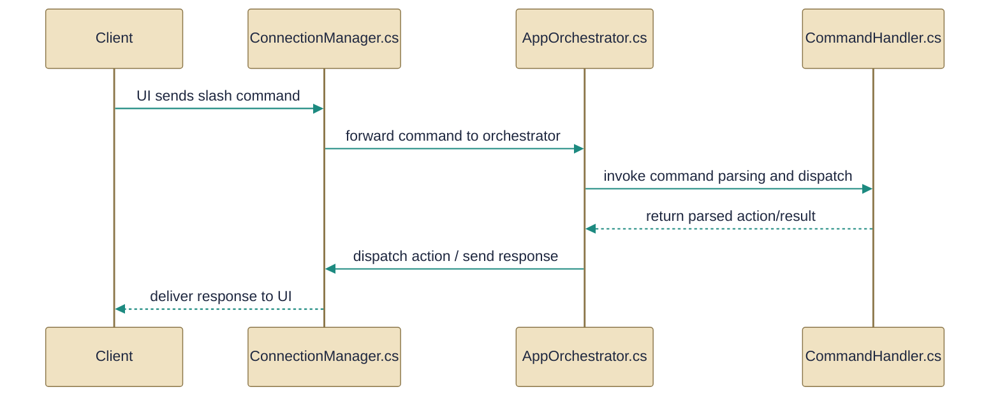

# Command handling

> Slash-command parsing and dispatching command actions from UI and orchestrator.

*Figure: How Command handling works.*

This guide explains how user-entered slash commands move from text input into application behavior and network actions. It describes the parsing and event surface (the command-to-event bridge), the central orchestrator that implements command handlers and coordinates UI-side concerns, and the connection manager that owns the live SignalR connection and performs the network work the orchestrator requests.

## CommandHandler.cs
Parses and executes chat commands; determines if input is a command.

The [CommandHandler](../Code/src/EchoHub.Client/Commands/CommandHandler.cs.md) class is the input-to-event bridge: it recognizes whether a text input is a slash command (via IsCommand) and runs a suite of HandleXxx parsing routines (for example HandleSetStatus, HandleSendAction, HandleCreateInvite, HandleExportData and many others listed in the source). It does not perform side effects itself; instead it exposes one event per supported command (OnSetStatus, OnSendAction, OnCreateInvite, OnExportData, etc.) and raises asynchronous events after parsing. The class also contains parsing helpers and semantics notes (status handling, StripQuotes, IsValidHex, ParsePathAndSizeFlag) so subscribers can depend on a consistent interpretation of user input. According to the topic relationships, this component is consumed by the [AppOrchestrator](../Code/src/EchoHub.Client/AppOrchestrator.cs.md), which subscribes to those events to implement behavior.

## AppOrchestrator.cs
Central coordinator handling command-related actions and user commands across the app.

The [AppOrchestrator](../Code/src/EchoHub.Client/AppOrchestrator.cs.md) wires the command parsing surface into application behavior: it subscribes to the events emitted by the [CommandHandler](../Code/src/EchoHub.Client/Commands/CommandHandler.cs.md) and implements the concrete handlers named in the source (a large set of HandleCmd* methods such as HandleCmdSetStatus, HandleCmdSendFile, HandleCmdJoinChannel, HandleCmdCreateInvite, HandleCmdExportData, HandleCmdKickUser, HandleCmdNukeChannel, etc.). It also owns UI-side responsibilities like BuildOutgoingAttachmentAsync, EnsureRoomUnlockedForSendAsync, CleanupPastedTempFiles, pending reply management, and resource cleanup (Dispose). Per its relationships the orchestrator depends on both [CommandHandler](../Code/src/EchoHub.Client/Commands/CommandHandler.cs.md) for parsing and [ConnectionManager](../Code/src/EchoHub.Client/Services/ConnectionManager.cs.md) for performing network operations; the source shows it translating parsed commands into calls and requests that drive the connection layer. The file also documents many small, focused flow steps (ApplyAsciiSize, HandleChannelSelected, HandleEditProfile, etc.) that adapt command intent into concrete application actions.

## ConnectionManager.cs
`ConnectionManager` collaborates directly with `AppOrchestrator` and other members of this topic (4 dependency links).

The [ConnectionManager](../Code/src/EchoHub.Client/Services/ConnectionManager.cs.md) owns the full lifecycle of a live chat connection: authentication and token handling, attempting to fetch and apply end-to-end encryption keys, instantiating and wiring the EchoHub (SignalR) connection, tracking which channels are joined, and forwarding SignalR callbacks as simple .NET events the UI can subscribe to. It exposes ConnectAsync semantics (reporting progress via an onStatus callback and throwing on authentication failure) and implements IAsyncDisposable so callers can call DisposeAsync to tear down the hub and underlying ApiClient. The file also defines the [ConnectResult](../Code/src/EchoHub.Client/Services/ConnectionManager.cs.md) record (Login, Channels, Histories) that packages the login response, joined channels list, and message histories returned by ConnectAsync. Notes in the source call out important behaviors: failures to fetch encryption keys are non-fatal, forwarded events may arrive on background threads, and callers (principally the [AppOrchestrator](../Code/src/EchoHub.Client/AppOrchestrator.cs.md)) must handle marshal-to-UI-thread concerns.

How the pieces fit

User input flows into [CommandHandler](../Code/src/EchoHub.Client/Commands/CommandHandler.cs.md), which parses text and emits a focused event per command. [AppOrchestrator](../Code/src/EchoHub.Client/AppOrchestrator.cs.md) subscribes to those events and implements the HandleCmd* methods that translate parsed intent into application actions and requests; when a command requires network interaction, AppOrchestrator delegates to [ConnectionManager](../Code/src/EchoHub.Client/Services/ConnectionManager.cs.md). ConnectionManager manages the SignalR connection and returns results or raises network events back to the orchestrator, while AppOrchestrator handles UI concerns (attachments, pending replies, local state) and coordinates lifecycle and cleanup.

---
*Covers 3 of 3 source files identified for this topic.*

*Synthesised by Aurion on 2026-07-23 05:52:46 UTC*
