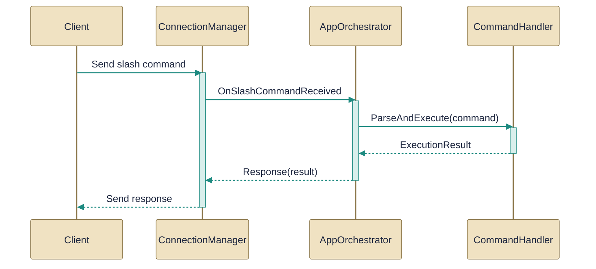

# Slash command handling

> Parsing and executing user commands entered as slash commands in chat.

*Figure: How Slash command handling works.*

This guide explains how slash-style chat input is parsed and executed across three collaborating components: a parser/dispatcher, an application orchestrator that implements command behavior and UI coordination, and a connection manager that exposes server and SignalR events. Read this to understand which file performs parsing, which one implements the command actions and UI glue, and which one owns the network and lifecycle concerns so you can correctly subscribe handlers and marshal events to the UI thread.

## CommandHandler.cs
Parses and executes slash commands from the chat input.

The [CommandHandler](../Code/src/EchoHub.Client/Commands/CommandHandler.cs.md) class is the parser and event-based dispatcher for any string that looks like a slash command. Its primary entry is HandleAsync which analyses the incoming text, maps it to one of many command handlers (the file lists HandleAvatar, HandleBan, HandleSend, HandleSetStatus, HandleJoin, etc.), raises the corresponding asynchronous On... events (consumer-provided Func<..., Task> handlers), and returns a CommandResult describing success, usage, or error. CommandHandler also includes parsing helpers such as IsCommand, IsValidHex, StripQuotes and ParsePathAndSizeFlag and exposes small helpers like StatusUsage and HandleDownloadPath so callers can rely on consistent argument parsing. Relationship: App code (the [AppOrchestrator](../Code/src/EchoHub.Client/AppOrchestrator.cs.md)) consumes CommandHandler by subscribing to its events so that parsed commands are executed by the orchestrator's handlers rather than by the parser itself.

## AppOrchestrator.cs
Wires command events to UI and coordinates command handling with the app lifecycle.

The [AppOrchestrator](../Code/src/EchoHub.Client/AppOrchestrator.cs.md) implements the concrete behavior for the commands exposed by the parser: it defines a large set of HandleCmd* methods (for example HandleCmdSetStatus, HandleCmdSendFile, HandleCmdJoinChannel, HandleCmdKickUser, HandleCmdCreateInvite, HandleCmdExportData and many more) plus UI-oriented helpers (MainWindow, BuildOutgoingAttachmentAsync, DownloadAttachmentAsync, ApplyAsciiSize, AsciiSizeLabel, CleanupPastedTempFiles). In practice the orchestrator subscribes the CommandHandler events to these HandleCmd* methods so that when the parser raises an On... event the orchestrator performs the actual action, updates UI state, manages attachments and download paths, and enforces room locking or permission checks (for example EnsureRoomUnlockedForSendAsync). Relationship: AppOrchestrator depends on the parser ([CommandHandler](../Code/src/EchoHub.Client/Commands/CommandHandler.cs.md)) to receive parsed commands and on the connection layer to execute server-facing actions; it wires command events into UI flows and uses ConnectionManager to carry out network operations.

## ConnectionManager.cs
`ConnectionManager` collaborates directly with `AppOrchestrator` and other members of this topic (4 dependency links).

The [ConnectionManager](../Code/src/EchoHub.Client/Services/ConnectionManager.cs.md) is the single place that manages the server connection lifecycle: it performs authentication (via the API client referenced in the docs), attempts to fetch and apply end-to-end encryption keys, constructs and registers handlers on the hub connection, and tracks channel membership state. It exposes high-level events forwarded from the underlying hub (MessageReceived, UserJoined, ChannelUpdated, ConnectionStatusChanged and similar) so callers like the orchestrator can subscribe without binding SignalR handlers directly. Important operational notes surfaced by the doc: ConnectAsync reports progress through an onStatus callback and will throw on authentication failure, its event callbacks may run on SignalR threads so UI code must marshal to the UI thread, and the manager implements IAsyncDisposable so callers should await disposal to release connection and API resources. Relationship: AppOrchestrator uses ConnectionManager to perform server actions and to observe incoming runtime events; ConnectionManager is therefore the network-facing collaborator the orchestrator relies on.

How the pieces fit

CommandHandler is the stateless parser/dispatcher that turns raw slash input into event invocations. AppOrchestrator subscribes to those events and implements the actual command semantics, UI updates, and attachment/download flows. ConnectionManager centralizes authentication, E2E key application, hub creation and SignalR event forwarding so AppOrchestrator can call into the network layer and react to server-originated events without handling low-level connection details.

---
*Covers 3 of 3 source files identified for this topic.*

*Synthesised by AurionDocs on 2026-07-23 09:32:15 UTC*
