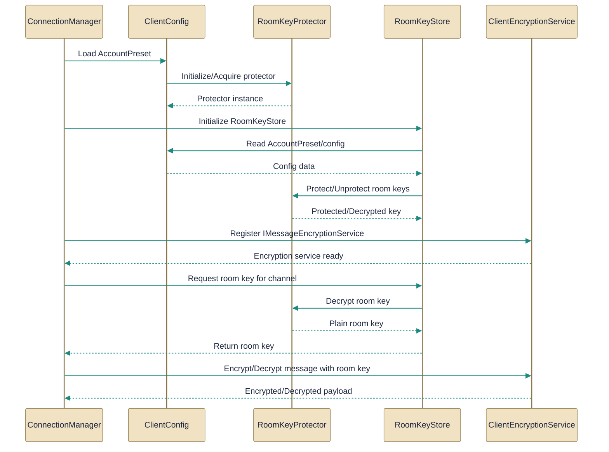

# Encryption and room key management

> End-to-end encryption plumbing and secure handling of per-channel room keys.

*Figure: How Encryption and room key management works.*

# Encryption and room key management

End-to-end encryption in the client is implemented as a few focused components: a runtime encryptor that mirrors the server format, a protector that encrypts per-channel room keys at rest, a store that binds persisted server entries to an in-memory cache, and a connection manager that wires those pieces into the live SignalR connection. This guide explains what each file actually implements, how they call each other, and where responsibilities (in-memory keys, persisted protected keys, and message-level cryptography) are split.

## ClientEncryptionService.cs
Implements IMessageEncryptionService for encrypting/decrypting messages.

The [ClientEncryptionService](../Code/src/EchoHub.Client/Services/ClientEncryptionService.cs.md) class is the client-side AES-256-GCM encryptor/decryptor that mirrors the server’s encryption format so clients and server exchange the same payload shape. It exposes SetKey to accept a 32-byte, server-provided base64 key, Encrypt to produce a prefixed base64 payload containing nonce and ciphertext+tag, and Decrypt to reverse that encoding; before a key is set Encrypt is intentionally a no-op and returns plaintext, and Decrypt returns a sentinel failure message when decryption fails. Per the documentation, the service isolates cryptography behind a swappable implementation and is used by higher-level connection code to apply message encryption only when a key is loaded; in this topic it is referenced by [ConnectionManager](../Code/src/EchoHub.Client/Services/ConnectionManager.cs.md).

## RoomKeyProtector.cs
Provides protection around room keys for secure storage/usage.

The [RoomKeyProtector](../Code/src/EchoHub.Client/Services/RoomKeyProtector.cs.md) class is the single API for protecting and unprotecting per-user room content keys before they are written to or read from client configuration. Its Protect method returns a storage-ready string that is prefixed to indicate the protection method ("dp1:" for Windows DPAPI or "k1:" for an AES-GCM-encrypted master key file on other platforms), and TryUnprotect attempts to recover the raw room key while reporting whether the stored value was a legacy plain-base64 entry and whether unprotection succeeded. The class accepts a directory (to locate the master key file) and caches the master key after guarded loading; callers such as [ClientConfig](../Code/src/EchoHub.Client/Config/ClientConfig.cs.md) and [RoomKeyStore](../Code/src/EchoHub.Client/Services/RoomKeyStore.cs.md) rely on it to convert between in-memory bytes and protected storage strings without having to deal with platform-specific details.

## RoomKeyStore.cs
Stores and retrieves room keys securely for channels.

[RoomKeyStore](../Code/src/EchoHub.Client/Services/RoomKeyStore.cs.md) binds runtime state (a decrypted, in-memory cache of room keys) to persisted per-server entries so users don't re-enter passphrases every launch. You call LoadForServer(serverUrl) to bind the store to a SavedServer in [ClientConfig](../Code/src/EchoHub.Client/Config/ClientConfig.cs.md); the store will read that SavedServer's ChannelKeys, call into [RoomKeyProtector](../Code/src/EchoHub.Client/Services/RoomKeyProtector.cs.md) to unprotect them, and populate its thread-safe cache. The class exposes methods to TryGetKey, StoreKey, Replace/Remove keys, and TryStoreFromEnvelope (which unwraps a wrapped key with a KEK) and will upgrade legacy plain/base64 entries to the protected format when possible; changes are persisted back to the SavedServer through ClientConfig and unreadable entries are logged rather than failing hard. Connection-side code (notably [ConnectionManager](../Code/src/EchoHub.Client/Services/ConnectionManager.cs.md)) uses RoomKeyStore to determine which channels are encrypted and to retrieve keys for encrypting/decrypting messages at send/receive time.

## ClientConfig.cs
`ClientConfig` collaborates directly with `RoomKeyProtector` and other members of this topic (3 dependency links).

[ClientConfig](../Code/src/EchoHub.Client/Config/ClientConfig.cs.md) is the central container for a user's persisted preferences and runtime state, and it holds SavedServer entries that include the persisted, protected ChannelKeys consumed by [RoomKeyStore](../Code/src/EchoHub.Client/Services/RoomKeyStore.cs.md). ClientConfig provides the serialized place where RoomKeyProtector-generated strings live (the protector prefixes such as "dp1:" or "k1:" are stored here), and callers such as RoomKeyStore read and write these SavedServer entries to keep the on-disk picture in sync with the in-memory cache. Because RoomKeyProtector derives its key-file location from a directory you pass to its constructor, ClientConfig’s location and usage patterns determine where the master key file will be stored and how RoomKeyStore persists upgrades from legacy entries.

## ConnectionManager.cs
`ConnectionManager` collaborates directly with `ClientEncryptionService` and other members of this topic (2 dependency links).

[ConnectionManager](../Code/src/EchoHub.Client/Services/ConnectionManager.cs.md) is the high-level lifecycle owner for authentication, establishing the EchoHub SignalR connection, and wiring end-to-end encryption into runtime behavior. During ConnectAsync it performs authentication (throwing on auth failure), attempts to fetch and apply an E2E encryption key (failure to fetch is non-fatal and the manager logs a warning), and then uses the [ClientEncryptionService](../Code/src/EchoHub.Client/Services/ClientEncryptionService.cs.md) to encrypt outbound messages and decrypt inbound ones when a key is present. It relies on [RoomKeyStore](../Code/src/EchoHub.Client/Services/RoomKeyStore.cs.md) to know which channels are encrypted and to obtain per-channel room keys, and it uses [ClientConfig](../Code/src/EchoHub.Client/Config/ClientConfig.cs.md) as the backing persisted configuration for saved servers; ConnectionManager forwards SignalR events as simple .NET events and implements IAsyncDisposable so callers can cleanly tear down network and API resources.

How the pieces fit

- ConnectionManager is the orchestrator: it authenticates, attempts to fetch the server-provided E2E key, wires SignalR events to the UI, and delegates message-level cryptography to [ClientEncryptionService](../Code/src/EchoHub.Client/Services/ClientEncryptionService.cs.md) when a key is present.
- RoomKeyStore sits between persisted state and runtime: it loads and persists ChannelKeys via [ClientConfig](../Code/src/EchoHub.Client/Config/ClientConfig.cs.md) and uses [RoomKeyProtector](../Code/src/EchoHub.Client/Services/RoomKeyProtector.cs.md) to unprotect/protect those keys so the on-disk config never contains raw base64 room keys (legacy unprotected values are upgraded when possible).
- RoomKeyProtector implements the platform-specific protection formats (DPAPI or a file-backed AES-GCM master key) and presents a stable Protect/TryUnprotect API so the higher-level store and config code do not need to handle cryptography details.

Together these components keep plaintext room keys out of persistent storage, keep a decrypted cache for active sessions, and ensure message encryption happens only when a server-supplied key has been loaded and applied by the client encryptor.

---
*Covers 5 of 5 source files identified for this topic.*

*Synthesised by Aurion on 2026-07-23 05:52:19 UTC*
