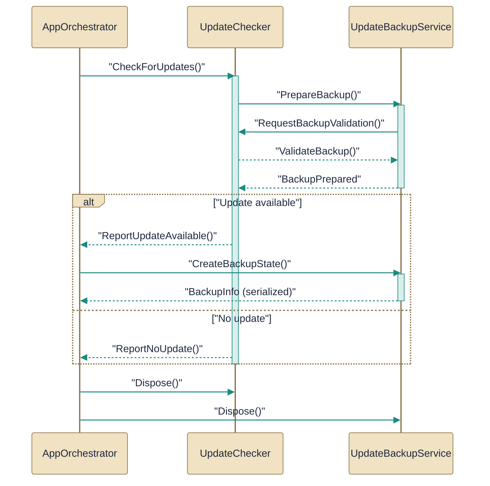

# Update management

> Checking for updates and backing up state related to updates.

*Figure: How Update management works.*

# Update management

This topic covers the small set of services and the orchestrator that detect available application updates, snapshot state before an update, and hand off the heavy update work so it happens after the Terminal.Gui main loop has exited. The pieces separate responsibilities: a background checker and confirmation flow, a backup/metadata helper that writes a ZIP and JSON, and the application orchestrator that stores the post-TUI delegate the host must invoke. Together they avoid console deadlocks and provide a predictable rollback surface for the updater.

## UpdateChecker.cs

Checks for updates and reports availability.

The [UpdateChecker](../Code/src/EchoHub.Client/Services/UpdateChecker.cs.md) type is a sealed, disposable service that runs update checks on a background schedule and coordinates a safe, post-TUI update process. It listens for the underlying updater events, shows a confirmation UI (via the confirmation dialog flow described in the docs), and—when the user confirms—sets the public [PendingUpdate](../Code/src/EchoHub.Client/AppOrchestrator.cs.md) delegate and requests the Terminal.Gui UI to stop so the host can perform the download/extract/restart work on a plain console. `Start()` only enables periodic checks in RELEASE builds, `CurrentVersion` exposes the assembly version (falling back to "0.0.0" if unavailable), and the checker attempts to create a pre-update snapshot by calling into [UpdateBackupService](../Code/src/EchoHub.Client/Services/UpdateBackupService.cs.md) before the heavy update work runs. The checker is consumed by the [AppOrchestrator](../Code/src/EchoHub.Client/AppOrchestrator.cs.md) and depends on [UpdateBackupService](../Code/src/EchoHub.Client/Services/UpdateBackupService.cs.md) for backup creation.

## UpdateBackupService.cs

Maintains backups for update-related data and state.

The [UpdateBackupService](../Code/src/EchoHub.Client/Services/UpdateBackupService.cs.md) is a static helper that centralizes pre-update snapshot and rollback metadata management. Its `CreateBackup()` routine snapshots `AppContext.BaseDirectory` into a `backup.zip` (skipping log files to avoid locking and using `CompressionLevel.Fastest`) and writes a `backup-info.json` that records the current version, application directory, and timestamp; it annotates that metadata using the `CurrentVersion` supplied by [UpdateChecker](../Code/src/EchoHub.Client/Services/UpdateChecker.cs.md). `BackupExists()` verifies that both the ZIP and the JSON exist, and `GetBackupInfo()` reads the stored metadata. Serialization for the `BackupInfo` metadata is handled by the source-generated [BackupJsonContext](../Code/src/EchoHub.Client/Services/UpdateBackupService.cs.md) to provide reflection-free `JsonSerializer` metadata. The service stores backups under the user profile at `~/.echohub/update-backup/`, depends on [UpdateChecker](../Code/src/EchoHub.Client/Services/UpdateChecker.cs.md) for the reported version, and is used by both the [AppOrchestrator](../Code/src/EchoHub.Client/AppOrchestrator.cs.md) and [UpdateChecker](../Code/src/EchoHub.Client/Services/UpdateChecker.cs.md).

## AppOrchestrator.cs

`AppOrchestrator` collaborates directly with `UpdateBackupService` and other members of this topic (2 dependency links).

The [AppOrchestrator](../Code/src/EchoHub.Client/AppOrchestrator.cs.md) is the TUI host and coordinator that declares UI components (like `MainWindow`) and the public [PendingUpdate](../Code/src/EchoHub.Client/AppOrchestrator.cs.md) delegate referenced by the update flow. In this topic its role is to be the object that stores the pending, post-TUI update action that [UpdateChecker](../Code/src/EchoHub.Client/Services/UpdateChecker.cs.md) can set when the user accepts an update; the application or host must examine and invoke that [PendingUpdate](../Code/src/EchoHub.Client/AppOrchestrator.cs.md) delegate after the Terminal.Gui main loop exits. `AppOrchestrator` depends on the backup and checker services to implement the safe update flow and is the natural boundary between the interactive UI and the plain-console updater.

How the pieces fit

Update detection and user confirmation are handled by [UpdateChecker](../Code/src/EchoHub.Client/Services/UpdateChecker.cs.md), which runs periodically (in RELEASE builds) and listens for updater events. When an update is accepted the checker asks [UpdateBackupService](../Code/src/EchoHub.Client/Services/UpdateBackupService.cs.md) to create a snapshot, sets the [PendingUpdate](../Code/src/EchoHub.Client/AppOrchestrator.cs.md) delegate on the [AppOrchestrator](../Code/src/EchoHub.Client/AppOrchestrator.cs.md), and requests the TUI to stop. After the Terminal.Gui main loop exits the host (or the orchestrator) must invoke the stored [PendingUpdate](../Code/src/EchoHub.Client/AppOrchestrator.cs.md) delegate to run the download/extract/restart work on a plain console; that work may restart the process and should be considered a non-returning operation. The backup metadata is serialized through the source-generated [BackupJsonContext](../Code/src/EchoHub.Client/Services/UpdateBackupService.cs.md) and stored under `~/.echohub/update-backup/` so the updater has a clear rollback artifact if needed.

---
*Covers 3 of 3 source files identified for this topic.*

*Synthesised by AurionDocs on 2026-07-23 09:33:37 UTC*
