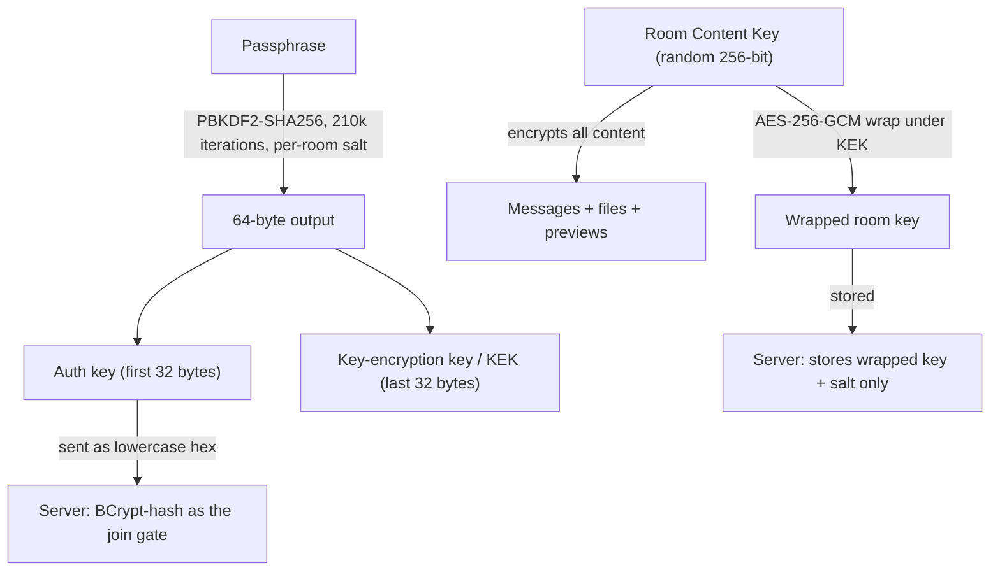
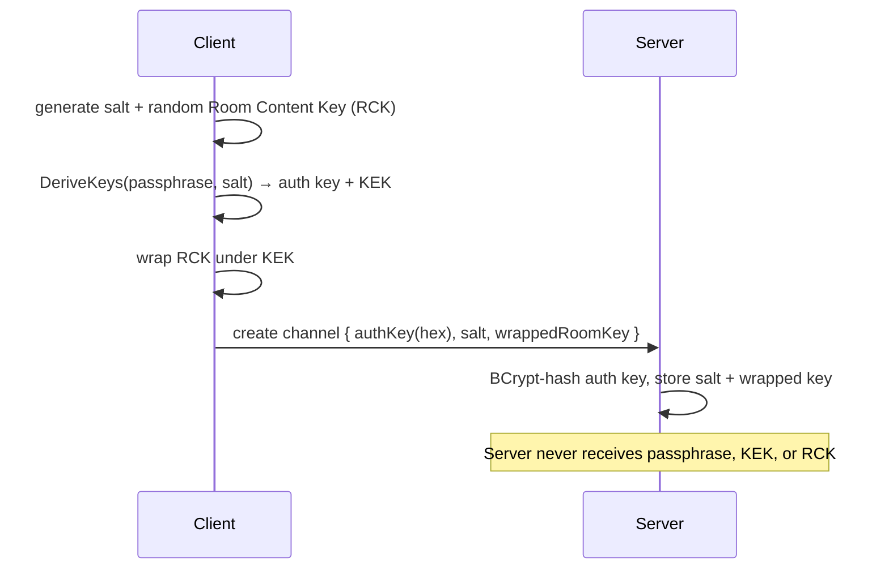
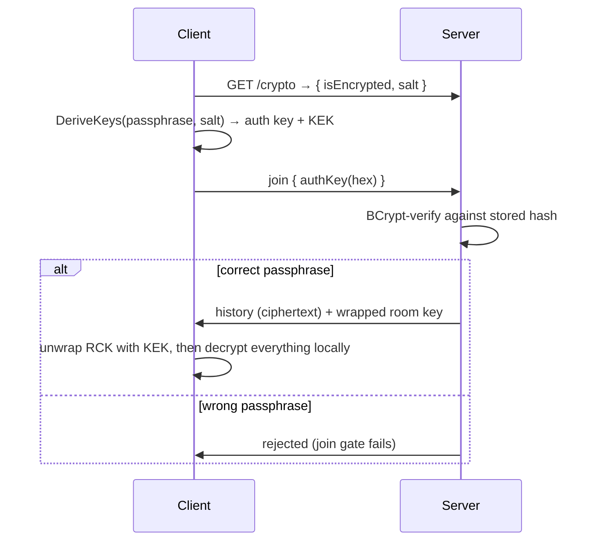

# Encrypted Rooms (Password-Protected Channels)

An **encrypted room** is a channel whose entire content — every message and every file — is
end-to-end encrypted with a key derived from a shared passphrase. Only people who know the
passphrase can read the room. **Not even the server owner can read the content**, yet the server
can still gate who joins, and it can count and measure what's stored (message count, file sizes,
timestamps) without ever seeing the plaintext.

This is a stronger guarantee than the [transport and at-rest encryption](encryption.md) described
elsewhere, where the server decrypts every message to process it. Here the server is treated as
*untrusted* for content: it holds only ciphertext and wrapped keys.

> **The passphrase is the only key.** There is no recovery. If everyone who knows a room's
> passphrase forgets it, that room's history is permanently unreadable — by design.

## What the server can and cannot see

| The server **can** see | The server **cannot** see |
| --- | --- |
| That the channel is encrypted | Message text |
| Message count and timestamps | File contents |
| Who sent each message (sender identity) | Image previews (ASCII art) |
| Each attachment's **file name** and byte size | The passphrase, the room key, or the key-encryption key |
| The estimated total size (via `/meta`) | Anything that would let it decrypt the above |

File **names are stored in plaintext** so the file list stays usable — treat a file name itself as
non-secret. Everything *inside* the file is encrypted.

## Key hierarchy

Three keys are derived from one passphrase. The passphrase, the key-encryption key, and the room
content key **never leave the client**.



- **Auth key** — the join credential. Derived from the passphrase, sent to the server as hex, and
  stored only as a **BCrypt hash**. Proving knowledge of it is what lets you join; it reveals
  nothing about the content key.
- **Key-encryption key (KEK)** — never sent. Used locally to *wrap* (encrypt) and *unwrap* the room
  content key.
- **Room Content Key (RCK)** — a random 256-bit key generated once, at room creation. It encrypts
  every message and file. The server stores it only in wrapped form, so it can hand the wrapped key
  to a joiner but can never unwrap it itself.

All content encryption is **AES-256-GCM** with a random 12-byte nonce and a 16-byte authentication
tag per item, so identical inputs never produce identical ciphertext, and any tampering is detected.

Room-encrypted text carries a self-describing prefix so clients and the server can tell it apart
from plaintext:

```text
$RC1$base64(nonce || tag || ciphertext)
```

## Creating a room

The client does all the cryptography locally, then hands the server only what it needs to gate joins
and store (but not read) the content.



## Joining a room



A wrong passphrase fails the BCrypt gate, so the server never even hands out the wrapped key. Even if
it did, an attacker without the KEK cannot unwrap it.

## What gets encrypted

When you send a message or attach files to an encrypted room, the client encrypts each part with the
room content key **before** uploading:

- **Message text** → `$RC1$…` ciphertext.
- **Files** (any kind) → the whole blob is AES-256-GCM encrypted client-side; the server stores an
  opaque ciphertext blob.
- **Image ASCII previews** → rendered on the client, then room-encrypted. The server never sees the
  rendered art.

The server records each attachment's **kind**, **file name**, and **byte size** (of the ciphertext
blob) as metadata, and broadcasts the ciphertext to other members, who decrypt locally.

## Changing the passphrase

`/passwd <old> <new>` rotates the passphrase. Because only the *wrapping* of the room content key
changes — not the RCK itself — **all existing history stays readable**:

1. The client proves knowledge of the old passphrase (old auth key).
2. It unwraps the RCK with the old KEK, then re-wraps it under the new KEK (new salt).
3. It uploads the new auth key + salt + re-wrapped key. The content is never re-encrypted.

## Inspecting a room

Use `/meta` in any channel to see what the server knows about it, including encrypted rooms:

```text
Room info for #private-room:
  Room ID       3f2a…-…-…
  Created       7/16/2026 2:31 PM
  Messages      128
  Unique users  4
  Est. size     42.5 MB
  Protection    end-to-end encrypted
```

`Est. size` is the sum of stored attachment blob sizes plus message text length — an estimate of the
room's footprint, computed entirely from metadata the server holds without reading any content.

## Limitations & security notes

- **No recovery.** A lost passphrase means unrecoverable history. Keep it safe; there is no reset.
- **File names are plaintext.** They stay readable so the file list works — don't put secrets in a
  file name.
- **IRC is disabled for encrypted rooms.** The IRC gateway forwards plaintext and cannot participate
  in the room's key scheme, so encrypted channels are not bridged to IRC.
- **Metadata is visible.** Message counts, timestamps, sender identities, file names, and sizes are
  intentionally readable so the server can moderate at the metadata level and report `/meta`.
- **Endpoint trust.** End-to-end encryption protects content from the server and the network, not
  from a compromised client device that already holds the passphrase.

## Related

- [Message Encryption](encryption.md) — transport (`$ENC$v1$`) and optional at-rest database
  encryption, where the server *does* decrypt content for processing. Encrypted rooms are a separate,
  stronger layer that sits on top.
