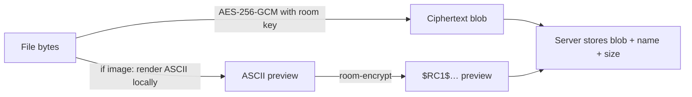

# Messages & Attachments

An EchoHub message is **text content plus up to 10 attachments**, Discord-style. A plain chat
line is just a message with no attachments; a photo dump is one message with several files and
an optional caption. This page explains how to attach files, what happens to them on the way to
the server, and how other clients receive them.

## Message basics

| Limit | Value |
| --- | --- |
| Max message length | 2,000 characters |
| Max newlines per message | 30 (no blank-line runs) |
| Max attachments per message | 10 |
| Link embeds per message | first 3 URLs |

Multiline messages are written with `Ctrl+N` for a newline; `Enter` sends. URLs in a message
get link embeds (title, description, theme color) fetched by the server.

## Attaching files

All of these end up in the same place — the **staging tray** — and are sent together as one
message the next time you press `Enter`, with whatever you've typed as the caption:

- **Paste a copied file** — copy one *or several* files in your file manager and press
  `Ctrl+V` in the input. All of them are staged at once.
- **Paste an image from the clipboard** — copy an image in a browser (right-click → *Copy
  image*), take a screenshot (`Win+Shift+S`), or copy from an image editor, then `Ctrl+V`.
  The image is attached directly as a PNG named `image.png` — no saving to disk first.
  On Linux this uses `wl-paste` or `xclip`; on macOS it requires
  [`pngpaste`](https://github.com/jcsalterego/pngpaste) (`brew install pngpaste`).
- **Drag & drop** — drop a file onto the terminal window; the client recognizes the dropped
  path and stages the file.
- **`/send <filepath>`** — stage a file by path (quote paths containing spaces).

The input frame's title shows what's currently staged. `/clear` drops all staged attachments
without sending. Sending with an empty input is fine — the message is just the attachments.

```text
┌ Message (2 attached: report.pdf, image.png) ──────────────┐
│ here's the summary and a screenshot_                      │
└────────────────────────────────────────────────────────────┘
```

**URL sends are different:** `/send <https://…>` sends an image URL immediately as its own
message — nothing is staged, and it isn't available in end-to-end encrypted rooms (the server
would have to fetch the image, which would defeat the encryption).

## Attachment kinds

The kind is detected per attachment, not per message:

| Kind | Detected by | Renders as | Default size limit |
| --- | --- | --- | --- |
| **Image** | Magic bytes: JPEG, PNG, GIF, WebP | ASCII-art preview in chat | 10 MB |
| **Audio** | Extension: `.mp3` `.wav` `.ogg` `.flac` `.aac` `.m4a` `.wma` | Playable row (▶) | 10 MB |
| **File** | Everything else | Downloadable row | 100 MB |

Limits are per file and server-configurable — see the `Uploads` section in the
[configuration guide](configuration.md) (`MaxImageSizeMB`, `MaxAudioSizeMB`, `MaxFileSizeMB`,
`MaxAttachmentsPerMessage`).

## Image previews (ASCII art)

Images are rendered in chat as half-block ASCII art. You pick the rendering size:

| Flag | Size | Feel |
| --- | --- | --- |
| `-s` / `/size s` | 40 × 40 | compact |
| `-m` / `/size m` | 80 × 80 | default |
| `-l` / `/size l` | 120 × 120 | detailed |

`/size` with no argument opens a picker; the choice persists as your default. A one-off
`-s|-m|-l` flag on `/send` applies to that message.

## Receiving attachments

Right-click a message (or press `F6` to select one with the arrow keys) for actions:

- **Images** → save to disk
- **Audio** → play (in-client playback)
- **Files** → download

Downloads go to your configured download folder — set it with `/downloadpath` (no argument
opens a native folder picker, or pass a path directly).

## Attachments in encrypted rooms

In an [end-to-end encrypted room](encrypted-rooms.md) every attachment is encrypted
client-side **before** upload:



The server never sees the file contents or the rendered preview — it stores an opaque blob and
broadcasts it to members, who decrypt locally. File **names and sizes remain visible** to the
server so the file list stays usable; don't put secrets in a file name. Pasted clipboard
images go through exactly the same pipeline.

## Deleting messages with attachments

Deleting a message also removes its uploaded attachment files from the server. You can always
delete your own messages; moderators can delete others' — see [Moderation & Roles](moderation.md).
