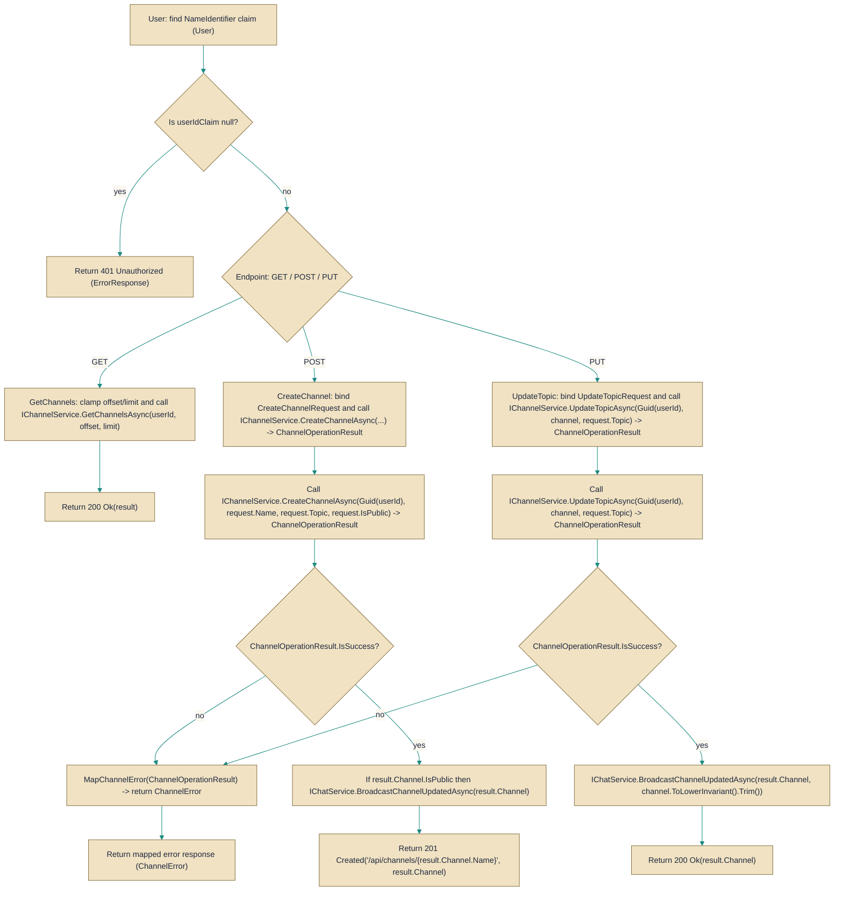

# ChannelsController

> **File:** `src/EchoHub.Server/Controllers/ChannelsController.cs`  
> **Kind:** class

*Figure: How ChannelsController works.*



```csharp
[ApiController]
[Route("api/channels")]
[Authorize]
[EnableRateLimiting("general")]
public class ChannelsController : ControllerBase
```


Exposes HTTP endpoints for listing, creating, updating, deleting and uploading content to channels; intended to be used by authenticated clients and to centralize request validation, rate-limiting and broadcasting of public-channel changes rather than letting callers interact with the lower-level services directly.

## Remarks
This controller is an API surface that orchestrates channel-related operations and delegates business logic to injected services (IChannelService for channel CRUD, IChatService for broadcasting updates, plus several helpers for storage, image processing and encryption). It enforces authentication and applies rate-limiting attributes at the controller and action level, and it performs basic input normalization/validation (for example clamping paging parameters and normalizing channel names when broadcasting updates).

## Notes
- All endpoints require an authenticated user: the controller reads ClaimTypes.NameIdentifier and returns Unauthorized(ErrorResponse) if the claim is missing.
- The GetChannels endpoint enforces paging constraints (offset >= 0, limit clamped to 1..100) — clients should expect server-side truncation of requested limits.
- File upload endpoint(s) are subject to additional rate-limiting and request size limits (RequestSizeLimit and RequestFormLimits referencing HubConstants.MaxFileSizeBytes); clients must respect these limits to avoid rejected requests.