# ModerationController

> **File:** `src/EchoHub.Server/Controllers/ModerationController.cs`  
> **Kind:** class

*Figure: How ModerationController works.*

```mermaid
%%{init: {'theme':'base','themeVariables':{'background':'#faf7ef','primaryColor':'#f0e2c2','primaryTextColor':'#1f2840','primaryBorderColor':'#8a7548','secondaryColor':'#d9efec','secondaryBorderColor':'#1d8a80','secondaryTextColor':'#1f2840','tertiaryColor':'#f2ebd8','tertiaryBorderColor':'#8a7548','tertiaryTextColor':'#1f2840','lineColor':'#1d8a80','titleColor':'#1f2840','fontSize':'14px','edgeLabelBackground':'#faf7ef','clusterBkg':'#f2ebd8','clusterBorder':'#8a7548','actorBkg':'#f0e2c2','actorBorder':'#8a7548','actorTextColor':'#1f2840','actorLineColor':'#8a7548','signalColor':'#1d8a80','signalTextColor':'#1f2840','activationBkgColor':'#d9efec','activationBorderColor':'#1d8a80','noteBkgColor':'#f2ebd8','noteBorderColor':'#8a7548','noteTextColor':'#1f2840','labelBoxBkgColor':'#f0e2c2','labelBoxBorderColor':'#8a7548','labelTextColor':'#1f2840','transitionColor':'#1d8a80','transitionLabelColor':'#1f2840','stateLabelColor':'#1f2840','altBackground':'#f2ebd8'}}}%%
flowchart TB

Start["ModerationController receives request"]

subgraph AssignRoleFlow["AssignRole (POST /role)"]
  A1["Call GetCallerAsync(ServerRole.Admin)"]
  A1 -->|"error"| A1e["Return ErrorResponse"]
  A1 -->|"ok (caller)"| A2["If request.Role == ServerRole.Owner"]
  A2 -->|"true"| A2e["Return BadRequest(ErrorResponse: cannot assign Owner)"]
  A2 -->|"false"| A3["Find target in EchoHubDbContext.Users by username"]
  A3 -->|"not found"| A3e["Return NotFound(ErrorResponse)"]
  A3 -->|"found (target)"| A4["If target.Role == ServerRole.Owner"]
  A4 -->|"true"| A4e["Return BadRequest(ErrorResponse: cannot change Owner)"]
  A4 -->|"false"| A5["If request.Role >= caller.Role"]
  A5 -->|"true"| A5e["Return BadRequest(ErrorResponse: cannot assign equal/above)"]
  A5 -->|"false"| A6["Set target.Role = request.Role and SaveChangesAsync on EchoHubDbContext"]
  A6 --> A7["Return Ok with success message"]
end

Start --> AssignRoleFlow

subgraph KickFlow["KickUser (POST /kick/{username})"]
  K1["Call GetCallerAsync(ServerRole.Mod)"]
  K1 -->|"error"| K1e["Return ErrorResponse"]
  K1 -->|"ok (caller)"| K2["Find target in EchoHubDbContext.Users by username"]
  K2 -->|"not found"| K2e["Return NotFound(ErrorResponse)"]
  K2 -->|"found (target)"| K3["If target.Role >= caller.Role"]
  K3 -->|"true"| K3e["Return BadRequest(ErrorResponse: cannot kick equal/higher)"]
  K3 -->|"false"| K4["channels = PresenceTracker.GetChannelsForUser(target.Username)"]
  K4 --> K5["For each channel: call IChatBroadcaster.SendUserKickedAsync(channel, target.Username, request?.Reason)"]
  K5 --> K6["Determine reason and call ForceDisconnectAndCleanupAsync(target.Username, reason)"]
  K6 --> K7["Return Ok with success message"]
end

Start --> KickFlow
```



```csharp
[ApiController]
[Route("api/moderation")]
[Authorize]
[EnableRateLimiting("general")]
public class ModerationController : ControllerBase
```


Exposes server moderation endpoints (assign role, kick, ban) used by administrators and moderators to perform authoritative user management. Use these endpoints when you need the server to update persisted user state, notify connected clients, and clean up presence/connection state rather than updating the database directly.

## Remarks
The controller centralizes moderation workflows and enforces role-based checks before making state changes. Each operation coordinates three concerns: persisting changes to the user record (via the DbContext), notifying active clients through all registered IChatBroadcaster implementations, and cleaning up presence/connection state via the PresenceTracker and internal disconnect helpers. That coordination is why consumers should call these endpoints instead of mutating user records themselves — the controller ensures notifications and connection teardown are performed consistently.

## Notes
- Usernames are normalized to lower-case when looked up; provide the canonical username or expect the server to lower-case the input.
- You cannot assign the Owner role or change the server owner's role; role comparisons use the ServerRole enum ordering so assigning an equal-or-higher role than the caller is rejected.
- These endpoints both notify connected clients (via all IChatBroadcaster instances) and force-disconnect affected connections; those broadcast and disconnect operations are awaited and can add latency to the request.