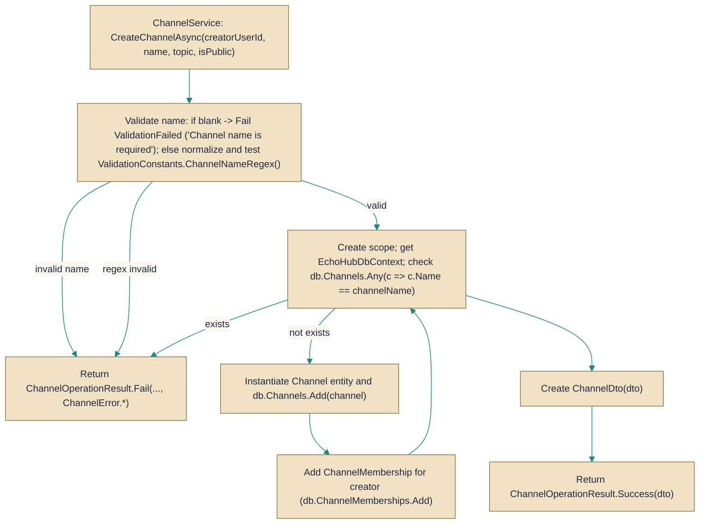

# ChannelService

> **File:** `src/EchoHub.Server/Services/ChannelService.cs`  
> **Kind:** class

*Figure: How ChannelService works.*



```csharp
public class ChannelService : IChannelService
```


Provides channel-management operations used by higher-level features (and by IChannelService callers) such as listing channels visible to a user, creating channels, updating topics, deleting channels and ensuring membership. Use this service when you need the server-side business rules and persistence logic for channels instead of accessing the DbContext directly.

## Remarks
ChannelService is a thin business layer that enforces validation and authorization rules and mediates all database access for channels. Each public method creates a short-lived IServiceScope and resolves EchoHubDbContext from it so the service itself can be registered with a longer lifetime (for example as a singleton) while still using a scoped DbContext per operation. It also delegates presence-related concerns to the PresenceTracker and emits structured logs via `ILogger<ChannelService>`.

## Notes
- Channel names are normalized to lowercase and trimmed before validation and persistence; callers should treat channel names as case-insensitive.
- Creation enforces a regex-based name policy and rejects empty or whitespace names. Topic text has a maximum length check (ValidationConstants.MaxChannelTopicLength).
- The creator of a channel is automatically added as a ChannelMembership at creation time; the CreatedByUserId is used to enforce who may update the topic (only the creator can change it).
- GetChannelsAsync calls EnsureDefaultChannelAsync before listing channels to guarantee the existence of the default channel; callers looking for the default channel can rely on it being present after this method completes.
- CreateChannelAsync checks existence with AnyAsync before inserting, but concurrent callers could still race; the database should enforce a unique constraint on channel name to guarantee correctness under concurrent creates.
- Each operation uses a fresh IServiceScope/DbContext (using-var ensures disposal). This avoids sharing a DbContext across calls but means ambient transaction behavior does not cross method boundaries.