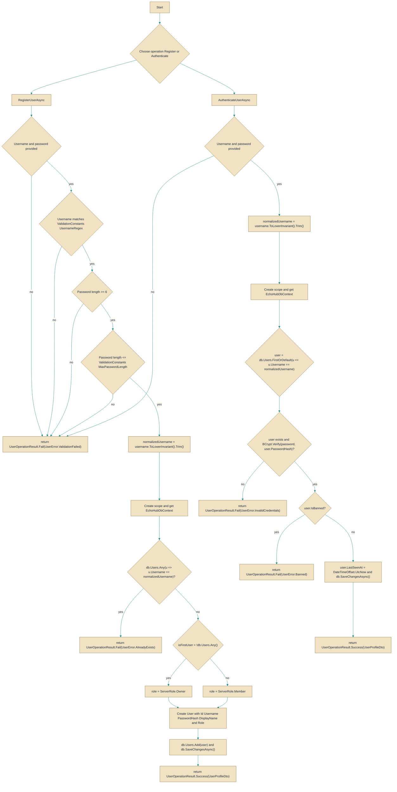

# UserService

> **File:** `src/EchoHub.Server/Services/UserService.cs`  
> **Kind:** class

*Figure: How UserService works.*



```csharp
public class UserService : IUserService
```


Handles user lifecycle operations: registration, authentication, and profile retrieval/updates, using a scoped EchoHubDbContext for each operation. Reach for this service when you need application-level user management (validation, normalization, password hashing, role assignment) rather than manipulating the database or hashing logic directly.

## Remarks
This class centralizes user-related policies so callers don't have to repeat validation, normalization, hashing, or role-assignment logic. It obtains an IServiceScope from the injected IServiceScopeFactory for every operation and resolves EchoHubDbContext from that scope — this keeps DbContext usage scoped to each method call and avoids lifetime mismatches when the service is registered with a longer lifetime. Passwords are hashed and verified with BCrypt, usernames are normalized (trimmed and lower-cased) and validated with ValidationConstants.UsernameRegex(), and the first user created is granted the Owner server role.

## Example
```csharp
// Assuming userService is an IUserService resolved from DI
var registerResult = await userService.RegisterUserAsync("alice", "P@ssw0rd", "Alice");
if (registerResult.IsSuccess)
{
    // registration succeeded
}
else
{
    // handle validation / duplicate / other failures
}

var authResult = await userService.AuthenticateUserAsync("alice", "P@ssw0rd");
if (authResult.IsSuccess)
{
    // authentication succeeded
}
else
{
    // handle invalid credentials or banned account
}
```

## Notes
- Usernames are normalized to lower-case and trimmed before checks and storage; uniqueness is enforced at the application level here, so consider also enforcing a unique index in the database to avoid race conditions.
- The first successfully registered user is assigned ServerRole.Owner; concurrent registrations may race — if that distinction matters, guard it at the database/transaction level.
- AuthenticateUserAsync updates the user's LastSeenAt and checks the IsBanned flag; password hashing/verification uses BCrypt under the hood.