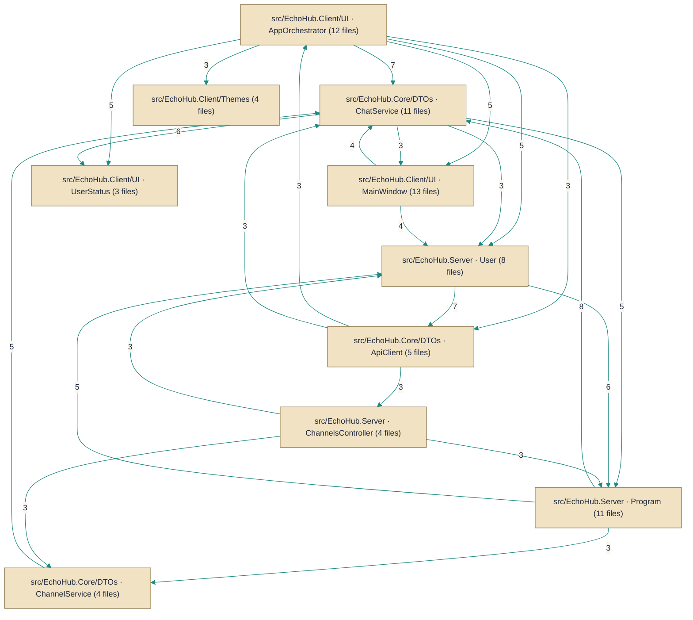

# Architecture — HueByte/EchoHub

> *Auto-synthesized from 341 documented symbols across 99 files on `master`.*

## Topic Guides

Deep-dives into cross-cutting concerns synthesized from the per-symbol corpus.

- [Real-time communication and SignalR](real-time-signalr.md) — How the system handles real-time chat and presence using SignalR across server and client. It coordinates messages, broadcasting, and presence tracking.
- [Authentication and token-based security](authentication.md) — How tokens are issued, validated, and used by clients to access protected resources across client and server.
- [Database access and migrations](database-migrations.md) — How the application models persist data and how migrations and initial setup are performed.
- [File uploads, storage, and validation](file-storage-validation.md) — Client and server file handling: validation, storage, and upload flows for media and avatars.
- [HTTP API surface and endpoints](http-api-surface.md) — REST API surface exposed by the server for authentication, channels, files, moderation, server-wide ops, and users.
- [Client startup and configuration management](client-startup-config.md) — How the client boots up and applies runtime configuration and settings.

## Architecture Diagram

## System Overview
EchoHub is a chat and media-sharing system that exposes an HTTP API (Controllers such as [`Code/src/EchoHub.Server/Controllers/AuthController.cs.md`]) and a real‑time messaging surface via a SignalR hub ([`Code/src/EchoHub.Server/Hubs/ChatHub.cs.md`]) to deliver messages, files and link embeds. Server-side business logic and helpers are implemented as services (for example [`Code/src/EchoHub.Server/Services/ChatService.cs.md`], [`Code/src/EchoHub.Server/Services/ChannelService.cs.md`]) and background workers (for example [`Code/src/EchoHub.Server.Irc/IrcGatewayService.cs.md`]); clients communicate via an API client library (e.g. [`Code/src/EchoHub.Client/Services/ApiClient.cs.md`]). Persistent state is kept in the Entity Framework DbContext [`Code/src/EchoHub.Server/Data/EchoHubDbContext.cs.md`].

## Key Components
**Controllers** — HTTP API surface that handles authentication, user and channel management, file operations and moderation. Implemented by [`Code/src/EchoHub.Server/Controllers/AuthController.cs.md`], [`Code/src/EchoHub.Server/Controllers/ChannelsController.cs.md`], [`Code/src/EchoHub.Server/Controllers/FilesController.cs.md`], [`Code/src/EchoHub.Server/Controllers/ModerationController.cs.md`], [`Code/src/EchoHub.Server/Controllers/ServerController.cs.md`], [`Code/src/EchoHub.Server/Controllers/UsersController.cs.md`].

**Services** — Application and domain logic for chat, channels, file storage/cleanup, media processing, message encryption, token management and startup migrations. Implemented by [`Code/src/EchoHub.Server/Services/ChannelService.cs.md`], [`Code/src/EchoHub.Server/Services/ChatService.cs.md`], [`Code/src/EchoHub.Server/Services/FileCleanupService.cs.md`], [`Code/src/EchoHub.Server/Services/FileStorageService.cs.md`], [`Code/src/EchoHub.Server/Services/ImageToAsciiService.cs.md`], [`Code/src/EchoHub.Server/Services/LinkEmbedService.cs.md`], [`Code/src/EchoHub.Server/Services/MessageEncryptionService.cs.md`], [`Code/src/EchoHub.Server/Auth/JwtTokenService.cs.md`], [`Code/src/EchoHub.Server/Setup/DataMigrationService.cs.md`].

**Workers / Hubs** — Real‑time messaging and long-running background processes that bridge to external systems and handle live message delivery. Implemented by [`Code/src/EchoHub.Server/Hubs/ChatHub.cs.md`], [`Code/src/EchoHub.Server.Irc/IrcGatewayService.cs.md`], [`Code/src/EchoHub.Server.Irc/IrcCommandHandler.cs.md`].

**Repositories / Persistence** — The data access layer and EF Core DbContext that persist users, channels, messages and related state. Implemented by [`Code/src/EchoHub.Server/Data/EchoHubDbContext.cs.md`].

**External integrations & Clients** — IRC integration, client libraries and protocol helpers used to connect external systems and client apps to the server. Implemented by [`Code/src/EchoHub.Server.Irc/IrcServiceExtensions.cs.md`], [`Code/src/EchoHub.Client/Services/ApiClient.cs.md`], [`Code/src/EchoHub.Core/Contracts/IEchoHubClient.cs.md`].

## Component Map

*Subsystems below are structural clusters detected from the dependency graph — groups of symbols more densely wired to each other than to the rest of the codebase.*

- **src/EchoHub.Client/UI · MainWindow** — 13 documented files
- **src/EchoHub.Client/UI · AppOrchestrator** — 12 documented files
- **src/EchoHub.Core/DTOs · ChatService** — 11 documented files
- **src/EchoHub.Server · Program** — 11 documented files
- **src/EchoHub.Server · User** — 8 documented files
- **src/EchoHub.Core/DTOs · ApiClient** — 5 documented files
- **src/EchoHub.Client/Services · UpdateBackupService** — 4 documented files
- **src/EchoHub.Client/Themes** — 4 documented files
- **src/EchoHub.Core/DTOs · ChannelService** — 4 documented files
- **src/EchoHub.Server · ChannelsController** — 4 documented files
- **src/EchoHub.Server.Irc · IrcCommandHandler** — 4 documented files
- **src/EchoHub.Client/Services · IMessageEncryptionService** — 3 documented files
- *…and 7 more subsystem folders*

### Components by Role

**Configuration**
- `IrcOptions` — `src/EchoHub.Server.Irc/IrcOptions.cs`

**Controllers**
- `AuthController` — `src/EchoHub.Server/Controllers/AuthController.cs`
- `ChannelsController` — `src/EchoHub.Server/Controllers/ChannelsController.cs`
- `FilesController` — `src/EchoHub.Server/Controllers/FilesController.cs`
- `ModerationController` — `src/EchoHub.Server/Controllers/ModerationController.cs`
- `ServerController` — `src/EchoHub.Server/Controllers/ServerController.cs`
- `UsersController` — `src/EchoHub.Server/Controllers/UsersController.cs`

**Data Access**
- `EchoHubDbContext` — `src/EchoHub.Server/Data/EchoHubDbContext.cs`

**Extensions**
- `IrcServiceExtensions` — `src/EchoHub.Server.Irc/IrcServiceExtensions.cs`

**External Clients**
- `ApiClient` — `src/EchoHub.Client/Services/ApiClient.cs`
- `IEchoHubClient` — `src/EchoHub.Core/Contracts/IEchoHubClient.cs`

**Handlers**
- `CommandHandler` — `src/EchoHub.Client/Commands/CommandHandler.cs`
- `IrcCommandHandler` — `src/EchoHub.Server.Irc/IrcCommandHandler.cs`

**Realtime Hubs**
- `ChatHub` — `src/EchoHub.Server/Hubs/ChatHub.cs`

**Services**
- `AudioPlaybackService` — `src/EchoHub.Client/Services/AudioPlaybackService.cs`
- `ChannelService` — `src/EchoHub.Server/Services/ChannelService.cs`
- `ChatService` — `src/EchoHub.Server/Services/ChatService.cs`
- `ClientEncryptionService` — `src/EchoHub.Client/Services/ClientEncryptionService.cs`
- `DataMigrationService` — `src/EchoHub.Server/Setup/DataMigrationService.cs`
- `FileCleanupService` — `src/EchoHub.Server/Services/FileCleanupService.cs`
- `FileStorageService` — `src/EchoHub.Server/Services/FileStorageService.cs`
- `IChannelService` — `src/EchoHub.Core/Contracts/IChannelService.cs`
- `IChatService` — `src/EchoHub.Core/Contracts/IChatService.cs`
- `IMessageEncryptionService` — `src/EchoHub.Core/Contracts/IMessageEncryptionService.cs`
- `IUserService` — `src/EchoHub.Core/Contracts/IUserService.cs`
- `ImageToAsciiService` — `src/EchoHub.Server/Services/ImageToAsciiService.cs`
- `IrcGatewayService` — `src/EchoHub.Server.Irc/IrcGatewayService.cs`
- `JwtTokenService` — `src/EchoHub.Server/Auth/JwtTokenService.cs`
- `LinkEmbedService` — `src/EchoHub.Server/Services/LinkEmbedService.cs`
- `MessageEncryptionService` — `src/EchoHub.Server/Services/MessageEncryptionService.cs`

---
*Generated by Aurion on 2026-07-08 17:10:50 UTC*
