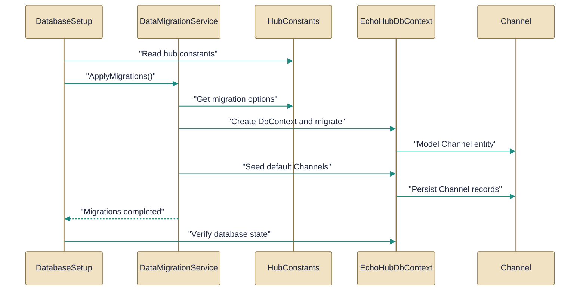

# Database access and migrations

> How the application models persist data and how migrations and initial setup are performed.

*Figure: How Database access and migrations works.*

# Database access and migrations

This guide explains how EchoHub models are persisted and how the application prepares and normalizes the database at startup. It highlights the EF Core boundary that owns the schema, the domain model used for seeding, and the two bootstrapper entry points that apply schema and data migrations so the rest of the app can assume a consistent store shape.

## EchoHubDbContext.cs

EF Core DbContext for EchoHub data models.

The [EchoHubDbContext](../Code/src/EchoHub.Server/Data/EchoHubDbContext.cs.md) class is the Entity Framework Core persistence boundary for the server: it exposes DbSet<User>, DbSet<Channel>, DbSet<Message>, DbSet<RefreshToken>, and DbSet<ChannelMembership>, and centralizes mappings and constraints such as unique usernames and unique channel names. It encodes provider-specific behavior too — defaulting to a local SQLite file named echohub.db when no external configuration is provided, and applying a DateTimeOffset-to-Unix-milliseconds conversion strategy to work around SQLite ordering limitations. The context also wires relationships (for example Channel→Messages and ChannelMembership linking Users and Channels) and configures cascade deletes so removing a Channel or User will clean up related rows; this class is consumed by the startup orchestrators to perform migrations and seed data.

## DataMigrationService.cs

Manages data migrations at startup or setup.

The [DataMigrationService](../Code/src/EchoHub.Server/Setup/DataMigrationService.cs.md) is a static startup-time orchestrator with a RunAsync entry point that opens a DI scope, resolves an [EchoHubDbContext](../Code/src/EchoHub.Server/Data/EchoHubDbContext.cs.md), IConfiguration, and an ILogger, then executes a sequence of guarded, idempotent data migration routines. The documented migrations include ensuring the default channel is public, converting legacy ANSI color codes in image messages into a color-tag representation, transforming embed JSON into an array format, and enforcing admin accounts from configuration; each step logs progress and avoids unnecessary writes. It depends on policy values and models such as [HubConstants](../Code/src/EchoHub.Core/Constants/HubConstants.cs.md) and [Channel](../Code/src/EchoHub.Core/Models/Channel.cs.md) and is invoked by the higher-level bootstrapper to normalize data after schema migrations are applied.

## DatabaseSetup.cs

Orchestrates initial database creation and seeding.

The [DatabaseSetup](../Code/src/EchoHub.Server/Setup/DatabaseSetup.cs.md) static class provides InitializeAsync, which creates a short-lived DI scope, resolves the DbContext and a logger, applies EF migrations, seeds the default channel (using [HubConstants](../Code/src/EchoHub.Core/Constants/HubConstants.cs.md).DefaultChannel), and then calls [DataMigrationService](../Code/src/EchoHub.Server/Setup/DataMigrationService.cs.md) to run the one-off data transformations. It also contains logic to detect legacy SQLite schemas and, when necessary and possible, backup and recreate the database so EF migrations can be applied; failures during initialization are logged and rethrown to surface startup problems. DatabaseSetup is the one-time bootstrap entry used during application start rather than per-request work.

## Channel.cs

`Channel` collaborates directly with `EchoHubDbContext` and other members of this topic (3 dependency links).

The [Channel](../Code/src/EchoHub.Core/Models/Channel.cs.md) class models a named conversation space and is the aggregate root for channel-scoped data: it has a required Name, defaulted IsPublic and CreatedAt (initialized to DateTimeOffset.UtcNow), and owns a Messages collection representing the one-to-many relationship to Message entities. Instances of Channel are the records that DatabaseSetup seeds (the default channel) and that DataMigrationService may read or adjust during migrations; EchoHubDbContext exposes Channels as a DbSet and configures uniqueness and relationships around this model. The class is intentionally a POCO so EF mappings in [EchoHubDbContext](../Code/src/EchoHub.Server/Data/EchoHubDbContext.cs.md) can enforce storage-level constraints separately from domain shape.

## HubConstants.cs

`HubConstants` collaborates directly with `DataMigrationService` and other members of this topic (2 dependency links).

The [HubConstants](../Code/src/EchoHub.Core/Constants/HubConstants.cs.md) static class centralizes compile-time constants used across the hub: the hub path, the default channel identifier, message and history limits, size thresholds, and embed-related limits. These constants are referenced by both [DatabaseSetup](../Code/src/EchoHub.Server/Setup/DatabaseSetup.cs.md) (for seeding the default channel) and [DataMigrationService](../Code/src/EchoHub.Server/Setup/DataMigrationService.cs.md) (for decisions made during migrations), ensuring a single source of truth for default identifiers and policy values.

How the pieces fit

DatabaseSetup is the bootstrap entry: it uses [EchoHubDbContext](../Code/src/EchoHub.Server/Data/EchoHubDbContext.cs.md) to apply EF migrations and to seed initial data (notably the default [Channel](../Code/src/EchoHub.Core/Models/Channel.cs.md) identified by [HubConstants](../Code/src/EchoHub.Core/Constants/HubConstants.cs.md).DefaultChannel). After schema and seed steps, DatabaseSetup invokes [DataMigrationService](../Code/src/EchoHub.Server/Setup/DataMigrationService.cs.md).RunAsync which opens its own scope, reuses the DbContext to normalize existing rows (ANSI-to-color-tag conversion, embed format changes, admin enforcement), and logs its actions. In short: EchoHubDbContext centralizes storage rules and mappings, Channel and HubConstants provide the domain identity and policy values, DatabaseSetup drives schema and seed work, and DataMigrationService brings legacy data into the current shape so the application can assume a consistent database at runtime.

---
*Covers 5 of 5 source files identified for this topic.*

*Synthesised by Aurion on 2026-07-08 17:06:39 UTC*
