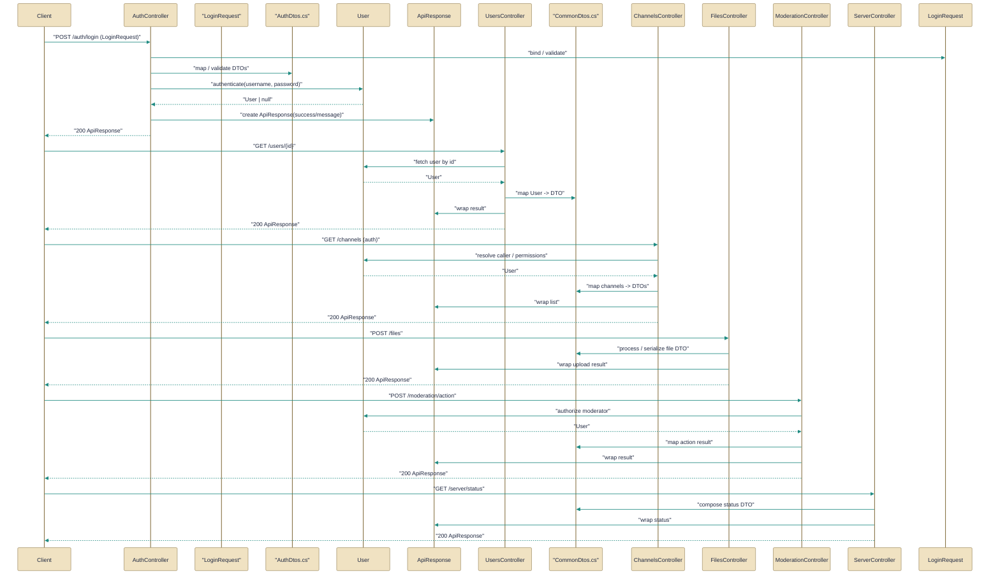

# HTTP API surface and endpoints

> REST API surface exposed by the server for authentication, channels, files, moderation, server-wide ops, and users.

*Figure: How HTTP API surface and endpoints works.*

This guide summarizes the HTTP API surface exposed by the server: the controllers that form the authenticated REST boundary and the DTOs and domain model they use to exchange data. It explains what each controller actually does (concrete endpoints and coordination responsibilities), which DTOs and model types shape requests and responses, and how controllers defer business logic and persistence to services and the database. Use this to orient on who enforces validation/auth/rate-limiting and which objects cross the HTTP boundary.

## AuthController.cs
Api controller for authentication endpoints.

The [AuthController](../Code/src/EchoHub.Server/Controllers/AuthController.cs.md) is the HTTP boundary for login, registration, refresh-token rotation, and logout workflows. It accepts DTOs such as the [LoginRequest](../Code/src/EchoHub.Core/DTOs/AuthDtos.cs.md) payload and returns token-bearing responses, while delegating user management to an injected user service, token creation to a token service, and refresh-token persistence to the database context. Important operational details live in the controller: refresh tokens are hashed before being stored, refresh operations revoke the old token (rotation) and issue a new pair, and all endpoints under api/auth are rate-limited under the "auth" policy so token lifetime configuration in the token service applies consistently across clients.

## ChannelsController.cs
Api controller for channel management endpoints.

The [ChannelsController](../Code/src/EchoHub.Server/Controllers/ChannelsController.cs.md) exposes endpoints to list, create, update, delete, and upload content to channels for authenticated users. It enforces authentication by reading the NameIdentifier claim, constrains paging parameters (offset >= 0, limit clamped to 1..100), applies controller- and action-level rate limits, and delegates business operations to services such as an IChannelService for CRUD and an IChatService for broadcasting channel changes. File uploads are additionally bound by request size and upload-specific rate limits (using HubConstants.MaxFileSizeBytes), and the controller normalizes inputs (channel names, paging) before handing them off so that broadcasting and persistence use a consistent canonical form.

## FilesController.cs
Api controller for file upload/download endpoints.

The [FilesController](../Code/src/EchoHub.Server/Controllers/FilesController.cs.md) provides a single GET action that serves a stored file by its GUID at /api/files/{fileId}. The action validates the supplied fileId, asks a FileStorageService to resolve the on-disk path, and returns the file stream with a content-type inferred from the extension (falling back to application/octet-stream); it returns 400 for invalid IDs and 404 when the file is missing. By centralizing file resolution and content negotiation here, the controller standardizes error responses (via the shared DTOs) and keeps raw filesystem concerns inside the storage service.

## ModerationController.cs
Api controller for moderation actions.

The [ModerationController](../Code/src/EchoHub.Server/Controllers/ModerationController.cs.md) exposes authoritative moderation operations — assign role, kick, ban — that must be invoked by administrators or moderators rather than by arbitrary data mutations. Each endpoint enforces role-based checks, persists changes via the DbContext, notifies connected clients through all registered IChatBroadcaster implementations, and cleans up presence/connection state using the PresenceTracker and internal disconnect helpers. The controller also normalizes usernames to lower-case for lookups, rejects role assignments that are equal-or-higher than the caller (ServerRole ordering), and awaits broadcast/disconnect operations (which can add latency) so that database state, client notifications, and connection teardown remain consistent.

## ServerController.cs
Api controller for server-wide operations.

The [ServerController](../Code/src/EchoHub.Server/Controllers/ServerController.cs.md) is a read-only, admin-oriented façade under /api/server that aggregates server state from the database, configuration, and the DirectoryClaimStore. It exposes actions like GetInfo (server summary), GetEncryptionKey (returns the configured encryption key or 503 if not available), and GetDirectoryStatus (admin inspection without leaking the claim token). A private GetCallerAsync centralizes authentication and authorization checks so admin endpoints consistently enforce a minimum ServerRole; callers should be aware this helper parses the NameIdentifier claim as a GUID and may throw if the claim is malformed.

## UsersController.cs
Api controller for user management endpoints.

The [UsersController](../Code/src/EchoHub.Server/Controllers/UsersController.cs.md) handles profile retrieval and updates plus avatar uploads under api/users for authenticated clients. It delegates profile operations to an IUserService and composes an image-processing pipeline (ImageToAsciiService) for avatar uploads, enforcing authentication and per-endpoint rate limits (general vs. upload). UploadAvatar validates form content and file presence, enforces a max-size via HubConstants.MaxAvatarSizeBytes, uses FileValidationHelper to restrict image types (JPEG, PNG, GIF, WebP), and translates domain results from the user service into HTTP responses using a MapUserError helper to ensure consistent error semantics.

## CommonDtos.cs
`ApiResponse` collaborates directly with `AuthController` and other members of this topic (12 dependency links).

The [CommonDtos](../Code/src/EchoHub.Core/DTOs/CommonDtos.cs.md) file defines the transport envelopes controllers use, most notably the non-generic and generic [ApiResponse](../Code/src/EchoHub.Core/DTOs/CommonDtos.cs.md) records that standardize success flags, optional human messages, and error lists (and optionally typed Data payloads). Controllers return these envelopes to provide predictable JSON shapes for success and error cases, and other DTOs in the file (ErrorResponse, PaginatedResponse, operation-result enums/records) encode common patterns like pagination and domain operation outcomes so the HTTP layer need only map service results to these DTOs.

## User.cs
`User` collaborates directly with `AuthController` and other members of this topic (5 dependency links).

The [User](../Code/src/EchoHub.Core/Models/User.cs.md) class is the domain model representing account identity, profile fields, presence state, and moderation flags. It requires Username and PasswordHash and records runtime metadata such as CreatedAt and LastSeenAt; default values express common initial states (Status Online, Role Member). Controllers load and persist instances of this type (for authentication, profile endpoints, moderation checks, and server summaries) so it is the canonical shape of user data crossing the persistence and HTTP boundaries.

## AuthDtos.cs
`LoginRequest` collaborates directly with `AuthController` and other members of this topic (4 dependency links).

The [AuthDtos](../Code/src/EchoHub.Core/DTOs/AuthDtos.cs.md) file defines the request and response payloads for authentication flows, notably the [LoginRequest](../Code/src/EchoHub.Core/DTOs/AuthDtos.cs.md) record that carries Username and Password, and the LoginResponse that bundles access and refresh tokens, expiration, and basic user identifiers. These DTOs are the contract for the auth endpoints: controllers accept immutable, value-based request records and return strongly-typed responses containing tokens and profile hints so clients can manage sessions without inspecting lower-level domain objects.

How the pieces fit

Controllers are the HTTP boundary: each controller enforces authentication, rate-limiting, and input validation, then delegates domain work to services and the DbContext. Shared DTOs in [CommonDtos](../Code/src/EchoHub.Core/DTOs/CommonDtos.cs.md) and the auth-specific types in [AuthDtos](../Code/src/EchoHub.Core/DTOs/AuthDtos.cs.md) standardize the wire format, while the [User](../Code/src/EchoHub.Core/Models/User.cs.md) model is the persistent identity object those services operate on. Cross-cutting concerns — token rotation and refresh persistence (AuthController), broadcasting and presence cleanup (ModerationController and ChannelsController), and file path resolution (FilesController) — are intentionally coordinated in controllers so callers never bypass notification, auditing, or security guarantees.

---
*Covers 9 of 9 source files identified for this topic.*

*Synthesised by Aurion on 2026-07-08 17:08:05 UTC*
