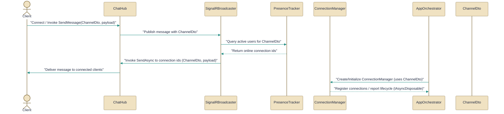

# Real-time communication and SignalR

> How the system handles real-time chat and presence using SignalR across server and client. It coordinates messages, broadcasting, and presence tracking.

*Figure: How Real-time communication and SignalR works.*

Real-time chat and presence are implemented as a small set of transport adapters and helpers that keep domain logic out of the SignalR plumbing. The server exposes a thin, authenticated SignalR hub that resolves caller identity and group membership, a broadcaster that translates domain events into SignalR calls while consulting a presence registry, and an in-memory presence tracker used to route messages. On the client side a ConnectionManager encapsulates authentication, optional end-to-end key setup, and SignalR wiring; the AppOrchestrator consumes that manager and surfaces higher-level UI and command handling. The DTOs (for example channel and message shapes) are the shared contracts passed between these layers.

## ChatHub.cs
Provides real-time chat via a SignalR hub with authorization.

The [ChatHub](../Code/src/EchoHub.Server/Hubs/ChatHub.cs.md) class is a per-connection SignalR Hub typed to an echo client interface; it acts as a transport adapter rather than containing chat business rules. Concretely it resolves the current user's GUID (ClaimTypes.NameIdentifier) and a "username" claim, normalises channel names with ToLowerInvariant().Trim(), manages SignalR group joins/leaves, and delegates operations such as join/leave/send/history/status to an injected chat service (documented as IChatService in the file). The hub centralises logging and error translation: it converts service results and exceptions into either caller responses (for example the JoinChannel result) or client-side error notifications via Clients.Caller.Error. Per the relationships line, the hub consumes DTO shapes from [ChatDtos](../Code/src/EchoHub.Core/DTOs/ChatDtos.cs.md) and is the SignalR endpoint that the [SignalRBroadcaster](../Code/src/EchoHub.Server/Services/SignalRBroadcaster.cs.md) will target when forwarding server-side events.

## SignalRBroadcaster.cs
Broadcasts chat messages to connected SignalR clients.

[SignalRBroadcaster](../Code/src/EchoHub.Server/Services/SignalRBroadcaster.cs.md) implements the IChatBroadcaster contract by translating domain-level broadcast requests into calls on an `IHubContext<ChatHub, IEchoHubClient>`. It consults the [PresenceTracker](../Code/src/EchoHub.Server/Services/PresenceTracker.cs.md) to resolve which connection IDs belong to recipients and filters out any connection IDs that start with the literal prefix "irc-" (these are considered non‑SignalR/IRC clients). The implementation resolves the hub context lazily from an IServiceProvider and caches it for reuse; the docs also call out a concrete bug (an incorrect array literal used when calling GroupExcept) that should be corrected to a valid array or enumerable. This class depends on the DTO types in [ChatDtos](../Code/src/EchoHub.Core/DTOs/ChatDtos.cs.md) for payload shapes and targets the [ChatHub](../Code/src/EchoHub.Server/Hubs/ChatHub.cs.md) client surface when delivering events.

## ConnectionManager.cs
Manages the SignalR connection lifecycle on the client.

The [ConnectionManager](../Code/src/EchoHub.Client/Services/ConnectionManager.cs.md) is a client-side lifecycle owner (implements IAsyncDisposable) that centralises authentication, token rotation, optional end-to-end encryption key retrieval/installation, SignalR/Echo hub wiring, and tracking of joined channels. Its connect flow is explicit: perform authentication (login/register/refresh and persist rotated refresh tokens), attempt to fetch and install an encryption key (non-fatal — the client will continue without it if unavailable), create and wire an EchoHubConnection, establish the SignalR connection, then join a default channel and fetch history; it surfaces those outcomes in a [ConnectResult](../Code/src/EchoHub.Client/Services/ConnectionManager.cs.md) record. The manager forwards real-time hub events (messages, presence, channel updates, errors, connection state) as high-level events so a consumer such as the [AppOrchestrator](../Code/src/EchoHub.Client/AppOrchestrator.cs.md) doesn't have to wire low-level handlers. Notes in the docs warn that ConnectAsync throws on authentication failure, IsAuthenticated simply reflects whether an ApiClient exists, and callers should avoid concurrent public async calls since the class shows no internal synchronization.

## PresenceTracker.cs
Tracks user presence for chat features and online status.

[PresenceTracker](../Code/src/EchoHub.Server/Services/PresenceTracker.cs.md) is an in-memory registry that maintains three coordinated maps: connectionId → (userId, username), username → set of connectionIds, and username → set of channel names. It uses ConcurrentDictionary for the outer maps but takes a private lock around operations that read or mutate the HashSet values (and around multi-step dictionary sequences) to ensure atomicity; the tracker raises a UserCountChanged event whenever the distinct online user count changes (and invokes that event outside the lock). The API documented shows typical operations such as UserConnected, JoinChannel (returns bool indicating whether the join was new), GetOnlineUsersInChannel, GetChannelsForUser, GetConnectionsInChannels, and UserDisconnected (which returns the username). The [SignalRBroadcaster](../Code/src/EchoHub.Server/Services/SignalRBroadcaster.cs.md) uses this tracker to map channels and users to the set of connection IDs it should target.

## ChatDtos.cs
`ChannelDto` collaborates directly with `ConnectResult` and other members of this topic (8 dependency links).

The DTO file [ChatDtos](../Code/src/EchoHub.Core/DTOs/ChatDtos.cs.md) defines the transport shapes used across client and server. The documented [ChannelDto](../Code/src/EchoHub.Core/DTOs/ChatDtos.cs.md) is an immutable record carrying Id, Name, nullable Topic, IsPublic, MessageCount, and CreatedAt (DateTimeOffset) and is intended as a pure data carrier without business logic. That DTO (and related types in the same file such as MessageDto and JoinChannelResult) are the payloads that the [ConnectionManager](../Code/src/EchoHub.Client/Services/ConnectionManager.cs.md) returns in its ConnectResult and that the [ChatHub](../Code/src/EchoHub.Server/Hubs/ChatHub.cs.md) and [SignalRBroadcaster](../Code/src/EchoHub.Server/Services/SignalRBroadcaster.cs.md) use when exchanging history, messages, and channel metadata.

## AppOrchestrator.cs
`AppOrchestrator` collaborates directly with `ConnectResult` and other members of this topic (4 dependency links).

[AppOrchestrator](../Code/src/EchoHub.Client/AppOrchestrator.cs.md) is the higher-level consumer of the client connection surface: it depends on the [ConnectionManager](../Code/src/EchoHub.Client/Services/ConnectionManager.cs.md) to perform Connect/Disconnect and subscribe to forwarded hub events, and it implements many command handlers and UI interaction points (RunAsync, HandleConnect, HandleMessageSubmitted, a wide set of HandleCmd* methods, etc.). The orchestrator maps UI actions and commands into calls against the ConnectionManager and the API, handles saved-session and configuration actions, and updates UI state based on events surfaced by the connection manager. Per the relationships, the orchestrator is both a consumer of ConnectResult and is wired into the connection manager's event model so it can react to messages, presence changes, channel joins, and errors.

How the pieces fit

The collaboration is a request-and-broadcast flow with clear separation of concerns: the client-side [ConnectionManager](../Code/src/EchoHub.Client/Services/ConnectionManager.cs.md) performs authentication, optional E2E key setup, and SignalR wiring; the [AppOrchestrator](../Code/src/EchoHub.Client/AppOrchestrator.cs.md) consumes that manager and translates UI/command actions into connection calls. On the server, [ChatHub](../Code/src/EchoHub.Server/Hubs/ChatHub.cs.md) is the authenticated SignalR endpoint that resolves identity, normalises channel names, and delegates domain actions to a chat service; presence is tracked in [PresenceTracker](../Code/src/EchoHub.Server/Services/PresenceTracker.cs.md), which the [SignalRBroadcaster](../Code/src/EchoHub.Server/Services/SignalRBroadcaster.cs.md) consults to target connection IDs for broadcasts. Shared DTOs in [ChatDtos](../Code/src/EchoHub.Core/DTOs/ChatDtos.cs.md) carry channel, message, and join/history payloads between these layers.

Key operational notes:

- Client connect flow: ConnectionManager authenticates, attempts key install, establishes an EchoHub connection, joins the default channel, and returns a [ConnectResult](../Code/src/EchoHub.Client/Services/ConnectionManager.cs.md) containing channels and default history.  
- Server broadcast flow: domain events are translated by [SignalRBroadcaster](../Code/src/EchoHub.Server/Services/SignalRBroadcaster.cs.md) into hub client calls using a lazily-resolved hub context and presence lookup; it explicitly filters out connection IDs prefixed with "irc-".  
- Presence semantics: [PresenceTracker](../Code/src/EchoHub.Server/Services/PresenceTracker.cs.md) is the single in-memory source of truth for connection→user and user→channels mappings and raises UserCountChanged when the distinct online user count changes.

---
*Covers 6 of 6 source files identified for this topic.*

*Synthesised by Aurion on 2026-07-08 17:04:51 UTC*
