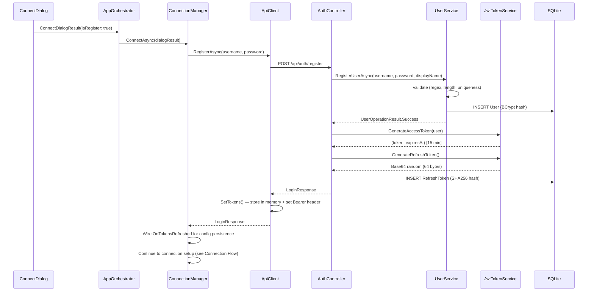
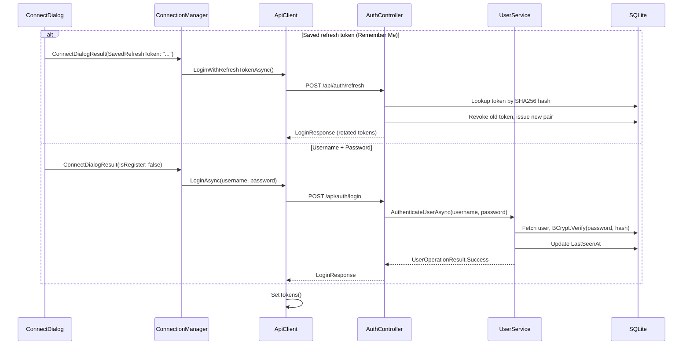
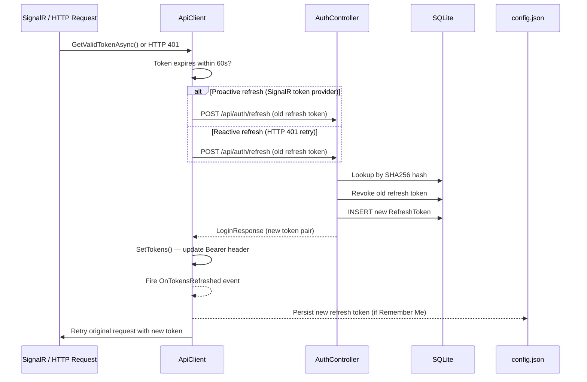

# Authentication

## User Registration

A new user creates an account on a server. The client sends credentials via REST,
the server hashes the password, issues JWT tokens, and the client stores the
refresh token for "Remember Me" sessions.

**Code references:**

| Step | File | Location |
|------|------|----------|
| Dialog UI | `src/EchoHub.Client/UI/Dialogs/ConnectDialog.cs` | Lines 251-268 (register handler) |
| Orchestrator entry | `src/EchoHub.Client/AppOrchestrator.cs` | Lines 550-592 (`HandleConnect`) |
| ConnectionManager auth | `src/EchoHub.Client/Services/ConnectionManager.cs` | Lines 74-76 (register branch) |
| ApiClient register | `src/EchoHub.Client/Services/ApiClient.cs` | Lines 32-43 (`RegisterAsync`) |
| AuthController register | `src/EchoHub.Server/Controllers/AuthController.cs` | Lines 28-49 |
| UserService register | `src/EchoHub.Server/Services/UserService.cs` | Lines 20-59 (`RegisterUserAsync`) |
| JWT generation | `src/EchoHub.Server/Auth/JwtTokenService.cs` | Lines 30-53 (access), 80-86 (refresh) |
| Token persistence | `src/EchoHub.Client/AppOrchestrator.cs` | Lines 1039-1053 (`SaveServerToConfig`) |

---

## User Login

Returning user authenticates with username/password or a saved refresh token.

**Code references:**

| Step | File | Location |
|------|------|----------|
| Login button handler | `src/EchoHub.Client/UI/Dialogs/ConnectDialog.cs` | Lines 214-249 |
| Saved token branch | `src/EchoHub.Client/Services/ConnectionManager.cs` | Lines 69-71 |
| Password branch | `src/EchoHub.Client/Services/ConnectionManager.cs` | Lines 78-80 |
| ApiClient login | `src/EchoHub.Client/Services/ApiClient.cs` | Lines 45-56 (`LoginAsync`) |
| AuthController login | `src/EchoHub.Server/Controllers/AuthController.cs` | Lines 51-72 |
| AuthController refresh | `src/EchoHub.Server/Controllers/AuthController.cs` | Lines 74-108 |
| UserService authenticate | `src/EchoHub.Server/Services/UserService.cs` | Lines 61-83 |

---

## Token Refresh

Access tokens expire after 15 minutes. The client auto-refreshes transparently
before requests and on 401 responses. Refresh tokens are rotated on each use.

**Code references:**

| Step | File | Location |
|------|------|----------|
| Proactive check | `src/EchoHub.Client/Services/ApiClient.cs` | Lines 110-129 (`GetValidTokenAsync`) |
| Reactive 401 retry (GET) | `src/EchoHub.Client/Services/ApiClient.cs` | Lines 338-358 (`AuthenticatedGetAsync`) |
| Reactive 401 retry (POST/PUT/DELETE) | `src/EchoHub.Client/Services/ApiClient.cs` | Lines 364-384 (`AuthenticatedRequestAsync`) |
| Refresh HTTP call | `src/EchoHub.Client/Services/ApiClient.cs` | Lines 58-71 (`RefreshTokenAsync`) |
| SignalR token provider | `src/EchoHub.Client/Services/EchoHubConnection.cs` | Line 37 (`AccessTokenProvider`) |
| Server-side rotation | `src/EchoHub.Server/Controllers/AuthController.cs` | Lines 74-108 |
| Token persistence callback | `src/EchoHub.Client/Services/ConnectionManager.cs` | Lines 253-264 |
