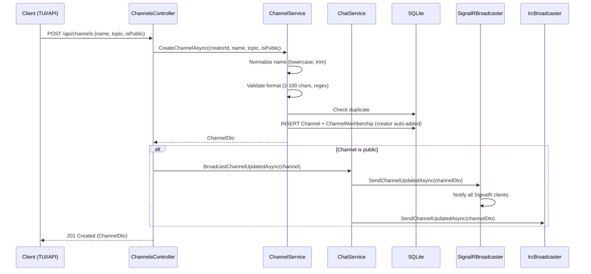
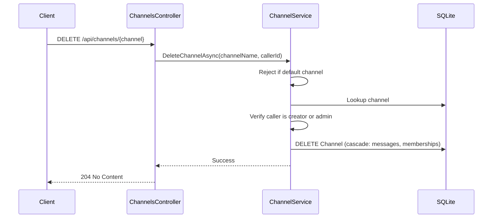
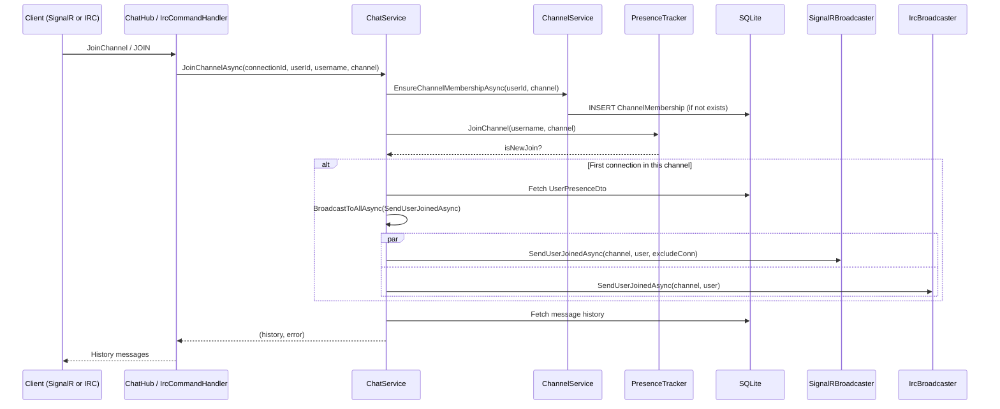
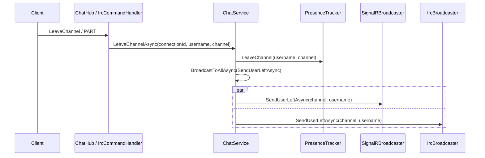

# Channels

## Channel Creation

Channels are created via the REST API. Public channels are broadcast to all
connected clients.

**Code references:**

| Step | File | Location |
|------|------|----------|
| Controller endpoint | `src/EchoHub.Server/Controllers/ChannelsController.cs` | Lines 60-76 |
| Channel service create | `src/EchoHub.Server/Services/ChannelService.cs` | Lines 50-90 |
| Broadcast updated | `src/EchoHub.Server/Services/ChatService.cs` | Lines 308-309 |

---

## Channel Deletion

Only the channel creator (or admin) can delete a channel. The default channel
is protected.

**Code references:**

| Step | File | Location |
|------|------|----------|
| Controller endpoint | `src/EchoHub.Server/Controllers/ChannelsController.cs` | Lines 94-106 |
| Channel service delete | `src/EchoHub.Server/Services/ChannelService.cs` | Lines 119-144 |

---

## Joining a Channel

Both SignalR and IRC clients join channels through `ChatService`. The presence
tracker determines if this is a genuinely new join (vs. a second connection) and
broadcasts accordingly.

**Code references:**

| Step | File | Location |
|------|------|----------|
| SignalR hub join | `src/EchoHub.Server/Hubs/ChatHub.cs` | Lines 59-81 |
| IRC join | `src/EchoHub.Server.Irc/IrcCommandHandler.cs` | Lines 361-414 |
| ChatService join | `src/EchoHub.Server/Services/ChatService.cs` | Lines 96-135 |
| Presence join | `src/EchoHub.Server/Services/PresenceTracker.cs` | Lines 58-70 |
| SignalR broadcast | `src/EchoHub.Server/Services/SignalRBroadcaster.cs` | Lines 26-32 |
| IRC broadcast | `src/EchoHub.Server.Irc/IrcBroadcaster.cs` | Lines 34-41 |

---

## Leaving a Channel

**Code references:**

| Step | File | Location |
|------|------|----------|
| SignalR hub leave | `src/EchoHub.Server/Hubs/ChatHub.cs` | Lines 83-96 |
| IRC part | `src/EchoHub.Server.Irc/IrcCommandHandler.cs` | Lines 416-435 |
| ChatService leave | `src/EchoHub.Server/Services/ChatService.cs` | Lines 137-143 |
| Presence leave | `src/EchoHub.Server/Services/PresenceTracker.cs` | Lines 72-81 |
