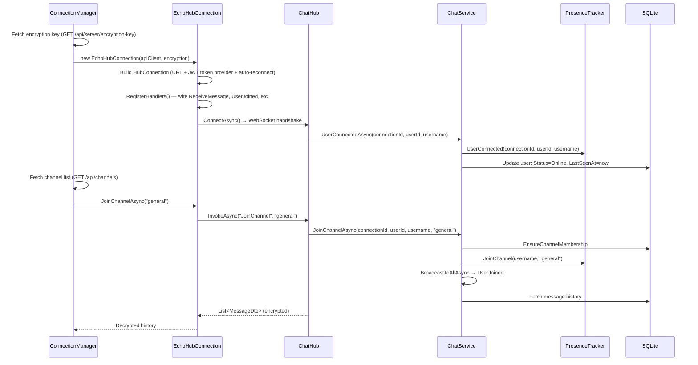
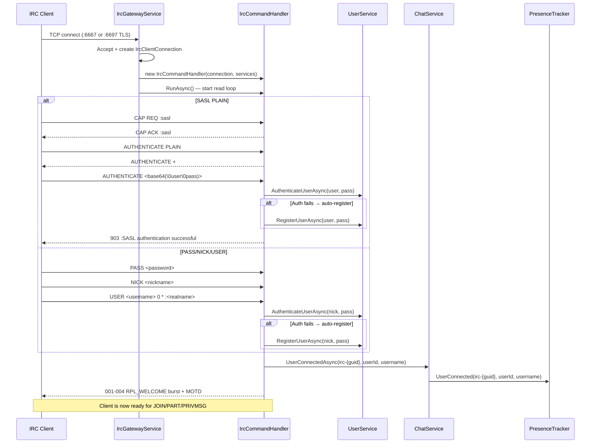
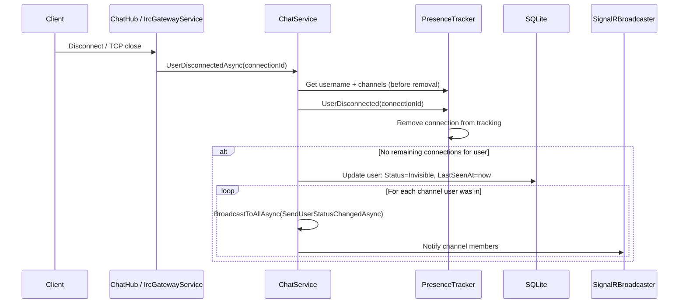

# Connection

## SignalR Client Connection

After authentication, the TUI client establishes a SignalR WebSocket, registers
event handlers, joins the default channel, and loads history.

**Code references:**

| Step | File | Location |
|------|------|----------|
| Connection orchestration | `src/EchoHub.Client/Services/ConnectionManager.cs` | Lines 58-140 (`ConnectAsync`) |
| EchoHubConnection setup | `src/EchoHub.Client/Services/EchoHubConnection.cs` | Lines 29-62 (constructor) |
| Handler registration | `src/EchoHub.Client/Services/EchoHubConnection.cs` | Lines 64-122 (`RegisterHandlers`) |
| Hub OnConnected | `src/EchoHub.Server/Hubs/ChatHub.cs` | Lines 31-43 |
| ChatService connected | `src/EchoHub.Server/Services/ChatService.cs` | Lines 41-57 |
| PresenceTracker connect | `src/EchoHub.Server/Services/PresenceTracker.cs` | Lines 13-29 |
| Join channel (hub) | `src/EchoHub.Server/Hubs/ChatHub.cs` | Lines 59-81 |
| Join channel (service) | `src/EchoHub.Server/Services/ChatService.cs` | Lines 96-135 |

---

## IRC Client Connection

IRC clients connect via TCP, authenticate with PASS/NICK/USER or SASL PLAIN,
and auto-join channels. New usernames are auto-registered.

**Code references:**

| Step | File | Location |
|------|------|----------|
| TCP listener | `src/EchoHub.Server.Irc/IrcGatewayService.cs` | Lines 45-90 (`ExecuteAsync`) |
| Client handler | `src/EchoHub.Server.Irc/IrcGatewayService.cs` | Lines 92-154 (`HandleClientAsync`) |
| Command read loop | `src/EchoHub.Server.Irc/IrcCommandHandler.cs` | Lines 40-98 (`RunAsync`) |
| SASL auth | `src/EchoHub.Server.Irc/IrcCommandHandler.cs` | Lines 136-207 (`HandleAuthenticateAsync`) |
| PASS/NICK/USER | `src/EchoHub.Server.Irc/IrcCommandHandler.cs` | Lines 209-267 |
| Registration completion | `src/EchoHub.Server.Irc/IrcCommandHandler.cs` | Lines 268-315 (`TryCompleteRegistrationAsync`) |
| Cleanup on disconnect | `src/EchoHub.Server.Irc/IrcGatewayService.cs` | Lines 136-153 |

---

## User Disconnect & Presence

When a client disconnects, the presence tracker determines if the user has any
remaining connections. If not, status is set to Invisible and all channels are
notified.

**Code references:**

| Step | File | Location |
|------|------|----------|
| SignalR disconnect | `src/EchoHub.Server/Hubs/ChatHub.cs` | Lines 45-57 |
| IRC cleanup | `src/EchoHub.Server.Irc/IrcGatewayService.cs` | Lines 136-153 |
| ChatService disconnect | `src/EchoHub.Server/Services/ChatService.cs` | Lines 59-94 |
| Presence disconnect | `src/EchoHub.Server/Services/PresenceTracker.cs` | Lines 31-53 |
