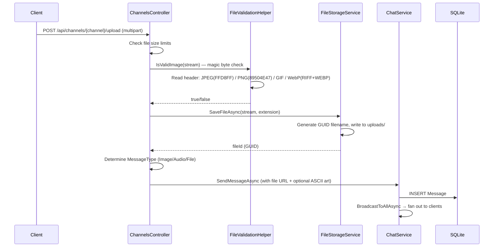
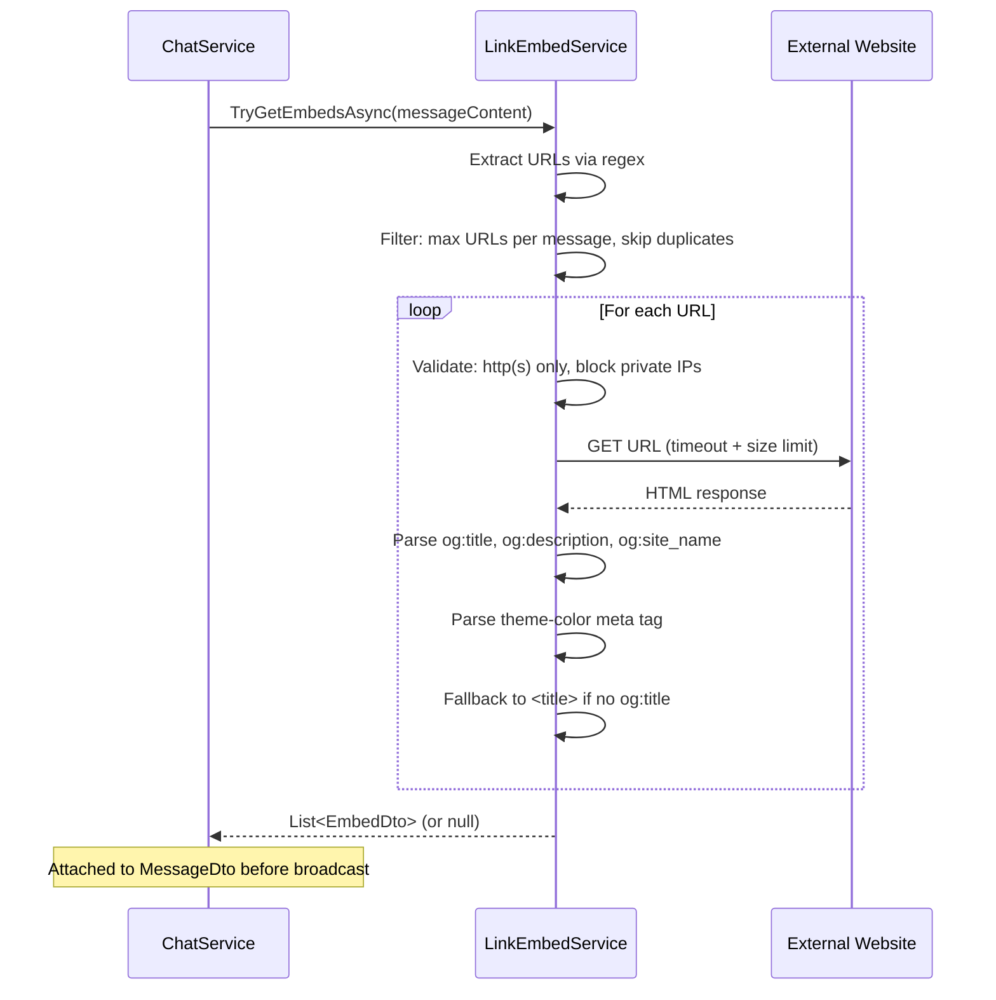
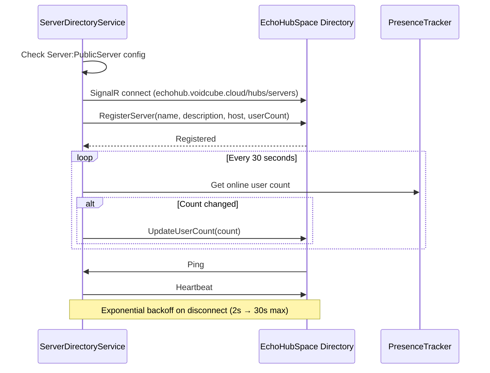

# Media & Services

## File Upload

Files are uploaded via REST, validated by magic bytes, stored with GUID filenames,
and broadcast as a message with a download link.

---

## Link Embed Resolution

When a message contains URLs, the server fetches OpenGraph metadata for preview
embeds.

---

## Server Directory Registration

Public servers register with the EchoHubSpace directory for discoverability.

