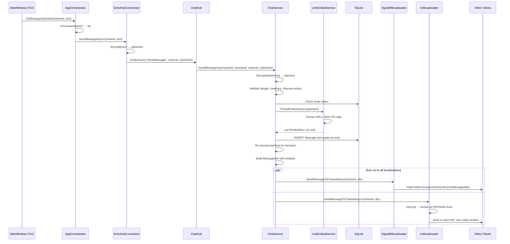
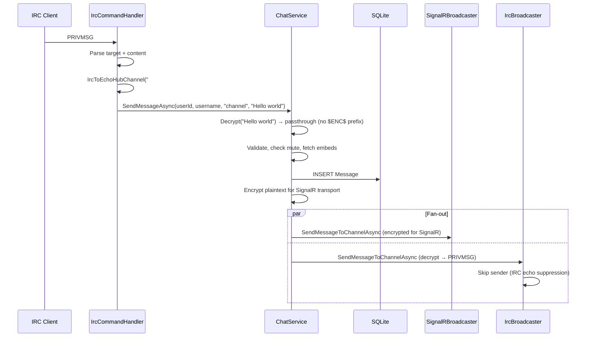
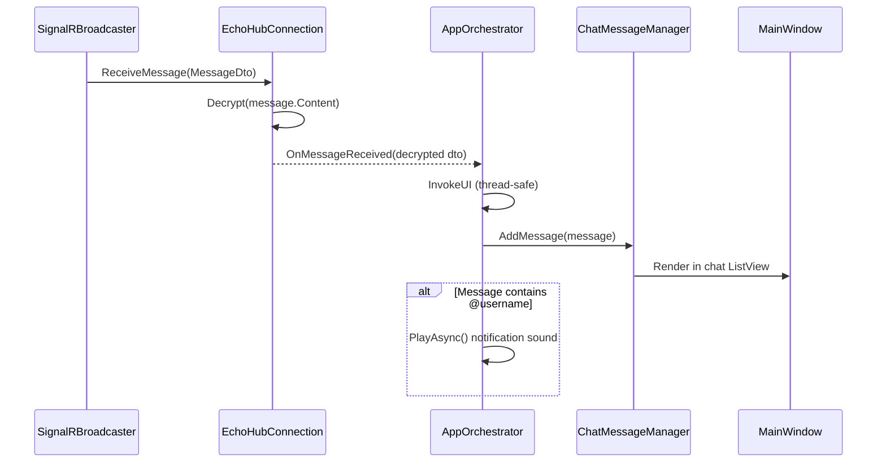
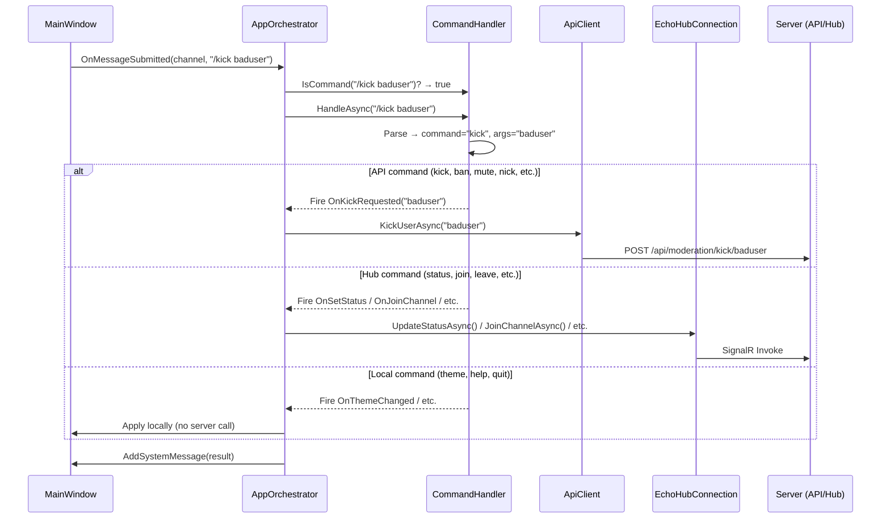

# Messaging

## Sending a Message (SignalR)

A message typed in the TUI travels through encryption, the SignalR hub,
`ChatService` validation, database storage, and fan-out to both SignalR and IRC
clients.

**Code references:**

| Step | File | Location |
|------|------|----------|
| Input handler | `src/EchoHub.Client/UI/MainWindow.cs` | Lines 428-449 (`OnInputKeyDown`) |
| Orchestrator dispatch | `src/EchoHub.Client/AppOrchestrator.cs` | Lines 631-661 (`HandleMessageSubmitted`) |
| Client encrypt + send | `src/EchoHub.Client/Services/EchoHubConnection.cs` | Lines 148-153 (`SendMessageAsync`) |
| Hub receive | `src/EchoHub.Server/Hubs/ChatHub.cs` | Lines 98-111 (`SendMessage`) |
| ChatService process | `src/EchoHub.Server/Services/ChatService.cs` | Lines 145-241 (`SendMessageAsync`) |
| Mute check | `src/EchoHub.Server/Services/ChatService.cs` | Lines 177-190 |
| Link embeds | `src/EchoHub.Server/Services/LinkEmbedService.cs` | Lines 28-51 (`TryGetEmbedsAsync`) |
| DB insert | `src/EchoHub.Server/Services/ChatService.cs` | Lines 208-221 |
| Broadcast fan-out | `src/EchoHub.Server/Services/ChatService.cs` | Lines 311-324 (`BroadcastToAllAsync`) |
| SignalR broadcast | `src/EchoHub.Server/Services/SignalRBroadcaster.cs` | Lines 23-24 |
| IRC broadcast | `src/EchoHub.Server.Irc/IrcBroadcaster.cs` | Lines 17-32 |

---

## Sending a Message (IRC)

Messages from IRC clients follow the same `ChatService` path but enter as
plaintext (no app-layer encryption).

**Code references:**

| Step | File | Location |
|------|------|----------|
| PRIVMSG handler | `src/EchoHub.Server.Irc/IrcCommandHandler.cs` | Lines 437-469 |
| Channel name conversion | `src/EchoHub.Server.Irc/IrcCommandHandler.cs` | Line 680 (`IrcToEchoHubChannel`) |
| ChatService (shared path) | `src/EchoHub.Server/Services/ChatService.cs` | Lines 145-241 |
| IRC echo suppression | `src/EchoHub.Server.Irc/IrcBroadcaster.cs` | Lines 25-26 |

---

## Receiving a Message (TUI Client)

When a message arrives via SignalR, the client decrypts it, adds it to the chat
view, and optionally plays a notification sound for @mentions.

**Code references:**

| Step | File | Location |
|------|------|----------|
| SignalR handler | `src/EchoHub.Client/Services/EchoHubConnection.cs` | Lines 64-71 |
| Orchestrator receive | `src/EchoHub.Client/AppOrchestrator.cs` | Lines 372-383 |
| @mention detection | `src/EchoHub.Client/AppOrchestrator.cs` | Lines 378-382 |

---

## Command Execution

Slash commands (`/status`, `/nick`, `/kick`, etc.) are parsed client-side and
dispatched to appropriate handlers, which call REST APIs or SignalR methods.

**Available commands:**

| Command | Type | Handler |
|---------|------|---------|
| `/status <status> [message]` | Hub | `UpdateStatusAsync` |
| `/nick <name>` | API | `UpdateProfileAsync` |
| `/color <hex>` | API | `UpdateProfileAsync` |
| `/join <channel>` | Hub | `JoinChannelAsync` |
| `/leave` | Hub | `LeaveChannelAsync` |
| `/topic <text>` | API | `UpdateChannelTopicAsync` |
| `/kick <user>` | API | `POST /api/moderation/kick/{user}` |
| `/ban <user>` | API | `POST /api/moderation/ban/{user}` |
| `/unban <user>` | API | `POST /api/moderation/unban/{user}` |
| `/mute <user> [mins]` | API | `POST /api/moderation/mute/{user}` |
| `/unmute <user>` | API | `POST /api/moderation/unmute/{user}` |
| `/role <user> <role>` | API | `PUT /api/moderation/role/{user}` |
| `/nuke` | API | `DELETE /api/channels/{channel}/messages` |
| `/send <file>` | API | `POST /api/channels/{channel}/upload` |
| `/profile [user]` | Local | Show profile dialog |
| `/avatar` | API | `POST /api/users/avatar` |
| `/theme <name>` | Local | `ThemeManager.SetTheme()` |
| `/servers` | API | `GET /api/serverdir/servers` |
| `/users` | Local | Show userlist |
| `/help` | Local | Show help text |
| `/quit` | Local | Exit application |

**Code references:**

| Step | File | Location |
|------|------|----------|
| Command detection | `src/EchoHub.Client/AppOrchestrator.cs` | Lines 639-655 |
| Command dispatch | `src/EchoHub.Client/Commands/CommandHandler.cs` | Lines 34-69 (`HandleAsync`) |
| Command handlers wired | `src/EchoHub.Client/AppOrchestrator.cs` | Lines 97-117 |
| Individual handlers | `src/EchoHub.Client/AppOrchestrator.cs` | Lines 122-350 |
