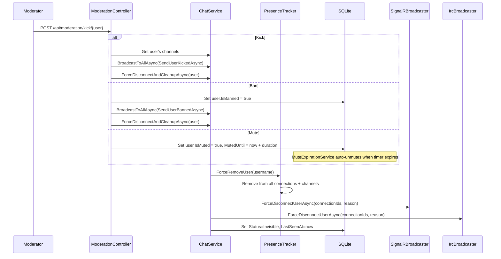

# Moderation

## Kick / Ban / Mute

Moderators and admins can kick, ban, or mute users via REST API or slash commands.
These actions force-disconnect the target and broadcast the event.

**Code references:**

| Step | File | Location |
|------|------|----------|
| Kick endpoint | `src/EchoHub.Server/Controllers/ModerationController.cs` | Lines 62-87 |
| Ban endpoint | `src/EchoHub.Server/Controllers/ModerationController.cs` | Lines 89-112 |
| Mute endpoint | `src/EchoHub.Server/Controllers/ModerationController.cs` | Lines 130-151 |
| Force disconnect | `src/EchoHub.Server/Controllers/ModerationController.cs` | Lines 232-256 |
| Mute expiration | `src/EchoHub.Server/Services/MuteExpirationService.cs` | Lines 22-62 |
| Mute enforcement | `src/EchoHub.Server/Services/ChatService.cs` | Lines 177-190 |
| Presence force remove | `src/EchoHub.Server/Services/PresenceTracker.cs` | Lines 161-178 |
